# litrag Tutorial

Written on 8 October 2026 for litrag 0.3.2, at commit 1cfe313 of `main`.

litrag keeps one library of papers per project, reads each paper into rows a person can query, ties each finding to the method that produced it, and grows the library by following citations. This tutorial walks through every function in the order a person meets it, with screenshots from a real 223-paper library.

## At a glance

litrag keeps a library of scientific papers for each research project. It reads every paper into a tree of rows: sections, paragraphs, figures, tables and references. Then it lets you search those rows, see which method produced each result, read numbers off charts, and grow the library by following citations.

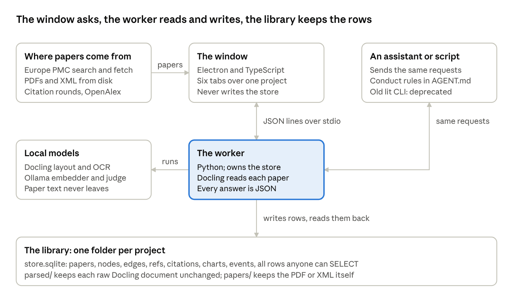

Three parts do the work.

- **The window** is an Electron app with six tabs, listed down its left edge: Projects, Search, Papers, Types, Query and Graph. A log pane runs along the bottom. It shows and asks. It never writes the store itself.
- **The worker** is a Python process the window starts. It reads papers with Docling, writes the store, and answers every request as one line of JSON. An assistant or a script can send it the same requests.
- **The library** is one folder per project under the library root. Its `store.sqlite` holds the rows. Its `parsed/` folder keeps each paper's raw Docling document, and `papers/` keeps the files.

Five rules from the project's own guide shape everything this tutorial shows.

1. **Local.** Paper text stays on the machine. The network is used only to fetch models once from Hugging Face, and to find and fetch papers and their identifiers: Europe PMC, NCBI, PMC's cloud copy, OpenAlex, and the host of an open copy.
2. **Rows first.** Every piece of a paper is a row you can query with SQL. The raw Docling document is kept, so a rebuild derives the rows again without running Docling.
3. **Filed once.** A paper is identified by DOI, then PMID, then the file's hash. Adding it again changes nothing; a reread is the deliberate way to replace it.
4. **Unassignable beats misassigned.** A section's role comes from the heading above it. When nothing names it with confidence, it is `other`, never a guess.
5. **Every answer is JSON,** and progress streams as events, so the window shows what is happening rather than a spinner.

The tutorial follows the order in which a person meets each function. Install and first start, Projects, and Finding and fetching papers get a library started. How a paper is read and The Papers tab show how a paper is read and how to inspect the result. Types, Asking the library (Query), Method links and labelling, Figures as numbers and The citation graph cover what you do with the rows. The last four sections cover scripting, upkeep, known limits and a quick reference.

The examples come from a library of 226 papers. 223 of them were read on a CPU-only machine without Ollama: 151 JATS XML and 72 PDF. The other three are PDFs left queued. In the screenshots the library holds 227 papers, because one more was fetched from Europe PMC while they were taken. Functions that need Ollama are described from the code and appear in their not-available state.

## Install and first start

litrag is two programs on one machine: a window you work in, and a Python worker that reads papers and keeps the library. Here you install both, start them, and see where your libraries live on disk.

### What you need

| Need | What it is for |
| --- | --- |
| Node 22 or newer | building and running the window from a checkout |
| Python 3.11 or newer, and uv | the worker's environment; the install script brings its own uv and Python 3.12 |
| torch, CPU build or CUDA 13 build | Docling's layout and table models; the CUDA build wants an NVIDIA driver R580 or newer |
| Docling's models, about 0.5 GB | laying out PDFs; fetched once from Hugging Face, with the first PDF |
| Ollama with `nomic-embed-text` (optional) | Query by meaning, embedding passages, naming unfamiliar headings |
| Ollama with `qwen3:14b` (optional) | the judge, the model labeller, and **Suggest from the project** on Search |

A GPU is optional. With the CUDA build, torch finds the card by itself. The example library was read on a CPU only. There a PDF took 25 seconds on average to reach its tree, and a JATS XML file under one. Reading the charts in a PDF's figures added about a minute more.

### Installing

**From a checkout.** This route works today:

```
git clone https://github.com/karimghabra/litrag.git
cd litrag
uv sync --project parser --extra cpu     # --extra cu130 with an NVIDIA card
npm --prefix app install                 # Electron and pdf.js
ollama pull nomic-embed-text             # optional: Query by meaning
ollama pull qwen3:14b                    # optional: judge, labeller, suggestions
```

A CPU environment is about 1.4 GB; a CUDA one about 6 GB. There is no macOS package, so on a Mac this is the only route.

**From a release package.** A release is meant to carry `litrag-<version>-win-x64.zip` and `litrag-<version>-linux-x64.tar.gz`: the app beside an install script. On Windows, extract the zip and double-click `install.cmd`. On Linux:

```
tar -xzf litrag-<version>-linux-x64.tar.gz
litrag-<version>-linux-x64/install.sh
```

The script needs no administrator rights. It puts the app, uv, a Python and the worker's environment in one folder: `%LOCALAPPDATA%\litrag` on Windows, `~/.local/share/litrag` on Linux. It logs every step to `install.log` there and ends with a summary. On Windows it installs Ollama with winget when it is missing; on Linux it only says where to get it, because Ollama's installer needs root.

| Switch (Linux, then Windows) | Effect |
| --- | --- |
| `--torch`, `-Torch` | `auto` (CUDA 13 when `nvidia-smi` runs, else CPU), `cpu`, `cu130` or `none` |
| `--prefetch-models`, `-PrefetchModels` | fetches Docling's models into `models/docling` under the library root now, so the first PDF needs no network |
| `--skip-ollama`, `-SkipOllama` | leaves Ollama alone |

Run the script again to update. `uninstall.sh` or `uninstall.cmd` in the install folder removes litrag. It lists what it removes, asks first, and refuses while litrag runs. `--yes`, or `-Yes` on Windows, skips the question. Neither script creates, moves or deletes a library, and uninstalling leaves Ollama as it was. A developer builds a package with `npm --prefix app run release -- linux` (or `-- win`), into `app/release/`. It first runs `npm --prefix app run dist:linux` (or `dist:win`), which leaves the unpacked app in `app/release/linux-unpacked` (or `win-unpacked`). Add `--no-build` to pack what is already there.

### Try it

1. Start the window. From a checkout, run `npm run app` at the top of the repository: it builds the window, then opens it. An installed litrag starts from the Start Menu or the applications menu, under **litrag**.
2. Watch the top right corner. The status reads **starting worker…** beside a grey dot, then turns green: **worker ready**. This takes under a second, because the worker loads Docling only when the first paper arrives.

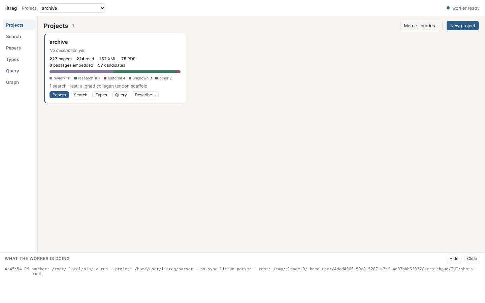

3. Read the first line of the log pane, under **What the worker is doing**. It names the worker command and the library root, for example `worker: /home/you/.local/bin/uv run --project /home/you/litrag/parser --no-sync litrag-parser · root: ~/.protracker/library`. Check the root: it decides which libraries you see.
4. On a root with no library yet, the **Project** picker reads **No projects yet**, and the Projects tab says "No projects yet. Make one: a name, and a line on what its literature is about." Click **New project** and fill it in (see Projects). The window opens on Projects the first time; after that it reopens on the tab and project you last used.
5. Add your first paper: drop a PDF or JATS XML file anywhere on the window, or click **Add papers…** on the Papers tab. The dot turns amber and pulses, and the status names each stage, such as **layout: Reading the layout: headings, paragraphs, tables, figures**. The log shows a line ending in `"Loading Docling and its models (first run downloads them)"}`, then one carrying `ready on cpu`, or `ready on cuda:0` when torch sees the GPU. On a machine that has never run Docling, the models then come down from Hugging Face with the first PDF.
6. Follow the paper in the log. Each step gets a line with the time and, in colour, the paper's key: its name in the library, such as `doi:10.3390/mi14081643` (see Finding and fetching papers). When nothing is left to do, the status reads **idle**. Open **Papers** to see the paper's card, now **parsed**, and its tree (see The Papers tab).

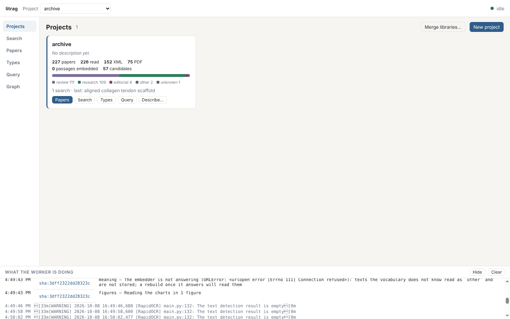

7. Click **Hide** in the log pane's title bar when you want more room. The pane folds to its title bar and the button reads **Show**. **Clear** empties the log.

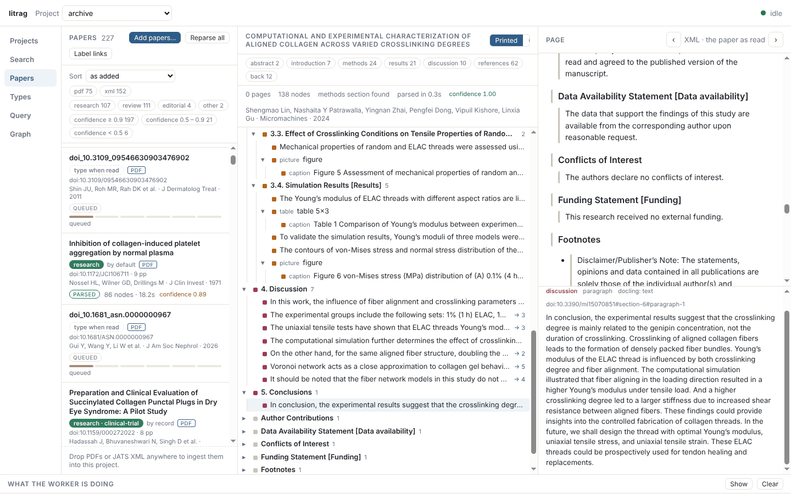

8. To quit, wait until the status reads **idle** and the progress line in the header, such as **Reading paper 1 of 1**, has gone. Then close the window, or choose **File** and then **Quit**. The menu bar is Electron's own: **File**, **Edit**, **View**, **Window**, **Help**. litrag adds nothing to it, and **File** holds only **Quit**.

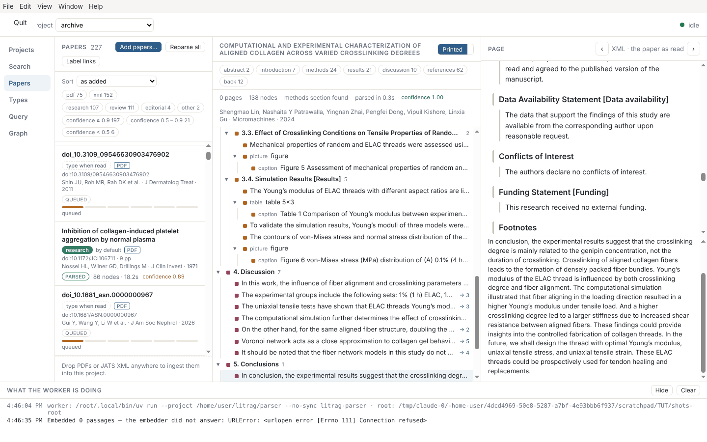

### The status at the top right

| Dot | Text | When |
| --- | --- | --- |
| grey | **starting worker…** | until the worker answers |
| green | **worker ready** | the worker answered `hello` |
| amber, pulsing | the stage and its message | a paper or a job is under way |
| green | **idle** | the job is done |
| red | **worker not running**, or **worker exited** with its exit code | the worker could not start, or it stopped |

Hover over the status to read a text that is cut short.

### What happens underneath

The window's main process starts the worker before it opens the window. It settles the command once, and the first match wins:

| Order | When | The worker command |
| --- | --- | --- |
| 1 | `LITRAG_PARSER` is set | that: a JSON array of arguments, a path to a program, or a command line split on spaces |
| 2 | an installed app | `bin/litrag-parser` (Windows: `Scripts\litrag-parser.exe`) in `LITRAG_VENV`, else in the install folder's `venv` |
| 3 | a checkout, with `parser/pyproject.toml` beside `app/` | `uv run --project <repo>/parser litrag-parser`, with `--no-sync` once `parser/.venv` exists |
| 4 | none of these | `litrag-parser` from PATH |

uv is looked for on PATH, then in the install folder, `~/.local/bin` and `~/.cargo/bin`. An installed app never uses uv.

The root follows one rule in the window, the worker and the install scripts: `LITRAG_ROOT`, else `PROTRACKER_LIBRARY`, else `~/.protracker/library`. The worker creates the root folder if it is missing and opens `lanes.sqlite` there. Then it prints a `ready` line and answers one JSON request per line.

The page usually loads after `ready` has gone by, so it sends `hello` to learn the worker is alive. The answer turns the status green. Asked by hand on a fresh root, the exchange reads:

```json
{"id": "r0", "op": "hello"}
{"event": "hello", "id": "r0", "worker": "0.3.2", "root": "/home/you/.protracker/library", "python": "3.13.16", "docling": null, "device": null, "meaning": {"model": "nomic-embed-text", "down": false, "error": null, "kinds": {}}, "boundary": null}
```

`worker` is the worker's version. `meaning` names the embedder; `down` turns `true` only after a question to it went unanswered. `boundary` stays `null` unless the boundary scorer is switched on.

Docling runs in a long-lived child process, started with the first paper of a session. Starting it, torch included, took 59.6 seconds on a 4-core CPU; later papers skip that. Docling loads its models at the first PDF: from `<root>/models/docling` when that folder holds them, else from the Hugging Face cache, which fills on first use.

On closing, the window sends the `quit` op and kills the worker 1.5 seconds later if it is still there. The worker stops its Docling child, answers `bye` and exits at once.

### Where the libraries live

```
~/.protracker/library/        the root (LITRAG_ROOT)
├── lanes.sqlite              the embedder's verdicts, shared by every library
├── models/docling/           Docling's models, only when prefetched
└── archive/                  one library per project; the folder name is its id
    ├── library.json          name, description, creation time, searches run
    ├── store.sqlite          the rows: papers, pages, nodes, events and the rest
    ├── papers/               the files, named by key: doi_10.3390_mi14081643.xml
    ├── parsed/               <key>.docling.json, Docling's raw document, never edited
    └── inbox/                downloads from Search and Collect, until they are read
```

A library is any folder under the root that holds a `library.json`; litrag ignores the rest. The id is the project's name made into a slug: "Looped ligament" becomes `looped-ligament`.

### Switches at start

| Variable | Default | Effect |
| --- | --- | --- |
| `LITRAG_ROOT` | unset | the library root |
| `PROTRACKER_LIBRARY` | unset | the root when `LITRAG_ROOT` is unset |
| `LITRAG_PARSER` | unset | the worker command, as in the table above |
| `LITRAG_VENV` | `<install folder>/venv` | the installed app's Python environment |
| `LITRAG_HEADLESS` | unset | `1` renders the window offscreen and never shows it |
| `LITRAG_OLLAMA_URL` | `http://127.0.0.1:11434` | where Ollama is asked |

`LITRAG_HEADLESS=1` is for tests. `LITRAG_HEADLESS=1 npm run e2e:studio` runs the product end to end with no window on screen, using Docling's models, Ollama and two PDFs from the archive beside the checkout.

### Good to know

- **The releases carry no archives yet.** In this version, the GitHub releases v0.3.0 and v0.3.1 hold no files, and 0.3.2 has no release. Install from a checkout. By the project's own notes, the Linux installer has been run end to end and the Windows one has never been run.
- **Only the embedder is pulled for you.** The install scripts pull `nomic-embed-text` and nothing else. Run `ollama pull qwen3:14b` yourself for the judge, the labeller and suggested searches.
- **Papers are read without Ollama.** The log then says once a session that "The embedder is not answering". Until it answers, any heading or text that litrag's own word lists do not name reads as `other`, never a guess (see How a paper is read). The project card shows **0 passages embedded**. Start Ollama and pull the embedder, then click **Embed passages** on the Query tab (see Asking the library (Query) and Maintenance).
- **The first PDF is slow, and its download is silent.** The 0.5 GB download shows no progress bar: only the amber dot and the paper's seconds counting up. Install with `--prefetch-models` to pay it in advance. From a checkout, `uv run --project parser --no-sync docling-tools models download layout tableformer -o ~/.protracker/library/models/docling` does the same.
- **Search the log for `ready on` to see the device.** `hello` answers `"docling": null, "device": null` in this version, even after papers are read, and every paper's `parser` column says `docling None`.
- **Quitting abandons the queue.** The worker exits without finishing. A paper it was reading is marked `failed`, "the worker stopped while reading this paper", the next time its library opens. Queued papers stay `queued` and are never resumed: the example library has three such PDFs. Drop their files again, or add them with **Add papers…**; any paper not yet read is read again.
- **Sync before the first start.** `npm run app` on a checkout with no `parser/.venv` creates one with PyPI's torch. At a shell, give `uv run` the same `--extra` you synced with, or `--no-sync`; otherwise uv swaps your torch build.
- **`LITRAG_HEADLESS=1` left set in a shell** starts a window that never appears. Unset it before `npm run app`.
- **A worker that stops is not restarted.** A pink band says **The worker is not running.** with the reason, and the dot turns red. Quit and start litrag again (see Troubleshooting and known limits).
- **The log lives only in the window.** It keeps the last 400 lines and writes nothing to disk. Warnings from the chart reader's OCR keep their terminal colour codes, so stray marks like `[33m` appear; they are harmless.

## Projects

A project is one library of papers gathered for one research question. Every other tab works inside the project chosen in the header, so you make one before your first search. The window says "project" and the worker's files say "library": they are the same thing.

### Try it

1. Open the **Projects** tab. On a first run the window starts here; later it opens on the tab you last used. Each project is a card, and the number beside the heading counts them. With no projects yet, the tab says "No projects yet. Make one: a name, and a line on what its literature is about."

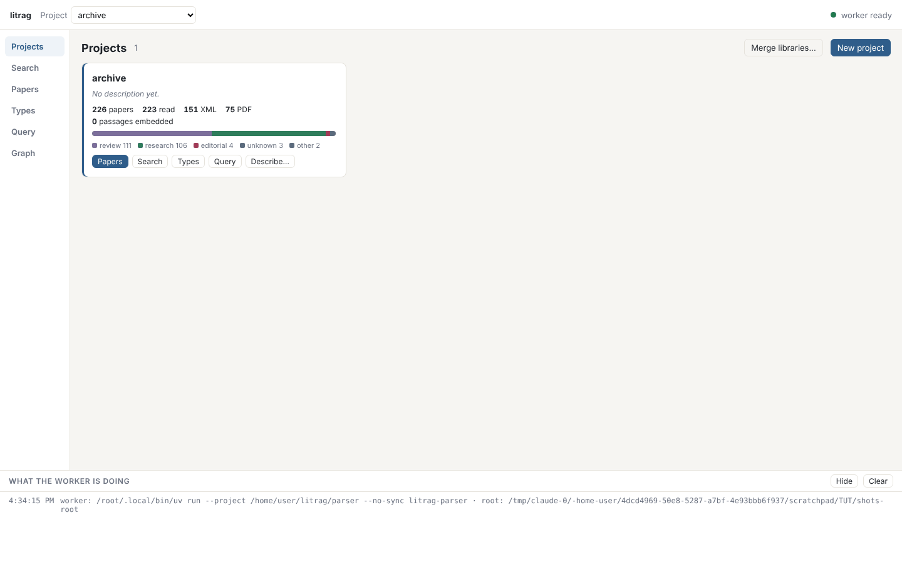

2. Read the card. The archive card shows:
   - its name, "archive", then "No description yet." in italics;
   - 226 papers, 223 read, 151 XML, 75 PDF, 0 passages embedded;
   - a bar of paper types, largest first: review 111, research 106, editorial 4, unknown 3, other 2. Hover a segment for its count.

   Three counts appear only when not zero: **failed**, **candidates** and **need a PDF**. A candidate is a paper a search or a citation round found for the project (see Finding and fetching papers). After a search, a line such as "2 searches · last: electrochemically aligned collagen tendon" follows the bar. The current project's card has a coloured left edge.
3. Click **New project**. A form opens above the cards, with the cursor in **Name**.
4. Type a name, for example "Looped ligament". In **What it is about**, write a few lines on the research question, the materials and the methods.

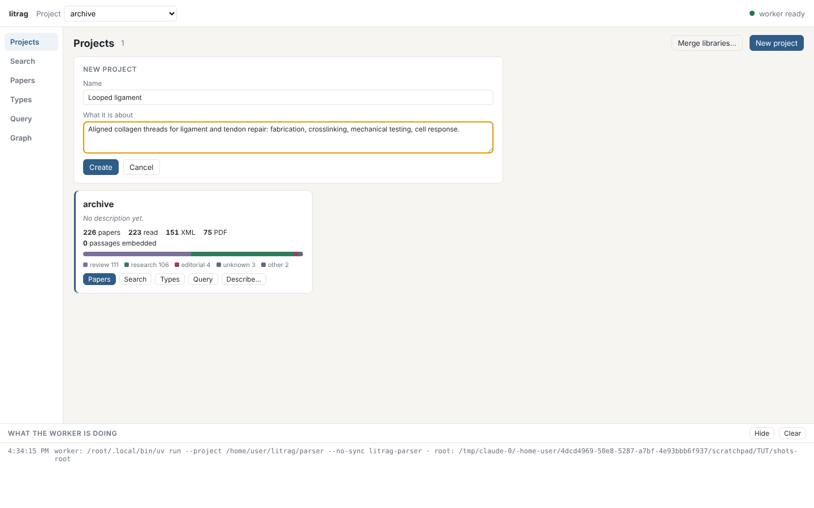

5. Click **Create**. The form closes, the log says "Created project looped-ligament", and a new card appears with 0 in every count and no type bar. The **Project** picker in the header switches to it.
6. Switch projects with the **Project** picker, or click a card to open its **Papers**. The card's buttons open **Papers**, **Search**, **Types** or **Query** for that project. There is no Graph button. Switching clears the Papers tab's selection and filters.
7. To combine projects, click **Merge libraries…**. The form lists every project with a checkbox and its paper count, for example "archive (226)".

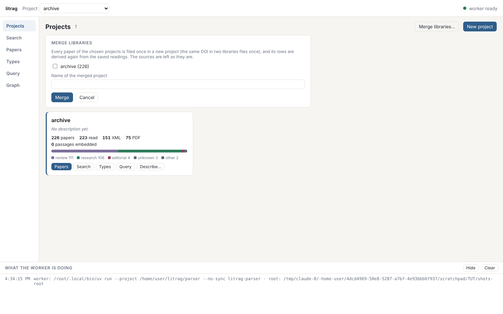

8. Tick two projects or more, type **Name of the merged project**, and click **Merge**. With fewer than two ticked, an alert says "Choose two projects or more, and name the merged one."
9. The bar in the header reads "Merging 2 libraries", then "Merging libraries", then "Deriving the rows again: mini-merged". A merge of two two-paper projects sharing one paper logged "Merged into mini-merged: 3 papers filed, 1 already there, 3 rebuilt". The merged project becomes current.

### What the description is for

Beyond the card, the description feeds **Suggest from the project** on the Search tab. That button sends the description and the searches already run to the local model (Ollama) and gets back Europe PMC queries (see Finding and fetching papers). With no description it answers "The project has no description to draft queries from: describe it first." Write it in **New project**: in this version the window offers no other place.

### Renaming, describing and removing a project

The window has no rename and no delete. The card's **Describe…** button does not work in this version: it asks for a browser prompt that Electron does not provide. No dialog opens; the log shows the error in red.

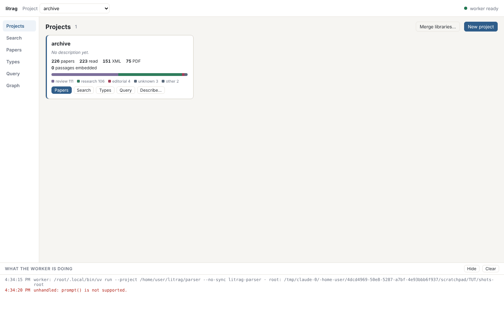

The workarounds:

- **Describe** a project with a `describe` request to the worker, or edit `description` in its `library.json` with the app closed. With the app open, choose **View › Toggle Developer Tools**, open its Console and type `await window.litrag.request('describe', { lib: 'archive', description: '…' })`. From a script, send the same request (see Driving litrag from an assistant or script).
- **Rename** it with the same request and a `name`. The id and the folder never change. An empty name, or one another project uses, is refused.
- **Remove** it by quitting the app and moving its folder out of the library root: the worker lists only folders holding a `library.json`. Nothing in litrag deletes a project.

```json
{"op":"describe","lib":"archive","description":"The 226-paper archive beside the checkout."}
{"op":"describe","lib":"archive","name":"Archive of 226"}
```

Each answers with a `project` event carrying the card's summary.

### What happens underneath

A project is a folder under the library root, named by its id:

```
~/.protracker/library/
├── lanes.sqlite            verdicts shared by every project
└── looped-ligament/
    ├── library.json        the manifest
    ├── store.sqlite        the rows
    ├── papers/             the paper files
    ├── parsed/             the raw Docling readings
    └── inbox/              where fetched files land before they are filed
```

The root is `LITRAG_ROOT`, else `PROTRACKER_LIBRARY`, else `~/.protracker/library`.

The id is made from the name once, at creation. Accents fold to plain letters, and letters with no plain form (Ø, ß, Greek, CJK) are dropped. The rest is lower-cased, each run of other characters becomes a hyphen, and the result is cut to 60 characters. "Ligament Ø résumé" becomes `ligament-resume`; a name that leaves nothing becomes `library`. A new project is refused when its id matches an existing project's id, name or notebook id.

The `projects` request builds the cards: it reads each manifest and counts each `store.sqlite` without writing. The window sends it each time you open the tab and after every finished job, so the counts follow the work. The picker lists projects by name. The current project is the one you chose, else the one remembered from last time, else the first by name: not the newest.

A merge only reads its sources. Each paper is filed once: by DOI (case ignored), then PMID, then file hash. The window sends the sources in name order, and when two hold the same paper the first copy is kept. A new paper brings its file, its raw Docling reading, its record, the model's stored answers, its method-link labels and its figure numbers. The worker then derives its rows again with `rebuild`, without Docling. A paper that comes without a finished reading is read again with Docling. Candidates come once each. The manifest gets every source's searches and a `mergedFrom` list.

Every project has an `inbox/`: a landing place, not a watched folder. Fetches from the Search tab and **Collect PDFs** download into it, and filing moves each file on into `papers/`. A file you put there by hand is not read. Drop it on the window instead, or use **Add papers…** on the Papers tab.

### library.json

The manifest is written sorted and indented. Here is Looped ligament after two searches, each shown on one line:

```json
{
  "createdAt": "2026-10-08T16:27:27Z",
  "description": "Electrochemically aligned collagen threads looped into ligament grafts: crosslinking, mechanics, cell response.",
  "id": "looped-ligament",
  "includes": [],
  "name": "Looped ligament",
  "queries": [
    {"query": "electrochemically aligned collagen", "at": "2026-10-08T16:28:54Z", "total": 446, "added": 5},
    {"query": "electrochemically aligned collagen tendon", "at": "2026-10-08T16:28:54Z", "total": 103, "added": 5}
  ],
  "updatedAt": "2026-10-08T16:27:27Z"
}
```

| field | what it holds | written by |
| --- | --- | --- |
| `id` | the id; the folder's name is what counts | New project, Merge |
| `name` | the name shown everywhere | New project, Merge, `describe` |
| `description` | the research context | New project, `describe` |
| `createdAt` | when it was made, in UTC | New project, Merge |
| `updatedAt` | the last description or rename | New project with a description, `describe` |
| `queries` | every search run: `query`, `at`, `total`, `added` | each search; a merge unites the sources' |
| `mergedFrom` | the ids a merge drew from | Merge |
| `projectId` | the notebook's project id | an `init` request only |
| `includes` | always `[]` | New project, Merge |

- **Saved searches.** There is no Save button: every search from the Search tab is appended to `queries`. They return on the card and as the Search tab's "Searches so far:" chips, the last 12 distinct ones; a click runs one again.
- **Includes.** Nothing in the window or the worker reads `includes`; only the deprecated `lit` CLI does. To draw on another project's papers, merge them.

### Projects and the research notebook

The research context lives in Protracker's notebook; litrag keeps the papers. Nothing in the window or the worker calls Protracker. They meet in three places:

- **One folder.** The default root `~/.protracker/library` is where the app and the notebook agree to look.
- **The description**, which carries the research context into the project.
- **The notebook id.** `projectId` holds the notebook's project id, for example `n156`. Only an `init` request sets it: `{"op":"init","name":"Pilot","projectId":"n156"}`. Any request can then name the project as `"lib": "n156"`. The window neither sets nor shows it.

### Good to know

- **Names that fold to the same id collide.** "looped LIGAMENT" after "Looped ligament" is refused: "A library with that id already exists: looped-ligament". So is a second name in Greek or CJK alone, since both get the id `library`. Change a word, or add a Latin word or a number.
- **Two projects can share a name.** A project renamed through the worker keeps its old id, so **New project** with that name makes a second one. The picker then shows the name twice. Rename one of them through the worker.
- **The card has no count for papers waiting to be read.** The archive card counts 226 papers and 223 read: the other three are PDFs left queued, visible only as "unknown 3" in the type bar. Find them on the Papers tab by their grey QUEUED badge (see The Papers tab).
- **A failed merge says so only in the log.** The form closes once the worker accepts the job. A name already taken comes back later as a red log line, with no alert. Pick another name and merge again.
- **A merge does not bring embedded passages.** Click **Embed passages** on the merged project's Query tab, with Ollama running.
- **A merge sets fetched candidates back to found,** because inbox files are not carried. Those whose paper the merged project holds are marked "in library" again; fetch the others again if you want them.
- **"N searches" counts runs.** Running a query again, or clicking **More results**, adds an entry. The Search tab's chips show each query once.

## Finding and fetching papers

The Search tab is where a library grows from a search. You ask Europe PMC for papers, every hit becomes a candidate, and you fetch the ones you want. For a paper with nothing open, the collect window helps you download it yourself. Files already on your disk come in by drag and drop or **Add papers…**.

### Try it

1. Choose the project in **Project** at the top left and click **Search** in the side bar. Chips after "Searches so far:" list the project's earlier queries; a click runs one again.
2. Type a Europe PMC query and press Enter or click **Search**. For `aligned collagen tendon scaffold` the count beside **Results** read "25 of 3,000".
3. Read a hit: its title, a byline, the start of the abstract, then pills and links.
   - **Byline:** the first three authors, "…", the last author, then journal, year and DOI. An author your query names is shown too, in bold. Hover the byline for every author.
   - **Status pill:** found, staged, fetching…, fetched, needs PDF, in library, failed or dismissed. Hover a "needs PDF" or "failed" pill to read why.
   - **Availability:** "open XML", "open PDF" or "no open full text".
   - **Links:** **publisher**, **Europe PMC**, and **open copy** when OpenAlex names one. They open in your own browser.
4. Look at **Candidates** on the right: every hit is already one. **this search 25** and **every search 25** switch between this search's hits and the project's. Status chips such as **found 24** filter by the stored status, so **ingested 1** counts the hits marked "in library". A paper the library holds is marked so at once and cannot be ticked.

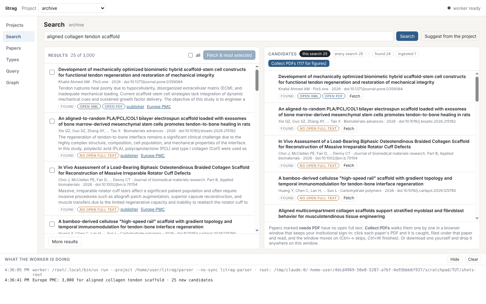

5. Tick the hits you want, or tick **all** for every hit that can be fetched. **Fetch & read selected** becomes **Fetch & read 1**.
6. Click **Fetch & read 1**. The pill turns "staged", then "fetching…". The header shows "Fetching 1 of 1" with a bar, and the log says what a fetch tries.

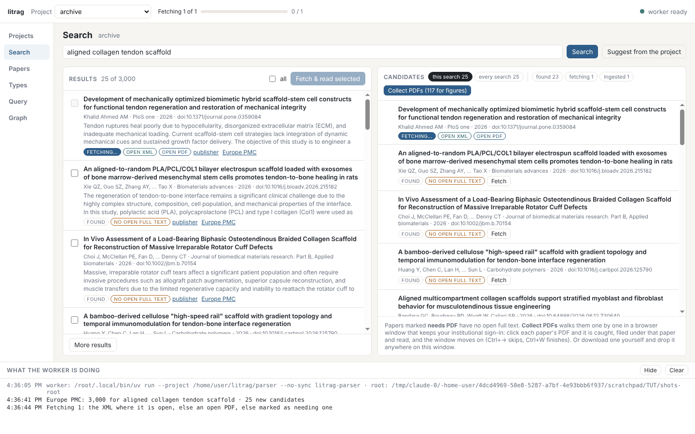

7. Wait a few seconds. The pill turns "in library" as soon as the paper is filed, before it is read. The header switches to "Reading paper 1 of 1". The log says "filed as new" for the XML and "seen before" for its PDF, which is kept for the figures. Then it follows the reading (see How a paper is read).

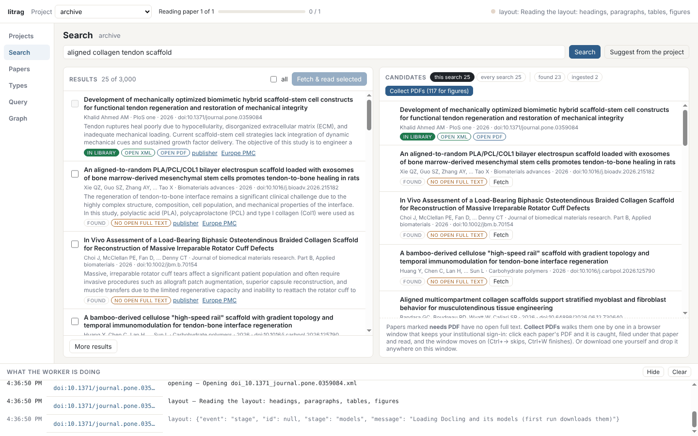

8. Click **More results** for the next 25 hits. A candidate that can be fetched has its own **Fetch** button. One marked needs PDF or failed also shows its links.

The paper fetched here, "Development of mechanically optimized biomimetic hybrid scaffold-stem cell constructs…", was read from its XML in 4.2 s. The charts in its 16 figures, read from the PDF, took 390 s on CPU.

### Europe PMC's query syntax

Your query goes to Europe PMC unchanged.

| You write | It finds |
| --- | --- |
| `collagen AND dehydrothermal` | both words; `OR`, `NOT` and parentheses work too |
| `"aligned collagen"` | the exact phrase |
| `AUTH:"Cauwenberghs G"` | an author; a bare name matches anywhere in the text |
| `TITLE:electrocompacted`, `ABSTRACT:…`, `JOURNAL:…` | a word in that field |
| `PUB_YEAR:[2020 TO 2026]` | a range of years |
| `AUTH_MAN:Y` | author manuscripts only |

### Suggest from the project

**Suggest from the project** asks the local model, through Ollama, for six queries drafted from the project's description. They appear as chips under the query box, and a click runs one. It needs Ollama running `qwen3:14b`, or the model named by `LITRAG_SUGGEST_MODEL` (else `LITRAG_JUDGE_MODEL`).

- Without a description it answers "The project has no description to draft queries from: describe it first."
- Without Ollama it answers "The local model did not answer (URLError): is Ollama running with qwen3:14b?"

In this version only **What it is about** in **New project** sets a description from the window (see Projects).

### The acquisition routes

A fetch tries each route in order and stops at the first that gives the paper. Routes 1 to 4 ask by PMCID alone.

| # | Route | Asked when | What it fetches |
| --- | --- | --- | --- |
| 1 | Europe PMC full text | a PMCID, open access in Europe PMC | the JATS XML |
| 2 | NCBI PMC | any PMCID route 1 did not serve, such as an NIH author manuscript | PMC's own JATS XML, if it has a body |
| 3 | PMC Cloud Service | any PMCID | the open-access PDF, checked against its MD5 |
| 4 | Europe PMC bulk area | a PMCID, open access or flagged with a PDF | the PDF, from EBI's zip |
| 5 | Open copy | OpenAlex names one at a publisher's or repository's host | that PDF, kept only if its first three pages print the paper's DOI or whole title |

OpenAlex names open copies for candidates a citation round has met (see The citation graph). With an XML, the paper's PDF is fetched too, from route 3 or 4, for its figures (see Figures as numbers). `LITRAG_FIGURES=off` stops that; `LITRAG_OPEN_COPIES=off` skips route 5.

When every route misses, the candidate needs a PDF, and its error lists each route's reason. When Europe PMC, NCBI or the Cloud Service could not be reached, it is "failed" instead: fetch it again later. A bot check ends route 5 with "the site asks for a browser (a bot check)".

### Collect PDFs

The collect window walks you through the papers no route could fetch, then the XML papers that want a PDF for their figures. It is a browser window that keeps your institutional sign-in from one run to the next.

1. Click **Collect PDFs** at the top of **Candidates**. Its label counts what waits: "Collect PDFs (2 + 117 for figures)" means two candidates need a PDF and 117 XML papers want one for their figures. In the screenshots it read "Collect PDFs (117 for figures)". A fetch that leaves a paper needing a PDF opens the window by itself.
2. The window is titled "Collect 1 of 117" and the paper's title. It opens the open copy, else the DOI's publisher page, else PubMed, else Europe PMC. Candidates come first, most cited first.

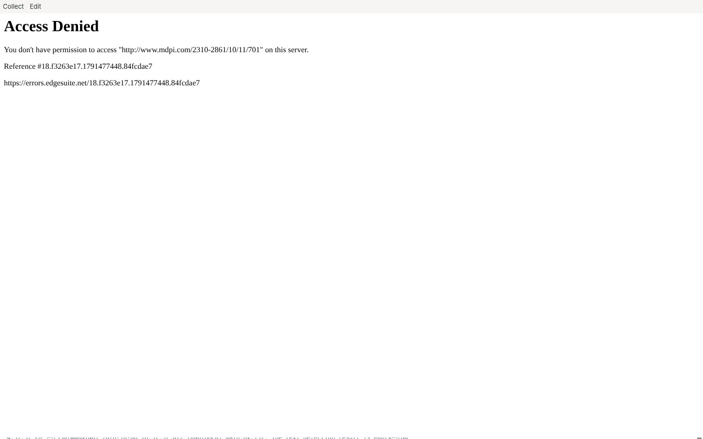

3. Sign in, pass any bot check yourself, and click the PDF once. As soon as the download starts, the window moves to the next paper. The file lands in `inbox/` under the paper's key and is sent to be read at once.
4. Steer with the **Collect** menu:

| Key | Menu item |
| --- | --- |
| Ctrl+→ | Skip this paper |
| Alt+← | Back (the previous page) |
| Ctrl+Home | Reopen the paper’s page |
| Ctrl+W | Finish collecting |

5. On the Search tab the button reads **Collecting…**, and a box shows "Paper 1 of 117", "0 caught · 0 skipped" and the title. A download that is not a PDF is deleted: "what came back is not a PDF (a sign-in page?)".

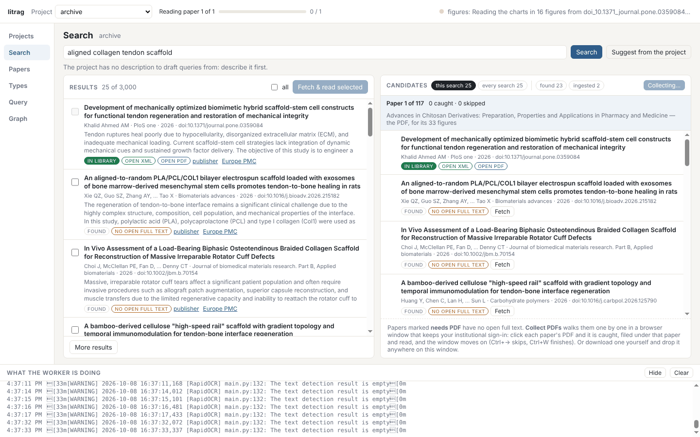

6. Press Ctrl+W or close the window. The box reads "Collect window closed" and the log gives the totals, such as "collect: 0 caught, 0 skipped of 117".

### Adding papers from disk

Click **Add papers…** on the Papers tab and pick PDF or XML files in the "Papers to ingest" dialog. Or drag files onto the window, on any tab, and let go.

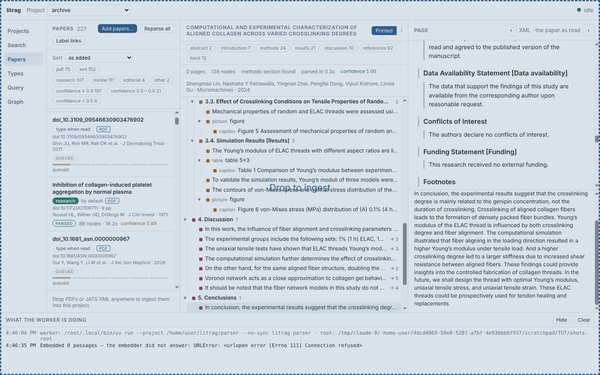

Only `.pdf` and `.xml` files are taken. Each gets a card on the Papers tab as soon as it is filed. The card is titled with the paper's file name, such as `doi_10.1371_journal.pone.0359084.xml`, until its tree arrives. A PDF you downloaded for a candidate is filed by the DOI it prints, and the candidate turns "in library".

**The inbox.** Fetches and Collect save into the project's `inbox/` until filing moves each file to `papers/`. A file whose paper was already read stays there. Nothing watches the folder: a file you copy there by hand is not read until you add it.

### Filed once

litrag looks each file up by DOI, then PMID, then the SHA-256 hash of its bytes. A new paper gets the first key that applies:

| Key | When |
| --- | --- |
| `doi:10.1371/journal.pone.0359084` | the paper has a DOI |
| `pmid:<PMID>` | no DOI, but a PMID |
| `pmcid:<PMCID>` | only a PMCID |
| `sha:3dff2322dd28323c` | no identifier: the first 16 hex digits of the hash |

Identifiers come from a JATS file's `article-id`, or a PDF's first two pages. Failing those, litrag reads a file name like `doi_10.1177_03635465221097939.pdf` or `PMC11398025.pdf`, then the candidate a fetch or Collect was for. Last, unless offline, it searches Europe PMC for the PDF's title and keeps a single exact match.

A file matching a paper already filed is logged "seen before". A paper already read stays as read; one never read is read now. A PDF of a paper held as XML is kept for its figures. `reread` replaces a reading (see How a paper is read). A script sees `existed: true` on the file's `paper` event, and `kept: true` when the earlier reading stays.

In the example library all but two papers are keyed by DOI. Ten files were "seen before", such as `sha_1dd0042a73ce0afe.pdf`, the same bytes as `doi_10.1177_03635465221097939.pdf`: 236 files made 226 papers.

### What happens underneath

A search files each hit in the `candidates` table of `store.sqlite`, unique by DOI, PMID, PMCID or OpenAlex id. A hit seen before keeps its status. The query is noted in the project's `library.json`, which feeds "Searches so far".

Each time the window loads the candidates, the worker marks those the library holds `ingested`. The window reloads them after every filed paper, so "in library" shows before the reading ends.

A fetch runs on the worker's one reading thread, behind any ingest or reparse. Its files are then ingested like dropped ones, the XML before its PDF. `candidate` events move the pills.

The window has no offline switch. An `ingest` request can carry `"offline": true`, which skips the title search and the Europe PMC record. With no network, Search fails with an alert and Fetch marks PMCID candidates "failed". Ingest still works, but a PDF it cannot identify by itself gets a `sha:` key.

### From a script

```json
{"op":"search","lib":"archive","query":"TITLE:electrocompacted AND collagen","size":10}
{"op":"fetch","lib":"archive","ids":[11,9]}
{"op":"wanted","lib":"archive"}
{"op":"dismiss","lib":"archive","ids":[4]}
{"op":"ingest","lib":"archive","paths":["/path/to/paper.pdf"],"offline":true}
```

`size` runs from 1 to 1000. `dismiss` sets candidates aside and `stage` takes them back; neither has a button. A fetch sends a `done` for its inner ingest first: wait for `"op":"fetch"` (see Driving litrag from an assistant or script).

### Good to know

- **"open PDF" is Europe PMC's flag.** It says a rendered PDF exists, not that one can be fetched. If a fetch leaves such a hit needing a PDF, use **Collect PDFs**.
- **Works a citation round found wait on the Graph tab.** **Candidates** leaves out a work a round found and nobody has fetched, unless your search found it too. A chip ending in **from citation rounds →** counts them, except while **this search** is on. Click it to open the Graph tab, where the **Next round** preset lists them.
- **One closed paper opens a long walk.** The collect window also lists every XML paper wanting a figures PDF. Take the ones you came for and press Ctrl+W.
- **Click a PDF link once.** A second download from the same page is saved under the next paper's name, and the walk skips past that paper. Run **Collect PDFs** again for it.
- **Bot checks are left to you.** From a cloud machine, 77 of 100 open-copy links answered with one. Use **Collect PDFs**, where your own browser is let in.
- **A fetch waits its turn.** It shares one thread with reading. Behind a paper whose figures take 390 s, or **Reparse all**, it does not start until that work ends.
- **Keep the window open until the status reads idle.** Closing it stops the worker and loses queued work. A paper left "queued" is not picked up at the next start: add its file again, from the project's `papers/` folder if need be.
- **A PMID in a file name is not read.** `pmid_6881287.pdf` prints no identifier and its title search failed, so it became `sha:3dff2322dd28323c`. Name such files `doi_<DOI with / as _>.pdf` or `PMC<n>.pdf` before adding them: no op rekeys a paper later.
- **Filing compares DOIs letter for letter.** A PDF printing its DOI in capitals files a second paper beside an XML giving it in lower case. Look for twins on the Papers tab: no op joins them later.

## How a paper is read

Reading turns a file into rows you can browse and query. A PDF or a JATS XML goes in. A tree of headings, paragraphs, figures and references comes out. Each piece of it is a node. Each node carries its lane, the part of the paper it sits in, such as methods or results. A PDF's nodes also keep their page and box. You watch it on the Papers tab each time you add or fetch a paper.

### Try it

1. Choose the project in **Project** and open **Papers**. Click **Add papers…** and pick a PDF or XML file, or drop files on the window. When the worker has filed the paper, its card appears: the file name as title, the key, a **queued** badge and a bar of six steps.

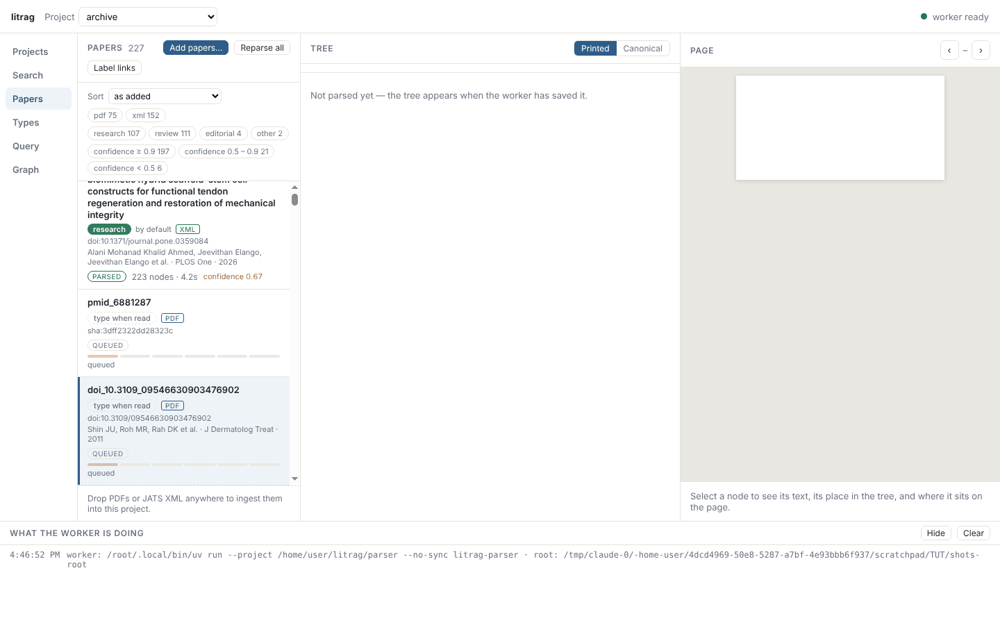

2. Watch the card. The badge turns **parsing** with the stage and its seconds, and the steps fill in. Hover one for its name: **queued**, **opened**, **layout (Docling)**, **text layer recovered**, **tree built, lanes assigned**, **saved**. The header shows **Reading paper 1 of 1** and, top right, the latest stage. The log pane, **What the worker is doing**, adds a line per stage.

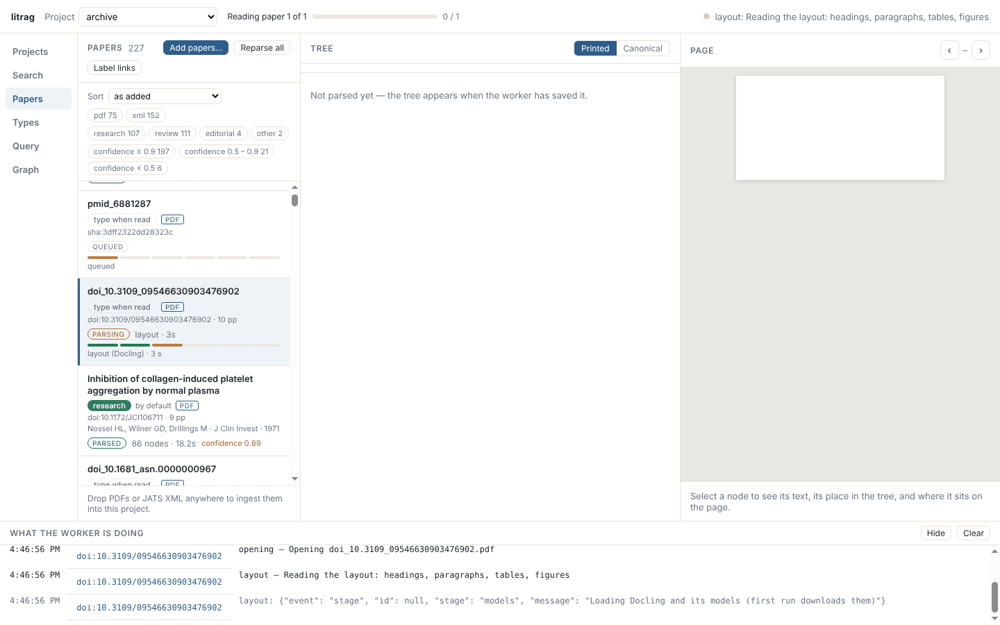

3. While a PDF's figures are read, the badge says **parsing** and **figures**, but the step label falls back to **queued**. The tree pane still says "Not parsed yet", though the tree is saved: it opens once the badge turns parsed.

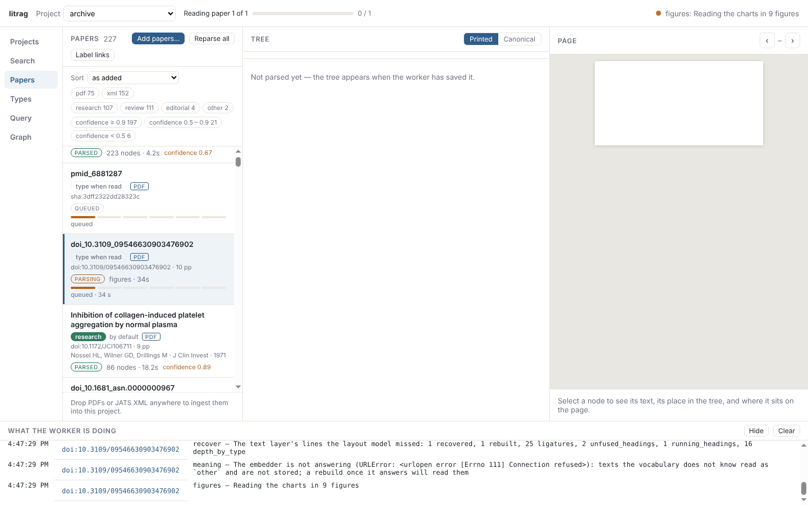

4. When the last stage is done the badge turns **parsed**. The card shows the paper's own title, its type, its node count and seconds, a confidence chip and a bar of its lanes. A selected paper's tree and first page open on their own.

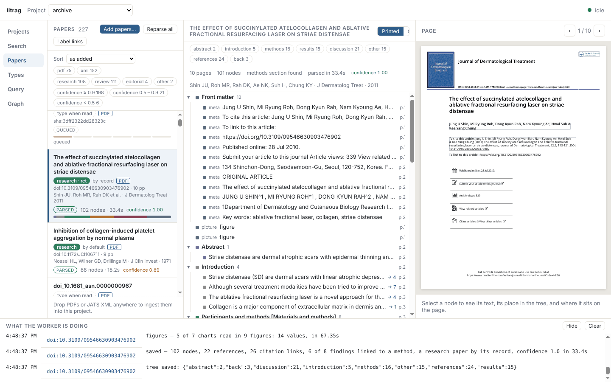

5. Hover the confidence chip to read why it is below 1.00. A paper with no methods lane also carries the flag **No methods section detected**.

The paper shown is a 10-page PDF, "The effect of succinylated atelocollagen and ablative fractional resurfacing laser on striae distensae" (2011). Its tree was saved after 33.4 s; its figures took 67 s more.

### What happens underneath

Filing comes first. The worker reads the file's identifiers; a PDF that prints none is looked up on Europe PMC by its title. The file is copied into `papers/` under its key: `doi:…`, else `pmid:…`, `pmcid:…`, or `sha:` and 16 hex digits of its hash. A new paper's Europe PMC record is fetched once.

Then come the stages, in this order. Each is a `stage` event in the window and a row in `events`. The messages are the striae paper's where it showed them.

| Stage | What it does | What you see |
| --- | --- | --- |
| `opening` | Marks the paper `parsing`; counts a PDF's pages | "Opening doi\_10.3109\_09546630903476902.pdf" |
| `layout` | Docling reads the file in a child process and writes its raw document to `parsed/` | "Reading the layout: headings, paragraphs, tables, figures", the seconds ticking |
| (models) | First paper the layout child reads: Docling loads its models. Not stored in `events` | A raw JSON log line from `layout`: "Loading Docling and its models (first run downloads them)" |
| `tree` | Starts the tree build, with Docling's counts of texts, tables and pictures | "Building the tree and assigning facets" |
| `judge` | Only when asked: a local model reads the page breaks the rules leave open | "Reading adjacent blocks with \<model>" |
| `recover` | PDF only: the text layer and the type on the page read back | "The text layer's lines the layout model missed: 1 recovered, 1 rebuilt, 25 ligatures, 2 unfused\_headings, 1 running\_headings, 16 depth\_by\_type" |
| `outline` | Only when asked: a local model reads the whole paper for its outline | "Reading the whole paper for its outline with \<model>" |
| `embedded` | Only when Ollama answers: passages embedded for Query | "\<n> passages embedded for search" |
| `meaning` | Once per worker, when the embedder does not answer | "The embedder is not answering (…): texts the vocabulary does not know read as `other` and are not stored; a rebuild once it answers will read them" |
| `figures` | A PDF's charts read into numbers (also a PDF kept beside an XML) | "Reading the charts in 9 figures", then "5 of 7 charts read in 9 figures: 14 values, in 67.35s" |
| `saved` | Everything stored | "102 nodes, 22 references, 26 citation links, 6 of 8 findings linked to a method, a research paper by its record, confidence 1.0 in 33.4s" |
| `failed` | A stage raised; the reason is kept in `papers.error` | The reason, and the card turns **failed** |

### Two paths: JATS XML and PDF

Both formats go through Docling, in a child process the worker keeps, then through the same tree builder. A crash or a timeout (`LITRAG_LAYOUT_TIMEOUT`, 300 s by default) earns one retry in a fresh child, announced by a second `layout` line. A second failure fails that paper only, never the papers queued behind it.

|  | JATS XML | PDF |
| --- | --- | --- |
| Before Docling | MathML formulas get a line of text, numeric citations are bracketed ("\[1,2\]"), section labels join their titles | Nothing |
| Docling | Its JATS reader takes the structure the file states | Its layout model finds headings, paragraphs, tables, pictures and captions, and structures the tables. Its OCR is off |
| After Docling | Nothing | The text layer read back (lines the model missed, split ligatures, empty formulas, glued sidebars) and the type on the page (headings run in or fused, each heading's depth) |
| Pages and boxes | None | Every node keeps its first page and its box in PDF points (`page`, `bbox_l` to `bbox_b`), which the Papers tab draws. Not the root, nor the reader-made "Front matter" section |
| OCR | Only for the figures of a PDF kept beside it | Only at `figures`: RapidOCR reads the words inside figure images, on this machine |

### The node tree

Every node is a row in `nodes`. Its id is its path, each step a type and a place among the parent's children. `doi:10.1002/jbm.a.36102#section-4#section-1#paragraph-1` is the first paragraph of the first subsection of the root's fourth child, "MATERIALS AND METHODS". The node types are `document` (the root, holding the title), `section`, `paragraph`, `list_item` (reference entries too), `table`, `picture`, `caption`, `formula`, `footnote`, `code` and `meta`.

- **Headings and levels**: numbering wins ("2.1" is level 2). A core heading such as "Methods" is top level. In a PDF, other headings take their depth from how prominently they are set. In an XML, the file's own nesting stands.
- **Front matter**: lines on the first two pages before the first known heading go under a reader-made "Front matter" section. Each is a `meta` node typed `authors`, `affiliations`, `dates`, `correspondence`, `keywords`, `funding`, `notice` (licence, citation line, publisher furniture), `abstract` or `other`. Rules type it first, the embedder second.
- **Built headings**: prose after the abstract that no heading claims gets an "Introduction" labelled `built`. With the embedder, a paper that prints no headings is cut into runs, each under a built heading. All seven built headings in the example library are Introductions.
- **Untitled sections**: a lost heading is never a silent merge. Prose after the reference list that is not an entry becomes "(untitled section)", like the author biographies closing `doi:10.1002/adma.202416260`. A "3.2" that arrives with no "3." read gets a stand-in "3. (heading not detected)".
- **Paragraphs across breaks**: a paragraph cut at a page or column break is joined to its rest when the words say so (an open bracket, a lowercase start, a trailing "and") or the page geometry does. The join reaches across a figure or table between the halves. Blocks read out of order within one column are put back. Where the rules are silent the halves stay apart, unless you ask the judge. The judge is a local model that reads both halves and says whether they are one paragraph (see Types).
- **References and citations**: entries in the references lane become `refs` rows. An XML's entries carry their own DOI and PMID; a PDF's are read from the entry's text. Markers in the prose (brackets, superscripts, author and year) become `citations` rows. A marker that names no entry stays unlinked.

### Lanes

Each node takes the lane of the top-level section above it. The store calls it `role`, and "assigning facets" in the `tree` stage message means assigning lanes. In the striae paper "Assessment of clinical effect" names no lane, but it sits under "Participants and methods", so it is methods. A back-matter heading set deeper is back wherever it sits.

| Lane | Headings that name it, for example |
| --- | --- |
| `abstract` | Abstract, Summary, Synopsis |
| `introduction` | Introduction, Background, Main text |
| `methods` | Materials and methods, Methods, Experimental section, Participants and methods, Study design |
| `results` | Results, Findings |
| `results-discussion` | Results and discussion |
| `discussion` | Discussion, Conclusions, Limitations, Outlook |
| `references` | References, Bibliography, Literature cited |
| `back` | Acknowledgements, Funding, Author contributions, Conflicts of interest, Data availability, Supplementary material, Ethics statement, Abbreviations, Keywords |
| `other` | Everything not named: topical headings such as "2. Overview of Gelatin", and the Front matter section |

A top-level heading is named rules first:

1. **The vocabulary** (`facets.py`) names it when the whole heading, numbering stripped, matches a known form: "3. Materials and Methods:" is methods.
2. **The catalogue** (`headings.py`) names exact spellings the vocabulary lacks: "Declaration of competing interest" is back. For the introduction, methods, results and discussion it also names families: "5 Corneal Implants and the Clinical Perspective" is discussion.
3. **The embedder** (`meaning.py`, nomic-embed-text through Ollama) names it by resemblance. It answers only when the nearest lane is near enough and clearly nearer than the next.

If the embedder names nothing, a short heading carrying "methods" and no results or discussion word is still methods. Anything else is `other`, never a guess. Front matter is not a lane: its lines sit in `other`, and the Canonical face and the Types tab show them in a `front` slot.

### Confidence

Every reading gets a number above 0 and at most 1, with the reasons it is not 1. It starts at 1.0, and each check that fires takes a share. It flags a reading; it changes nothing. On 199 papers held as both PDF and XML, four readings in five at 0.9 or more matched their XML well; under 0.5, five in six were seriously off. The chip is coloured by these bands. Its tooltip lists the reasons, heaviest first.

| Check | Fires when | The reason reads |
| --- | --- | --- |
| abstract | the abstract holds more than 10% of the prose | "the abstract holds N% of the prose: the body began with no heading the reader knew" |
| back | back matter holds more than 20% of the prose | "N% of the prose lies in back matter" |
| references | long paragraphs in the reference list pass 2% of the prose | "N% of the prose lies in the reference list as paragraphs too long to be entries" |
| introduction | the introduction is the largest lane, past a third of the body | "the introduction holds N% of the body: the sections after it were read as its children" |
| methods | the methods are the largest lane, past 45% of the body | "the methods hold N% of the body: a heading after them was missed" |
| discussion | a review's discussion is its largest lane, past 55% | "the discussion holds N% of a review's body" |
| missing | a lane the paper's type should have is absent (research: introduction, methods, results, discussion) | "N of the lanes a paper of this type has are missing" |
| repeats | more than 4% of the text appears twice | "N% of the text is there twice" |
| cut | more than 10% of the paragraphs end without a full stop | "N% of the paragraphs end without a full stop: cut in two" |
| headings | more than two headings look like bullets, sentences or two fused | "N headings are not headings: a bullet, a sentence, two fused" |
| type | no source settles what kind of paper it is | "no source says what kind of paper this is, and its shape does not either" |

The lowest in the example library is a 1996 ASAIO Journal PDF, `doi:10.1097/00002480-199609000-00075`, at 0.063. Three lanes are missing, the methods hold the whole body, the abstract holds 63% of the prose, and a quarter of the paragraphs are cut.

### How long it takes

| What | Time on this CPU-only machine |
| --- | --- |
| A JATS XML | under a second: 0.7 s on average |
| A PDF | tens of seconds: 24.7 s on average, from 1.3 s to 166 s |
| The first paper after the worker starts | also waits for Docling to load its models: up to a minute |
| A PDF's figures | after the tree is saved, and left out of the card's seconds: 67 s for the striae paper's 9 figures |

### What is stored

| Where | One row per | Holds |
| --- | --- | --- |
| `papers` | paper | key, format, pages, status, error, seconds, has\_methods, type, confidence and its reasons |
| `pages` | PDF page | page number, width, height |
| `nodes` | node | id, parent, type, label, level, role, heading, ancestry, text, page, box, `self_ref` into the raw document |
| `refs` | reference entry | number, text, DOI, PMID, year, first author |
| `citations` | marker | citing node, entry number, marker as printed |
| `events` | stage or note | paper, time, stage, message |
| `parsed/<key>.docling.json` | paper | Docling's raw document, never edited. The key is written with `_` for `:`, `/` and the like, as in `doi_10.1002_jbm.a.36102.docling.json` |

The raw document is kept so the rows can be derived again without Docling, when the tree builder changes or Ollama becomes available.

### Reading again

|  | How to ask | Docling? | Use it when |
| --- | --- | --- | --- |
| `rebuild` | No button: `{"op":"rebuild","lib":"archive"}`, `keys` optional | No: rows from `parsed/`, the PDF's text layer read again, charts kept. About a second a paper | The reader changed, or Ollama is back |
| `reparse` | **Reparse all** on the Papers tab, or `{"op":"reparse","lib":"archive","keys":["doi:10.1002/jbm.a.36102"]}` | Yes, on the stored file, every stage | Docling or its models changed; a paper left queued |
| `reread` | No button: `{"op":"ingest","lib":"archive","paths":["<file>"],"reread":true}` | Yes, on the new file, which replaces the stored one | You have a better copy of a paper |

Adding a paper already read changes nothing: the log says "seen before". **Reparse all** asks "Read all N papers again with Docling?" first. A rebuild visits only parsed papers whose raw document exists, and sends no stages: only progress and a `tree` event per paper. From a shell in the checkout, with the app closed so that only one worker writes:

```
uv run --project parser --no-sync litrag-parser --root=$HOME/.protracker/library
{"id":"1","op":"rebuild","lib":"archive"}
{"id":"2","op":"quit"}
```

### Good to know

- **The steps run out of order.** `tree` starts before `recover`, so a PDF's bar reaches "tree built, lanes assigned" and falls back. During `figures` and `meaning` the label reads "queued". Trust the badge and the status top right.
- **In a batch, a card just read shows "untyped" and no confidence chip** until the whole batch is done. The list then reloads with both.
- **Without Ollama**, headings neither the vocabulary nor the catalogue knows read as `other`, and no headings are built beyond "Introduction". The `meaning` stage says so once per worker, not per paper. Start Ollama, then rebuild.
- **A scanned PDF** with no text layer fails with "Docling read nothing from the file: no text, no tables", or gives a thin tree. Find the XML or a PDF with text.
- **A PDF of a paper held as XML is not read as text.** It is kept beside the XML for its figures. To replace the XML's reading with the PDF's, use `reread`.
- **JATS superscripts are glued to the word before** in most XML papers: "acquire1 H NMR spectra" in `doi:10.1016/j.jare.2025.05.059`. A search for "acquire" misses it. Query matches any of a question's words, so use several.
- **Some PDF reference entries lose their last line** when it carries the DOI, so the entry has no DOI to follow. Prefer the XML when Europe PMC has it.
- **Nature-family papers can lose their methods lane.** In `doi:10.1038/s41467-024-55476-4` (Nature Communications) "Methods" is empty and its subsections sit under "Ethics statement", in `back`. The chip reads 0.44: "48% of the prose lies in back matter". Read its methods under the back lane.
- **Some PDF words are split at a line end**: "a pre viously published protocol" in `doi:10.1002/jbm.a.36102`, though the raw document has it whole. A search for "previously" misses it.
- **The stage history is not shown in the window.** Read it on the Graph tab: replace the query in the **Ask in SQL** box with this one and click **Run**:

```sql
SELECT at, stage, detail FROM events WHERE paper = 'doi:10.3109/09546630903476902' ORDER BY id
```

- **A paper still queued when the window closes stays queued.** The app does not pick it up on start. Add its file again, or reparse its key.
- **A paper the worker was reading when it stopped** turns **failed**: "the worker stopped while reading this paper". Add it again or reparse it.

## The Papers tab

The Papers tab shows every paper of the current project as litrag read it. Come here to check whether a paper was read well, to find a passage on its page, to follow its citations, and to add papers by hand.

### Try it

1. Click **Papers** in the left rail. The tab shows the project chosen in the header's **Project** menu, in three panes: **Papers**, **Tree** and **Page**. The log, **What the worker is doing**, runs underneath. Until you pick a paper, the tree pane says "Pick a paper."

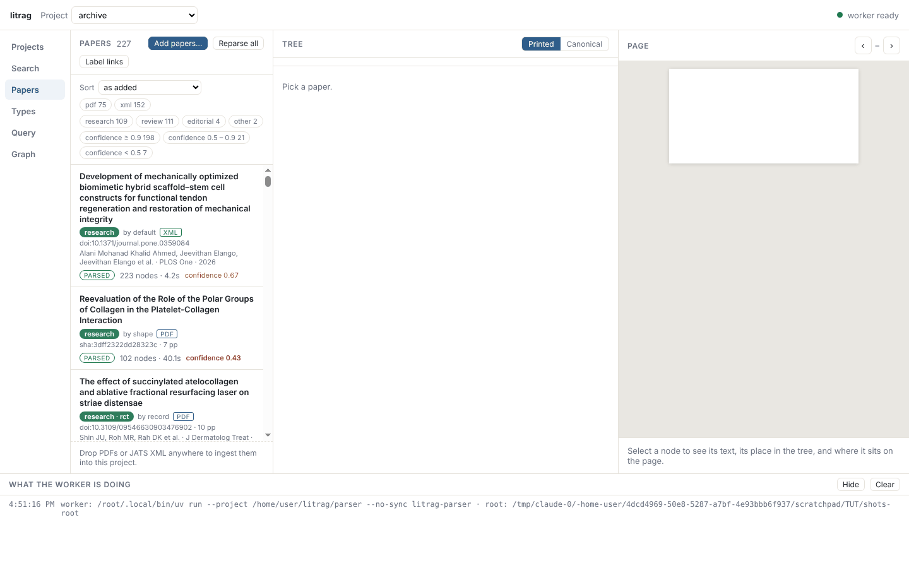

2. Read the cards: one per paper. The table after these steps names every part.
3. Hover the confidence on a card to see why the score is not 1. Green is 0.9 or more, orange 0.5 to 0.9, red under 0.5. On papers held in both formats, four readings in five at 0.9 or more were good; five in six under 0.5 were seriously off.
4. Narrow the list with the chips above it: format, type and confidence band, one row each. Click **other 2** and the count reads "5 of 227"; click it again to show every paper. Chips in different rows combine. Papers not yet read pass the type and confidence chips.

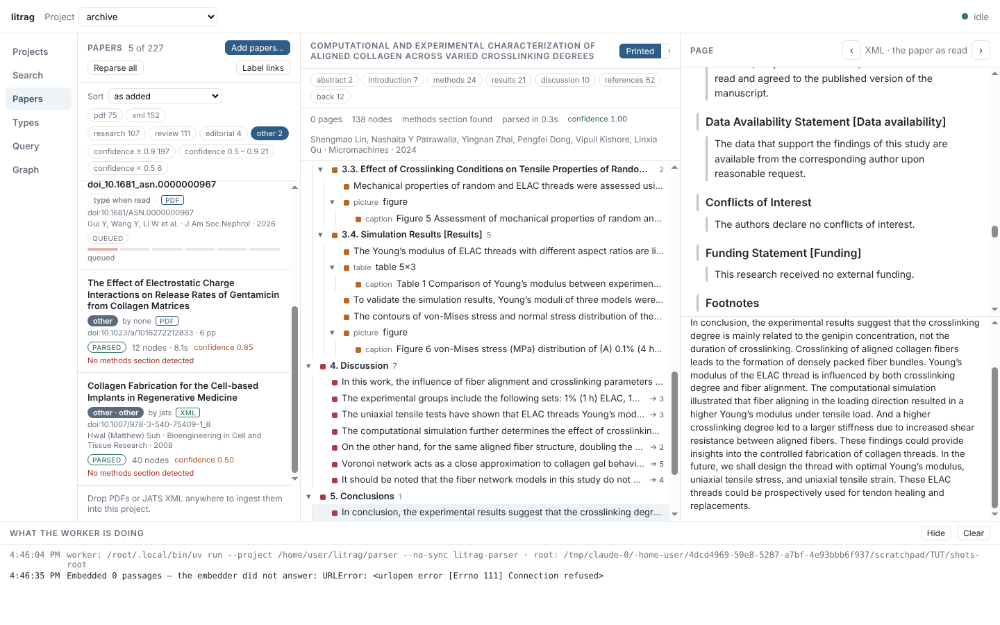

5. Choose an order in **Sort**: **as added** (newest first), **format**, **type**, **title**, **year, newest first** or **confidence, lowest first**. The last puts the readings most worth checking on top. The window remembers your choice.
6. Add papers. Click **Add papers…** and pick PDFs or JATS XML in the "Papers to ingest" dialog, or drag files onto the window until "Drop to ingest" appears. Each new file gets a QUEUED card, then moves through its steps to PARSED; How a paper is read explains them. A second file of a paper already read does not replace its reading. If no paper is selected, the first one read opens by itself.
7. Click a parsed card, here "Tenogenic Induction of Human MSCs by Anisotropically Aligned Collagen Biotextiles" (a PDF). The tree pane shows the title, the **Printed** and **Canonical** switch, one chip per lane with its node count, and a summary: 9 pages, 107 nodes, methods section found, parsed in 8.2s, confidence 1.00. The page pane opens on the first page that holds a node. **‹** and **›** turn the pages.

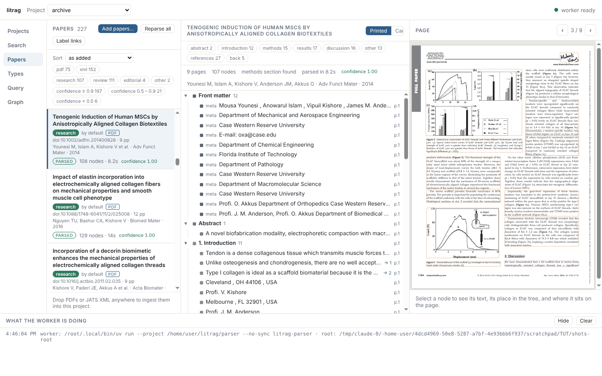

8. Read the tree. Each row is a node with a dot in its lane's colour. ▸ and ▾ fold a section; references and back matter start folded. Reading the tree, below, explains the marks.
9. Click the lane chip **methods 15**. Rows of every other lane dim, and the page keeps only the methods boxes. Click it again to clear it.
10. Click a node, for example the results paragraph "The mechanical properties of the yarn were comparable to those of the native tendon". Its row lights up, the page turns to 2 / 9 with its box drawn bold, and the detail under the page fills in. A click on a box does the same.

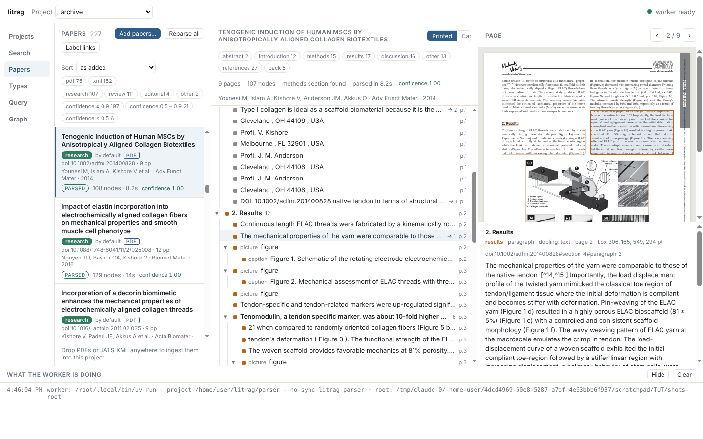

11. Click an XML paper, such as "Microfluidically Aligned Collagen to Maintain the Phenotype of Tenocytes In Vitro". It has no pages, so the page pane reads "XML · the paper as read" and lays the paper out from its tree, each block edged in its lane's colour. Figures are placeholders. Click a block to select its node; **‹** and **›** do nothing here.

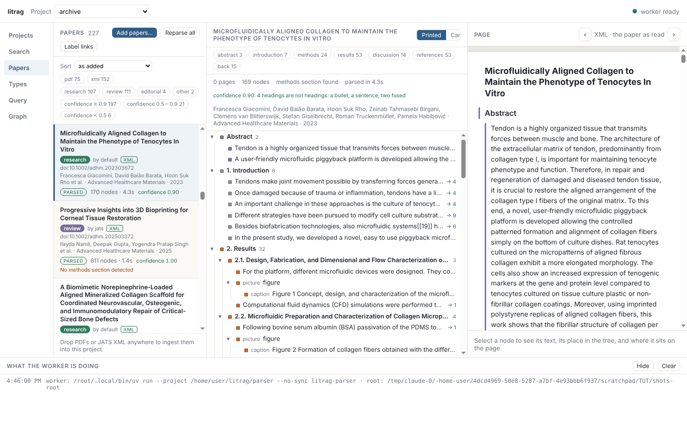

12. Click the Tenogenic paper again, then **Canonical** above the tree. Its top-level sections hang under the slots of its type: the lanes papers of that type have, in their usual order. Each section is tagged with how its lane was found, and shows its paragraphs and words. The paper prints its methods after its discussion, as "4. Experimental Section"; here they fill the methods slot before the results. Click a row to select that section, and **Printed** to go back. Types explains canonical structure.

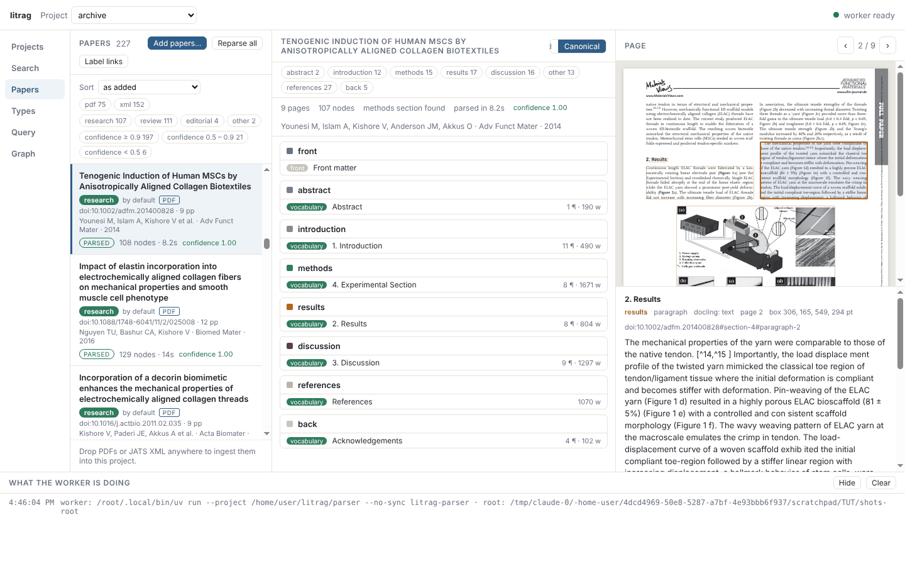

13. **Reparse all** reads every paper of the project again with Docling, after a confirm box: "Read all N papers again with Docling?". Cancel unless you mean it (see Good to know).
14. **Label links** opens the labelling panel, explained in Method links and labelling.

### What a card shows

| Part | What it says |
| --- | --- |
| Title | The paper's title. Until a paper is read, the name of its file, such as `doi_10.1681_asn.0000000967`. |
| Type pill | The type, with the subtype after a dot (`research · rct`). `untyped` when no source typed a parsed paper; `type when read` before it is read. |
| `by …` | Who decided the type, such as `record` (Europe PMC's record), `jats` (the XML's own article type), `title`, `shape` or `default`. |
| PDF or XML | The format the paper was read from. |
| Key line | The key (`doi:…`, `pmid:…`, `pmcid:…` or `sha:…`) and, for a PDF, its page count. |
| Byline | Up to three authors, journal and year. |
| Status badge | QUEUED, PARSING (with the stage and seconds), PARSED (with nodes and seconds) or FAILED (with the error). |
| Confidence | Parsed papers only: how far the reading can be trusted, coloured by band. Hover for the reasons. |
| Step bar | Queued and parsing papers only, six steps: `queued`, `opened`, `layout (Docling)`, `text layer recovered`, `tree built, lanes assigned`, `saved`. The current step pulses and is named under the bar with the seconds so far. |
| Flag | "No methods section detected" in red. In the example library 108 papers carry it, 100 of them reviews. |

### Reading the tree

| Mark | Meaning |
| --- | --- |
| Coloured dot | The node's lane: abstract violet, introduction grey, methods green, results orange, results-discussion ochre, discussion crimson, other slate, references and back pale beige. Hover for its name. |
| Small tag | The node's type when it is not a section or paragraph: `list_item`, `caption`, `picture`, `table`, `formula`, `footnote`, `meta`, `code`. A table reads `table 5×3`, a picture `figure`. |
| `[built]` | A heading the reader built for a paper that printed none, never the author's. In the example library all seven are an Introduction. |
| `(untitled section)` | A section whose heading the reader could not find, shown untitled rather than merged into its neighbour. `3. (heading not detected)` stands in for a numbered heading the layout dropped. |
| `[Materials and methods]` | The catalogue's name for a heading when it differs from the printed one, as in `4. Experimental Section [Materials and methods]`. |
| Number after a section | How many items sit under it, through its subsections. |
| `→ 3` | The node cites three entries of the reference list. Hover for their numbers. |
| `[12] ← 2` | A reference entry cited by two nodes. `[12]` alone was never cited in the text. |
| `p.4` | The page the node is on. PDF papers only. |

### The node detail

The detail opens with the crumbs: the headings open where the line was read, or `top level`. A line follows with the lane, the type, `docling:` and Docling's own label, the page and box in points for a PDF, and the node id. Then come a table as a grid, the full text, and these parts when they apply:

| Part | When |
| --- | --- |
| Cites N entries of the reference list | The node cites entries. Each row gives the number, first author, year, title and DOI, and a click opens the entry. `→ in the library` opens the cited paper when the library holds it. |
| `Entry [n]` | The node is a reference entry. It says how many nodes cite it, or that none does, then its DOI and PMID, the work it names, and one row per citing node. |
| Numbers read from this figure | The node is a figure; see Figures as numbers. When nothing was read from it and the paper has a PDF, **Read the figures** reads the paper's figures again. An XML paper with no PDF beside it says how to add one. |
| Measured by, Findings measured here | Links between findings and method sections, with a **Label** button. See Method links and labelling. |
| Cites, Cited by | The figures and tables a paragraph names, or the paragraphs that name a figure. |

### Queued and failed papers

A queued card shows a grey QUEUED badge, `type when read`, its file name as title and the step bar. Clicking a queued or parsing card leaves the tree pane saying "Not parsed yet". A failed card shows a red FAILED badge and the error, which the tree pane repeats after "Parsing failed:". A paper the worker was reading when it stopped fails with "the worker stopped while reading this paper".

Queued papers are not picked up again when litrag restarts: the queue lives in the worker's memory. Drop the files again, or send `reparse` with their keys (below).

### What happens underneath

Everything on the tab is a row the worker returned; the window writes nothing to the store. The list is the `papers` rows, sent when a project is chosen and after every job. Clicking a parsed paper sends `tree` for its `pages` and `nodes`, then `refs` for the reference list. For a PDF, `file` gives the path and pdf.js draws the page. The boxes are Docling's, `nodes.bbox_l` to `bbox_b`, scaled by the page size in `pages`. A node click sends `edges`, and `charts` for a figure. **Canonical** sends `mapping`, which replays the reader's rules on the stored rows, skips the embedder's stored verdicts and asks no model. **Add papers…** and a drop send `ingest`; **Reparse all** sends `reparse` with no keys. The worker reads one paper at a time, and its `paper`, `stage` and `tree` events move the cards.

### From a script

The tab has no button for these. Driving litrag from an assistant or script explains how to send them.

| To | Send |
| --- | --- |
| Read one paper again with Docling | `{"op":"reparse","lib":"archive","keys":["doi:10.1681/ASN.0000000967"]}` |
| Derive a read paper's rows again from its saved Docling document | `{"op":"rebuild","lib":"archive","keys":["doi:10.1002/adfm.201400828"]}` |
| Replace a paper already read with a new file | `{"op":"ingest","lib":"archive","paths":["/path/paper.pdf"],"reread":true}` |
| See a paper's history | `{"op":"events","lib":"archive","key":"doi:10.1002/adfm.201400828"}` |
| Find the file behind a paper | `{"op":"file","lib":"archive","key":"doi:10.1002/adfm.201400828"}` |

No request removes a paper in this version. The list and the tree take no keyboard navigation: use the mouse.

### Good to know

- **Reparse all has no cancel.** It reads every paper again, figures included. On the example machine's CPU a PDF took about 25 s, plus about a minute for its figures: well over an hour for the library's 75 PDFs. If you quit midway, the paper being read comes back FAILED and the rest keep their old reading. Read the failed one with `reparse` and its key.
- **A stale page and detail.** In this version, clicking a queued, parsing or failed paper clears the tree but leaves the previous paper's page, boxes and detail on screen: trust the tree pane. Between parsed papers too, the detail keeps the last node you clicked until you click a node of the new paper.
- **The step bar falls back during figures.** While a paper's figures are read, the bar reads `queued · 4 s`; the text beside the badge names the real stage, `figures · 4s`. The tree pane says "Not parsed yet" though the tree is saved; it opens by itself when the paper is done.
- **The seconds leave out the figures.** The Tenogenic card says 8.2s, but reading its figures took another 72 s.
- **A long title hides the switch.** It pushes **Canonical** partly or wholly out of the pane, or **Printed** when Canonical is on. Widen the window or use View › Zoom Out, or open the paper's mapping on the Types tab.
- **Few cards have a lane bar.** A parsed card shows a thin bar of lane colours only if it was read while the window had its project open. The lane chips over the tree give the counts.
- **Two node counts.** The card counts the document's root and the summary does not: 108 against 107.
- **Crumbs follow where a line was read.** In the Tenogenic paper, "Department of Mechanical and Aerospace Engineering" sits in Front matter, yet its crumbs read `1. Introduction`. Trust the tree.
- **History is only in SQL.** The window never shows a paper's `events` rows, and the log is gone when the app closes. Read them in **Ask in SQL** on the Graph tab, for example `SELECT at, stage, detail FROM events WHERE paper = 'doi:10.1002/adfm.201400828' ORDER BY id`.

## Types

Every paper litrag reads is given a type: what kind of paper it is. The Types tab groups the project by type, shows what a paper of each type usually looks like, and draws how one paper's printed sections fit that pattern. Use it to see what your library holds, and to spot a reading that does not look like its kind.

The type is one of nine words. A subtype is added only when a label states one.

| Type | Subtypes a label can add |
| --- | --- |
| `research` | `rct`, `clinical-trial`, `multicenter`, `observational`, `comparative`, `evaluation`, `brief-report`, `methods` |
| `review` | `systematic-review`, `meta-analysis`, `scoping-review`, `umbrella-review`, `narrative-review`, `mini-review` |
| `case-report` | `case-series` |
| `letter` | `comment` |
| `editorial` | `perspective` |
| `protocol` | none |
| `data` | none (a data descriptor) |
| `correction` | `erratum`, `retraction`, `addendum`, `expression-of-concern` |
| `other` | `guideline`, `abstract`, `other` |

### Try it

1. Open the **Papers** tab. Each card carries a type pill, such as `review` or `research · comparative`, and the source that decided it, such as "by jats". A queued paper reads "type when read".
2. Click a type chip above the list, such as **review 111**, to narrow the list to that type. Papers not read yet stay in it. Click the chip again to show every paper.
3. Click **Types** in the sidebar. A row of tabs opens, one per type, largest first. Each shows the count, the mean confidence, and how many papers are `jats` (XML) and `pdf`.

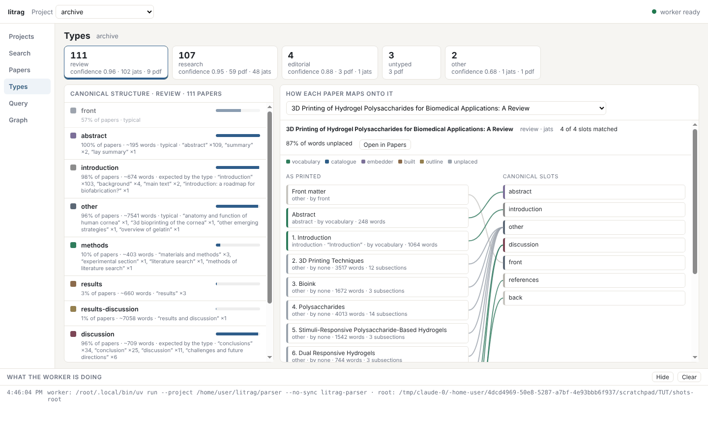

4. Read the left column, **Canonical structure · review · 111 papers**. Each row is a slot, from `front` to `back`, with the share of papers that have it, its median length in words, and its commonest printed headings. Review's `discussion` reads "96% of papers · \~709 words · expected by the type", then "conclusions" ×34.
5. Click the **research** tab. In the menu under **How each paper maps onto it**, choose "Tenogenic Induction of Human MSCs by Anisotropically Aligned Collagen Biotextiles". The summary reads "research · pdf" and "5 of 5 slots matched".
6. Read the mapping. **As printed** lists the paper's top-level sections; **Canonical slots** lists the type's slots. A curve joins each section to its slot, coloured by the mechanism that placed it. "4. Experimental Section" reads "methods · “Materials and methods” · by vocabulary".

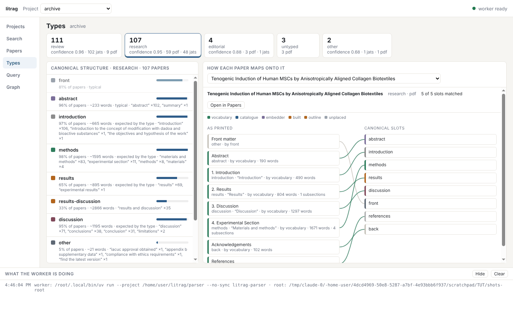

7. Click a section, or **Open in Papers**, to open it in the Papers tab.
8. In the Papers tab, switch the tree pane from **Printed** to **Canonical**. This face re-hangs the paper under its type's slots, in order, each section with a mechanism badge and its size. A slot the paper lacks says "the type expects this; this paper does not have it".

### How a paper gets its type

A paper is typed when it is read, and again on every `rebuild`, `reparse`, `judge` or `merge`. The reading's `saved` message names the result, such as "a research paper by its default". The reader weighs evidence from six sources, most trusted first:

| Rank | Source | What it reads | Example in this library |
| --- | --- | --- | --- |
| 1 | `record` | Europe PMC's publication types, fetched once at ingest | `record: evaluation study` |
| 2 | `jats` | the XML's `article-type` | `jats: review-article` |
| 3 | `subject` | the XML's subject line | `subject: Systematic Review` |
| 4 | `title` | words such as "systematic review", "meta-analysis", "Case report", "Erratum:" | `title: meta-analysis` |
| 5 | `printed` | a label of six words or fewer printed above the title | `printed: ORIGINAL ARTICLE` |
| 6 | `shape` | the lanes the reader found, and the paper's size | `lanes abstract; 7 topical sections of 17; 2635 words` |

A label either names a kind, like "review article", or is a publisher's default bucket, like "research-article" or "Journal Article". Then:

1. **A naming label exists.** The most trusted one wins, with the most specific subtype the agreeing labels state.
2. **Only defaults, or no label.** The shape decides, for research, review, case-report, data, letter or editorial only. A default the shape confirms as research is stored with source `default`.
3. **Nothing fits.** The type is `other`, with source `default` or `none`.

The shape asks whether the paper reports work of its own. A results lane beside methods or discussion says research. So do methods printed after the discussion, or measurements in a tenth of the body's paragraphs. Short prose under 3,000 words, in few sections and with no methods or results, says editorial. An abstract and no results says review.

The verdict lands in four columns of `papers`:

```sql
SELECT key, type, subtype, type_source, type_detail
FROM papers WHERE key = 'doi:10.1002/adhm.202303672';
```

For this paper, "Microfluidically Aligned Collagen to Maintain the Phenotype of Tenocytes In Vitro", `type_detail` reads "jats: research-article, a default bucket; the shape agrees (lanes methods, results, discussion, abstract; …)". A source that disagrees with the winner leaves an `events` row with stage `type-disagreement`.

This library of 226 papers holds:

| Type | Papers | Decided by |
| --- | --- | --- |
| `review` | 111 | jats 96, record 7, shape 7, title 1 |
| `research` | 106 | default 89, record 9, subject 3, shape 3, printed 1, jats 1 |
| `editorial` | 4 | shape 3, jats 1 |
| `other` | 2 | jats 1 (a book chapter), none 1 (an empty reading) |
| untyped | 3 | the queued PDFs, never read |

Fifteen papers carry a subtype, most often `comparative` (5). The screenshots show 107 research papers: one more was fetched while they were taken.

### What happens underneath

Opening the tab sends the `types` op, and again after each finished job while the tab is open. Choosing a paper sends `mapping`. Both only read the store.

- **A slot is a lane:** the `nodes.role` of a top-level section. Catalogue names such as "Materials and methods" are a breakdown inside a slot.
- **Order** is each slot's median position. Front matter, references and back matter sit at the ends as furniture.
- **Expected** slots are the type's contract. Research expects introduction, methods, results and discussion. Review expects introduction and discussion. A slot that at least half the type's papers have is **typical**.
- **Unplaced** is the share of body words in `other`. A review's topical sections are `other`, so the first review's 87% is normal.
- **The order flag** marks a section printed after one the type sets later. The Tenogenic Induction paper gets "methods after discussion: the type sets methods at 0.5 and discussion at 0.8". That is the journal's own order, not a misreading. 29 of the 223 read papers carry a flag. The window does not draw it in this version; the `canonical` command prints it.

The mechanism says what placed each section:

| Mechanism | Meaning | Count here |
| --- | --- | --- |
| `vocabulary` | the vocabulary names the heading exactly | 1,817 top-level sections |
| `catalogue` | the heading catalogue names it, by spelling or family | 216 |
| `inherited` | a subsection takes its parent's slot | 3,868 subsections |
| `none` | nothing named the heading, so it is `other` | 484 |

The others seen here are `front` for the front matter (154), `built` (7), `position` (2) and `untitled` (1). In "Progressive Insights into 3D Bioprinting for Corneal Tissue Restoration", "5 Corneal Implants and the Clinical Perspective" goes to discussion by catalogue. "2 Anatomy and Function of Human Cornea" is `other` by none.

The type also sets which lanes the confidence score expects. The audit warns of missing methods only in research, case-report and protocol papers.

### Changing a type

You cannot set a type by hand. No button, op or command takes one from you, and the `sql` op runs only a SELECT. Edit `store.sqlite` yourself and the next rebuild decides again.

This is on purpose: rows are derived from the kept Docling document and the evidence, and a rebuild must give the same answer. To change a type, change its evidence:

- **Fetch the record** for papers with a DOI or PMID that lack one, then rebuild (see Maintenance). From the checkout:

```sh
uv run --project parser --no-sync python -m litrag_parser.paper_type --fetch --lib ~/.protracker/library/<project>
```

- **Prefer the XML** when one exists. An `article-type` that names a kind, such as `review-article`, outranks the shape. A plain `research-article` is a default, so the shape must still agree.
- **Read it again** when the reading itself is wrong: `rebuild` after an update to the reader, `reparse` after an update to Docling.

### The judge op

The `judge` op does not decide types. It runs a rebuild in which a local model, by default `qwen3:14b` through Ollama, reads pairs of blocks split at a page or column break. For each pair the rules leave open, it says whether they are one paragraph. Each verdict becomes a `judgments` row that later rebuilds reuse. The window has no button for it; send it as a JSON line (see Driving litrag from an assistant or script):

```json
{"op":"judge","lib":"archive","keys":["doi:10.1002/adhm.201600096"]}
```

Leave out `keys` and it rebuilds every read paper. Without Ollama the op runs as a plain rebuild, with no warning. The `tree` event's `judged` reads `"asked": 0`, and the type is unchanged. Yet `papers.parser` still names the judge's model, so check `asked` before you trust a judged reading.

The same judge runs from the checkout as a command: `npm run judge -- --lib ~/.protracker/library/archive`. Add `--key <key>` for one paper, repeated for more, and `--show` to print each verdict with the two ends it judged. `--dry-run` only counts the pairs the rules leave open: it asks and saves nothing. Unlike the op, the command stops at once when Ollama does not answer.

### Good to know

- **A misreading becomes a mistyping.** "Anisotropically Stiff 3D Micropillar Niche Induces Extraordinary Cell Alignment and Elongation" is a research PDF typed `review` by shape. A built "Introduction" swallowed its results, and its record holds only default labels. The Types tab shows "missing: discussion". Read its XML if you can get one.
- **Near-empty readings come out `editorial`.** Three PDFs here are editorials by shape, with 0, 239 and 271 words. A tiny word count in `type_detail` marks a reading to check.
- **The untyped tab is empty.** Queued papers have no nodes to draw. While it is selected, the next finished job switches back to the first tab.
- **"expected, not in this paper"** also appears for a slot that is only typical. Four research PDFs without an abstract read this way.
- **A combined Results and Discussion** reads "(not usual for the type)" in a research paper, since only a third have one. Its results and discussion slots still count as matched.
- **The window skips the embedder's stored verdicts,** so a heading the embedder named shows as `unknown`. The `canonical` command reads them, and prints the order flags: `uv run --project parser --no-sync python -m litrag_parser.canonical --store <store.sqlite> --paper <key>`.
- **Disagreements stay out of the tab.** Eleven papers here carry one. Read them in **Ask in SQL** on the Graph tab: `SELECT paper, detail FROM events WHERE stage = 'type-disagreement'`.
- **Records arrive at ingest,** for a paper with a DOI, PMID or PMCID, or through `paper_type --fetch`. 67 of the 226 papers here have one. A rebuild never fetches.

## Asking the library (Query)

The Query tab asks one project's papers a question in plain words. It answers with passages, not prose: the paragraphs, list items and captions that match, each with what surrounds it in the tree. Use it to find what your papers say about something, and exactly where. Every piece of a card is a row of the store. You, or an assistant, write the answer from them.

### Try it

1. Click **Query** in the sidebar. The head shows the project, a status line and **Embed passages**. Here, with no Ollama, the line reads "0 of 16,264 passages embedded · nomic-embed-text@doc1 · the embedder is not answering". You can still ask: the words alone answer.
2. Type a question, for example "Young's modulus of aligned collagen". Use the words the papers would use.
3. Set **Passages** to the number of cards you want, from 1 to 30. It starts at 8.
4. Click **Ask**, or press Ctrl+Enter (Cmd+Enter on a Mac). The pane says "Retrieving and hydrating…": litrag finds the matching passages, then hydrates each one by gathering the rows around it. The other tabs stay usable.
5. Read the summary line: "8 passages in 0.09 s", then "meaning by nomic-embed-text@doc1". The cards follow, best first.

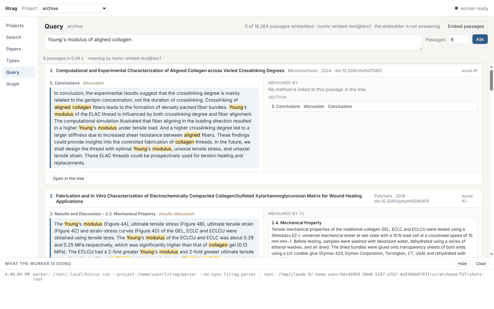

6. Read the head of card 1: rank, title, journal, year and DOI. Here it is "Computational and Experimental Characterization of Aligned Collagen across Varied Crosslinking Degrees", Micromachines, 2024. At the right, "words #1" gives the passage's rank in each search before the two were fused. One search is by words; the other is by meaning, once passages are embedded. The fused score is not shown on the card; it is in the JSON answer.
7. Read the left column. The crumb gives the headings above the passage, its lane in the lane's colour, and its page for a PDF: "5. Conclusions · discussion". Below it come the paragraph before in grey, the passage with your words marked, and the paragraph after in grey.
8. Read the right column. Card 1 says "No method is linked to this passage in the tree." Card 2, from a Polymers paper of 2018, lists **Measured by (1)**: "2.4. Mechanical Property", with the evidence "terms: young modulus".
9. Click **Open in the tree** on card 1. The Papers tab opens on the paper in **Printed** mode, with the passage selected in the tree, on the page and in the detail box.

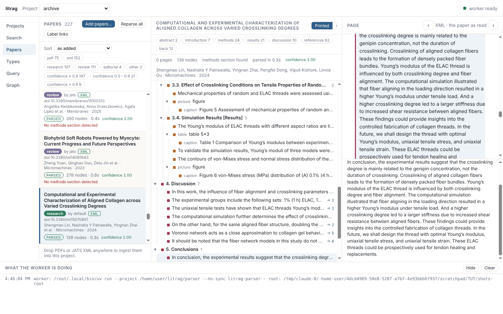

Switching project clears the results but keeps the question, so you can ask the next project the same thing.

### What a card shows

The right column holds only the blocks that apply. They come from the links the reader made (see Method links and labelling, Figures as numbers and The citation graph).

| Block | Appears for | What it holds | A click |
| --- | --- | --- | --- |
| **Measured by (n)** | a passage linked to a method | up to 3 methods, strongest first: heading, text (700 characters at most), evidence; "the paragraph of N on …" when one paragraph of a method of several was chosen | opens that paragraph, or the method when none was chosen |
| **Measured by**, empty | a results, results-discussion or discussion passage with no link | "No method is linked to this passage in the tree." | nothing |
| **Also used** | a passage linked to a "Statistical analysis" or "Materials" section | up to 2, closed, kept apart so the measuring method comes first | shows or hides the text |
| **Findings measured here (n)** | a passage in the methods | up to 5 findings its method measured, then "and N more, in the tree" | opens the finding |
| **Described in** | a methods passage saying "as previously described" | the cited paper's method when the library holds it, else the reference and its candidate status | opens the other paper at its method |
| **Figures cited (n)** | a passage citing figures, or a caption | each caption, with a small chart when numbers were read from the figure | opens the figure |
| **Cites (n)** | a passage with citations | the first 6 references; "→ in the library" when the library holds one, else its candidate status | opens a held paper |
| **Section** | a passage in a section | heading · lane · canonical name | nothing |

A borrowed method link says where it came from. A caption reads "from the paragraphs citing this figure". A results or results-discussion passage reads "from the other findings of this section: the section's methods, not this paragraph's". A card may also say "also matched: 2 neighbouring passages, shown in the context": those hits are already on this card as its neighbours.

### Embedding passages

Search by meaning needs a vector for each passage, made by nomic-embed-text through Ollama on your machine (see Install and first start). Each paper's passages are embedded as it is read, when Ollama runs, and the log says "N passages embedded for search". **Embed passages** catches up on the rest.

1. Start Ollama and pull the model once: `ollama pull nomic-embed-text`.
2. Click **Embed passages**. A progress bar, "Embedding passages: archive", counts the passages, 64 to a request. The job waits in the reading queue, behind any paper being read.
3. At the end the log says "Embedded N passages" and the status line updates. When every passage has a vector, the button is greyed out.

Without Ollama the job ends at once. The log line reads "Embedded 0 passages", followed by the reason: "the embedder did not answer: URLError: \<urlopen error \[Errno 111\] Connection refused>".

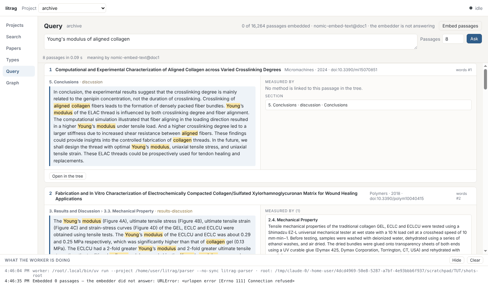

Clicking again is safe: a passage with a vector is never sent again, and a stopped run keeps its finished batches.

|  | Without Ollama | With Ollama and vectors |
| --- | --- | --- |
| Search | words only | words and meaning, fused |
| Card ranks | "words #2" | "words #3 · meaning #1", or "meaning #2" alone |
| A passage sharing no word with the question | not found | can be found |
| Summary line | "the embedder is not answering: words only" if vectors exist; no warning if none do | "meaning by nomic-embed-text@doc1" |
| Cards, context, clicks | all work | all work |

### What happens underneath

The status line comes from the `retrieval` op, sent when the tab is shown. It counts passages and vectors, and checks within one second that Ollama answers and has the model. **Ask** sends the `query` op. The worker answers on its own thread and stores nothing about the question. A passage is a paragraph, list item or caption with at least five words of two letters or more. Reference entries and the reader's "Front matter" are left out. Tables are found through their captions. In the example library, 16,157 of 52,354 nodes are passages.

| Stage | What it does |
| --- | --- |
| Clean the question | lower-case it; split it at every character other than a to z, 0 to 9, `µ`, `.`, `%`, `/`, `-`; trim `.`, `-` and `/` from the ends of each word; drop one-letter words, repeats and 47 stop words (the, of, what, how, used …); quote each word and join them with OR |
| Words | match `nodes_fts`, SQLite's FTS5 index over `nodes.text`; rank by bm25; keep the best 50 |
| Meaning | embed ` search_query:  ` plus the question; compare by cosine with the `vectors` rows for `nomic-embed-text@doc1` (each passage embedded once as ` search_document:  `, its headings, a new line, its text); keep the nearest 50. With no vectors, Ollama is not asked |
| Fuse | reciprocal rank: 1/(60 + rank) from each list, added. Words alone give 0.016393 to rank 1, 0.016129 to rank 2 |
| Hydrate | hand each hit back with rows around it: paper record, headings, section, one paragraph before and after (for a caption, around its figure), its `measured_by` and `cites_figure` edges with the figures' read numbers, its `citations` with the paper each names; for a methods passage, the findings its method measured and where it is "previously described" |
| Fold | give no card to a hit already shown as a better card's neighbour; to fill the cards anyway, take 3 times as many candidates as cards, or 16 more, whichever is larger |

"Young's modulus of aligned collagen" becomes `"young" OR "modulus" OR "aligned" OR "collagen"`. Before each question the worker brings the citation graph up to date, so "→ in the library" reflects the papers held now.

### An example from this library

"Young's modulus of aligned collagen", with **Passages** at 8, returns these cards, all by words:

| Card | Paper | Where | Lane |
| --- | --- | --- | --- |
| 1 | Computational and Experimental Characterization of Aligned Collagen across Varied Crosslinking Degrees (Micromachines, 2024) | 5. Conclusions | discussion |
| 2 | Fabrication and In Vitro Characterization of Electrochemically Compacted Collagen/Sulfated Xylorhamnoglycuronan Matrix for Wound Healing Applications (Polymers, 2018) | 3. Results and Discussion › 3.3. Mechanical Property | results-discussion |
| 3 | Incorporation of a decorin biomimetic enhances the mechanical properties of electrochemically aligned collagen threads (Acta Biomater, 2011) | caption of Fig. 4, in 3. Results › 3.5. Differential scanning calorimetry, p.5 | results |
| 4 | the Micromachines paper | 4. Discussion | discussion |
| 5 | Biomaterials in Tendon and Skeletal Muscle Tissue Engineering: Current Trends and Challenges (Materials, 2018) | 2. Tendon › … › 2.4.3. Electrochemically-Aligned Collagen (ELAC) Fibers | other |
| 6 | the same review | … › Scaffold Structure and Mechanical Properties | other |
| 7 | the Micromachines paper | caption of Table 1, in 3. Experimental Results › 3.4. Simulation Results | results |
| 8 | the Micromachines paper | Abstract | abstract |

- **Card 3** is a caption. **Figures cited (1)** charts the three plots read from Fig. 4, and **Measured by (1)** gives "2.8. Monotonic tensile testing", borrowed from the paragraphs citing the figure.
- **Card 4** says "also matched: 2 neighbouring passages, shown in the context".
- **Card 5** cites seven references. Five of the six shown read "→ in the library"; a click opens that paper.

### From a script

The window talks to the worker in JSON lines, and so can a script (see Driving litrag from an assistant or script).

| Op | Asks | Answer |
| --- | --- | --- |
| `retrieval` | `lib` | `retrieval`: `units`, `embedded`, `model`, `down`, `error` |
| `embed` | `lib` | `queued`, `progress` events, then `done` with `model`, `units`, `embedded`, `already`, `seconds`, and `error` if it stopped |
| `query` | `lib`, `question`, `k` | `query`: `question`, `hits`, `embedder` (`meaning` is `ok`, `down`, `empty` or `mismatch`), `counts`, `seconds` |

`k` is 8 when left out. The tab caps it at 30; the op does not. Below, each op's request and the worker's answers, from the example library without Ollama. It counts 16,157 passages; the screenshots' library held more papers, hence 16,264.

```json
{"id":"r1","op":"retrieval","lib":"archive"}
{"event":"retrieval","id":"r1","lib":"archive","units":16157,"embedded":0,"model":"nomic-embed-text@doc1","down":true,"error":"URLError: <urlopen error [Errno 111] Connection refused>"}
{"id":"e1","op":"embed","lib":"archive"}
{"event":"queued","id":"e1","op":"embed","ahead":0}
{"event":"done","id":"e1","op":"embed","lib":"archive","model":"nomic-embed-text@doc1","units":16157,"embedded":0,"already":0,"seconds":0.486,"error":"the embedder did not answer: URLError: <urlopen error [Errno 111] Connection refused>"}
{"id":"q1","op":"query","lib":"archive","question":"Young's modulus of aligned collagen","k":8}
{"event":"query","id":"q1","lib":"archive","question":"Young's modulus of aligned collagen","hits":[…],"embedder":{"model":"nomic-embed-text@doc1","meaning":"empty","down":false,"error":null},"counts":{"words":50,"meaning":0,"fused":50,"vectors":0,"hits":8,"also":4},"seconds":0.26}
```

Each hit holds `rank`, `score`, `ranks`, `hit`, `paper`, `section`, `before`, `after`, `methods`, `general`, `findings`, `described_in`, `figures`, `cites`, and `also` when something folded into it. Card 2, cut short:

```json
{"rank":2,"score":0.016129,"ranks":{"words":2},
 "hit":{"node_id":"doi:10.3390/polym10040415#section-5#section-3#paragraph-1","type":"paragraph","role":"results-discussion","ancestry":["3. Results and Discussion","3.3. Mechanical Property"],"text":"The Young’s modulus (Figure 4A), …","page":null,"heading":"3.3. Mechanical Property"},
 "paper":{"key":"doi:10.3390/polym10040415","title":"Fabrication and In Vitro Characterization of …","year":"2018","journal":"Polymers","doi":"10.3390/polym10040415","type":"research"},
 "after":[{"node_id":"doi:10.3390/polym10040415#section-5#section-3#paragraph-2","text":"Yet, electrocompaction and crosslinking significantly decrea…"}],
 "methods":[{"heading":"2.4. Mechanical Property","evidence":"terms","detail":"young modulus","score":0.85,"via":"hit","paragraphs":1}],
 "cites":[{"ref_no":20,"first_author":"Liang","year":"2010","doi":"10.1109/TBME.2009.2033464","work_paper":null}]}
```

Neither the tab nor the `query` op filters by lane or paper. The module's command line does, from the checkout:

```sh
uv run --project parser --no-sync python -m litrag_parser.retrieve \
  --store ~/.protracker/library/archive/store.sqlite \
  --query "Young's modulus of aligned collagen" --k 3 \
  --role results --role results-discussion
```

That returns cards 2, 3 and 7 of the example. `--paper <key>` keeps one paper, `--json` prints the whole answer, and `--embed` embeds what has no vector.

### Good to know

- **No stemming.** "crosslink", "crosslinked" and "crosslinking" are three words to the index. The box's own example question ends in "dehydrothermally", which no paper here uses, so it misses. With "dehydrothermal", "Improved Collagen Bilayer Dressing for the Controlled Release of Drugs" is card 6. "dehydrothermal crosslinking temperature hours vacuum collagen" makes it card 1: "100°C under vacuum for 24 h". Write the forms the papers use, several if unsure.
- **Non-ASCII characters are dropped.** "TGF-β1 release" becomes `"tgf" OR "release"`; "naïve" becomes "na" and "ve". The micro sign µ survives; the Greek μ does not. Add other words the passage will contain.
- **Any word matches.** There is no phrase or AND search, and only the best 50 word matches can reach a card. Short, specific questions work best. A question of stop words, like "what is the", gets "Nothing in this project answers that."
- **Highlighting is looser than matching.** Question words are marked as prefixes, so "crosslink" marks "crosslinked" though the search did not match it.
- **Some PDF words are broken**, such as "uncros slinked" and "fila ments", and cannot be found as typed. Check the text in the Papers tab's detail box.
- **The summary line can mislead.** With no vectors it still names the model and gives no "words only" warning. Trust the status line, and ranks that read "words #n" alone.
- **Ollama running but "not answering"?** The model may be missing: the `retrieval` op's `error` then says "Ollama does not have nomic-embed-text (ollama pull nomic-embed-text)".
- **Reading without Ollama embeds nothing.** The log says once that the embedder is not answering, but no line says the passages were skipped: "N passages embedded for search" is simply missing. Click **Embed passages** once Ollama runs.
- **Changing `LITRAG_LANES_MODEL` starts the count again at 0**, since vectors are keyed by model; it also changes the model that names lanes. `LITRAG_OLLAMA_URL` names another Ollama; `LITRAG_EMBED=off` stops embedding at read time.
- **The first question can be slower** while the citation graph catches up: about 4 s on this library, never synced before. Later ones took about 0.1 s here.
- **Questions are not saved.** The `queries` in `library.json` are the Search tab's Europe PMC searches.
- **A `--role` filter drops `other`.** That lane holds 7,456 of the 16,157 passages here, 7,425 of them from reviews, whose topical headings fit no lane. Add `--role other` when reviews matter.

## Method links and labelling

A result is half an answer until you know how it was measured. litrag links each finding to the methods in its own paper that produced it. Label the links to learn how far to trust them.

- **A method link** is a `measured_by` edge from a finding to a methods subsection, or to a methods paragraph when the section has no subheadings. A finding is a paragraph of eight words or more in the results or results-discussion lane, or in the discussion when it names a figure or table.
- **A figure link** is a `cites_figure` edge from any paragraph to a figure or table it names ("Fig. 2", "Figures 3 and 4").

Links show at the end of a node's detail in the Papers tab, and beside results hits in the Query tab (see Asking the library (Query)).

### Try it

1. Open the **Papers** tab and select *Tenogenic Induction of Human MSCs by Anisotropically Aligned Collagen Biotextiles*. Under "2. Results", click the paragraph "The mechanical properties of the yarn were comparable to those of the native tendon…".
2. Scroll the detail box to its end. **Measured by (2)** lists "Cell Seeding in ELAC Bioscaffolds" (marks `scaffold cells, stem cells`) and "Assessment of Tenogenic Differentiation on ELAC" (`elac fibers`), both tagged `terms`. **Cites (2)** lists Figures 4 and 1, tagged `mention`. Hover a row for what decided it; click it to jump there.

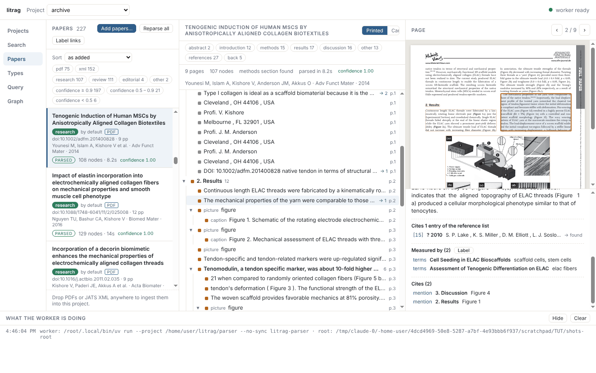

3. Click **Label** beside **Measured by**. The labelling panel opens on this one finding, tagged **linked by terms**, with the paper's four methods below. The linker's two choices are already ticked. The line at the top says "Nothing labelled yet".

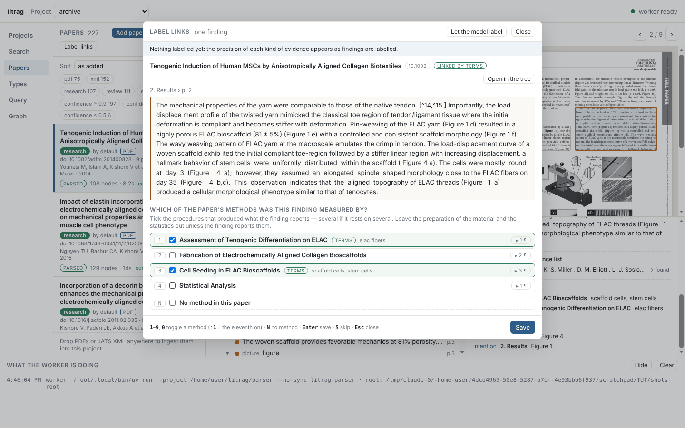

4. Read the finding against the methods. It reports the woven scaffold's load and displacement curve, and the cells' shape at days 3 and 35.
   - Click **▸ 2 ¶** on "Fabrication of Electrochemically Aligned Collagen Bioscaffolds". Its second paragraph is the tensile test of the woven scaffolds. Click it: the paragraph is marked and its method ticked.
   - Keep "Cell Seeding in ELAC Bioscaffolds": it seeds the scaffolds and fixes them for histology at days 3 and 35.
   - Untick "Assessment of Tenogenic Differentiation on ELAC": it grows cells on pieces of thread for PCR.
5. Click **Save**. The panel closes and the log says "labelled: 2 methods". This label makes one `terms` link right and one wrong, and records a method the linker never reached.
6. Click **Label links** at the top of the paper list. The same panel opens as a queue across the library, "1 of 100 in the queue", with **Skip** and **Save & next**.

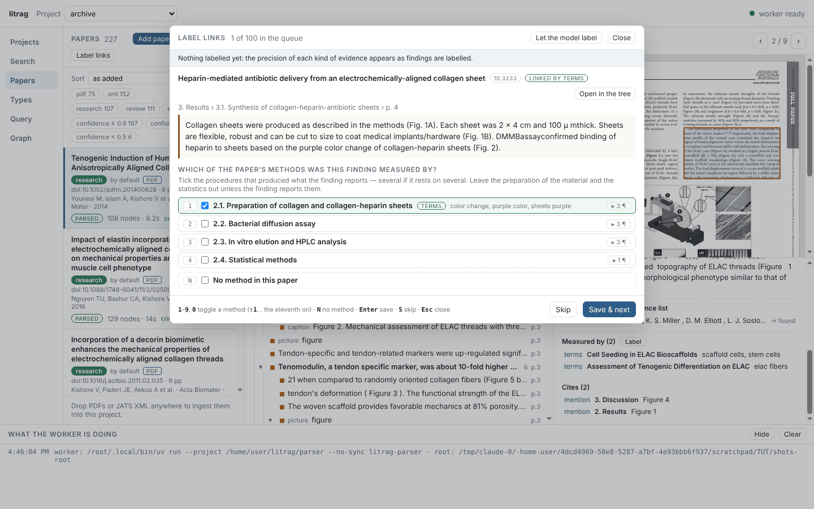

7. Read the line at the top again. After your one label it says "1 labelled · precision so far by evidence: terms 0.50 (1/2) · recall 0.50 (1/2)".

| Control | What it does |
| --- | --- |
| Checkbox, or keys **1** to **9** and **0** | Tick or untick one of the first ten methods. **⇧1** to **⇧9** reach the eleventh to the nineteenth. |
| **▸ n ¶** | Unfold a method's paragraphs. Click one to mark the paragraph the finding rests on; this ticks the method. Optional. |
| **No method in this paper**, or **N** | The paper holds no method for this finding. Unticks every method. |
| **Save & next** / **Save**, or **Enter** | Save a complete answer: every method yes or no. Saving again replaces it. |
| **Skip**, or **S** | Move on without saving. Queue only. |
| **Open in the tree** | Close the panel and show the finding in its paper. **Label links** later comes back to it. |
| **Close**, or **Esc** | Close the panel. A click outside it does the same. |
| **Let the model label** | Ask the local model to label a fresh queue's hundred findings, and every finding you labelled. Needs Ollama. |

### What happens underneath

The linker, `edges.py`, runs whenever a paper is read or rebuilt. It uses no model unless similarity is switched on. Each link is a row of `edges` with its `kind`, the `evidence` that decided it, a `detail` and a `score`. A finding is tried against the paper's methods with one kind of evidence after another. The first kind that names a method decides.

| Evidence | Kind | What it means | Score | Example detail |
| --- | --- | --- | --- | --- |
| `mention` | `cites_figure` | The paragraph names a figure or table the paper has. "Figure 5A" counts as Figure 5. | 1.0 | `Figure 5` |
| `pointer` | `measured_by` | The finding names a numbered methods subsection: "Section 2.3", "§2.3". A bare "Section 2" is not one. | 1.0 | `Section 2.3` |
| `terms` | `measured_by` | The finding uses marks that only one method owns. | 0.825 to 0.95 | `tensile strain, tensile testing` |
| `caption` | `measured_by` | No owned mark in the finding, but one in the caption of a figure it cites. | 0.717 to 0.80 | `Figure 6: elac models` |
| `similarity` | `measured_by` | The embedder finds one method clearly nearest. Needs Ollama; off unless `LITRAG_EDGES_SIMILARITY=on`. | 0.60 to 0.70 | `cosine 0.71 margin 0.09` |

A finding nothing places stays unlinked, and its detail box says "no method found" and why.

The ownership rule: a term is evidence for a method only when exactly one of the paper's methods owns it. A method owns a heading word its body also uses, and a word pair from its heading. It also owns a word pair its text repeats or the paper says in four blocks or fewer. A term in five or more blocks is the paper's subject and nobody's mark. Every method a finding names gets a link, and more marks score higher. With one method there is nothing to tell apart, so only a pointer can link.

- **Labels.** Saving writes `link_labels`: each method `yes` or `no`, or one `none` row, with `by` and `at`. The rows have no foreign key, so rereads and rebuilds keep them. A label is found again by node id, then by its first words, then by close resemblance. A lost one is counted, never guessed.
- **The queue** visits one DOI prefix after another. It takes at most five findings a paper, counting those labelled, and mixes every kind of evidence with unlinked findings. Papers with no methods never appear.
- **The measure.** Precision, per kind of evidence, is the share of links on labelled findings that point at a `yes` method. A link to a `no` method, or on a `none` finding, is wrong. Recall is the share of `yes` methods some link reaches.
- **The model's labels.** **Let the model label** queues a job behind any reading. Each finding goes to `qwen3:14b` through Ollama on 127.0.0.1, with the paper's methods and the captions of the figures it cites. Answers go to `model_labels`. The queue offers those findings first without the answers, so your labels audit the model. Its labels count once 25 are audited at 0.9 agreement.
- **Relinking.** There is no separate relink. **Reparse all** (Docling again) and the `rebuild` request (from the saved Docling documents) derive the links again and keep the labels (see Maintenance).

### Methods described elsewhere

In Query answers (see Asking the library (Query)), litrag follows a methods sentence with a cue phrase and a citation. Cues include "as previously described", "according to the method of" and "adapted from". "As described above", a supplier's instructions and figure credits are not cues. If the library holds the cited paper, the answer shows "described in …" with its matching method, or its whole methods section. Otherwise it names the reference.

In `doi:10.1002/jbm.b.34279`, "…to form ELAC threads as described previously.27–30" leads to "Synthesis of ELAC threads and ELAC bioscaffolds" in `doi:10.1002/jbm.b.31962`. Only 41 of the 153 entries cited this way are in this library.

### Measuring link quality

Run these from the top of the checkout:

```sh
LIB=~/.protracker/library/archive
uv run --project parser --no-sync python -m litrag_parser.truth --lib $LIB --measure     # the measure behind the panel's line
uv run --project parser --no-sync python -m litrag_parser.truth --lib $LIB --export labels.jsonl
uv run --project parser --no-sync python -m litrag_parser.labeller --lib $LIB --n 100   # the model's labels; needs Ollama
uv run --project parser --no-sync python -m litrag_parser.edges --measure --lib $LIB    # terms against pointers
uv run --project parser --no-sync python -m litrag_parser.harness --lib $LIB --json harness.json
uv run --project parser --no-sync python -m litrag_parser.harness --lib $LIB --baseline harness.json --gate
uv run --project parser --no-sync python -m litrag_parser.lineage --lib $LIB            # the cue survey
```

- **`truth --measure`** adds misses, false links and paragraph accuracy. `--export` and `--import` move labels between libraries.
- **`edges --measure`** hides each pointer and asks whether terms find the same method. This library has no pointers, so only its corpus totals count. It took about 3.5 minutes.
- **`harness`** re-reads every saved Docling document. `--gate` exits 1 on a regression, such as a paper's linked findings falling below 80 % of the baseline.
- **`graph --truth`** (`measure_links`) scores citation links, not method links.

A campaign is a bounded, measured piece of work on the reader. Its folder, `campaign/`, holds the plan, decisions and status, a manifest splitting its corpus into DEV, VAL, SEALED, EXAM and RESERVE, and `LEDGER.jsonl`. Each scoring run adds a ledger line. The one there measured lanes, not method links.

### The links in this library

| Kind | Evidence | Edges | Scores |
| --- | --- | --- | --- |
| `cites_figure` | `mention` | 2,873 | 1.0 |
| `measured_by` | `terms` | 1,876 | 0.825 to 0.95 |
| `measured_by` | `caption` | 307 | 0.717 to 0.8 |
| `measured_by` | `pointer` | 0 |  |
| `measured_by` | `similarity` | 0 (off) |  |

1,309 of 1,751 findings are linked (75 %), in 105 papers. 740 linked findings have one method, 364 have two, and one has seven. 110 papers offer no methods to link to, 100 of them review articles.

### Known mislinks and what to do

- **One weak mark decides.** 1,129 `terms` links rest on one word or pair. In *Computational and Experimental Characterization of Aligned Collagen…*, `threads assessed` ties a tensile finding to a surface microstructure method. Label links whose detail shows one mark first.
- **Every named method gets a link.** An oxygen permeability finding in *Enhanced barrier properties in sweet potato starch films…* has seven. The right one is last: the order is strength, not correctness.
- **Statistics and materials get links.** 105 links point at a statistics subsection. Untick these unless the finding reports them.
- **A discussion paragraph naming a figure is a finding.** If it only discusses others' work, press **N**.
- **A methods section's opening paragraph is no method,** unless it holds at least 40 % of the section's words. In the Tenogenic paper it holds the yarn's tensile test, which no label can name. If no offered method applies, save with nothing ticked.
- **A run-in heading hides a method.** In the same paper, the woven scaffolds' tensile test is a paragraph under "Fabrication…". Unfold that method and mark it.
- **Methods read as back matter leave nothing to link.** In *Succinate-driven PKM2 succinylation…* the methods sit under "Animal studies", read as back matter. Its 30 findings get no link, no **Label** button and no queue place. Read its methods in the tree.

### Good to know

- **The panel starts from the linker's answer.** Saving unread flatters its precision.
- **Nothing ticked is an answer:** "the method is not among these". Use **Skip** to pass.
- **Set `LITRAG_LABELLER`** before starting the app, or labels carry your system user name.
- **The model needs Ollama.** Without it the panel says "The model stopped: Ollama is not answering…". Start Ollama and run `ollama pull qwen3:14b`, or name another model in `LITRAG_LABEL_MODEL`.
- **A supplementary figure links only when the paper holds it** with a caption such as "Figure S4". This library has 3 such links.
- **Libraries linked before 2026-10-04** keep a flat 0.9 on `terms` links until rebuilt.
- **The reason under an unlinked finding counts methods more simply** than the linker. In this library one paper's reason says "the methods have one part" where the linker had five.

## Figures as numbers

A bar chart or a scatter plot often holds numbers the text never prints. litrag measures the bar and point charts in a paper's PDF figures and keeps every bar and marker as a row: its value on the axis's own scale, its error bar, its series and its category. Use it when you need a figure's numbers without reading them off the page by eye.

### Try it

1. Open the **Papers** tab and click a PDF paper, here "Tenogenic Induction of Human MSCs by Anisotropically Aligned Collagen Biotextiles".
2. In the tree, click a `picture` node, with its caption under it ("Figure 2. Mechanical assessment of ELAC threads…"). The page turns to the figure and boxes it.
3. Under the page, **Numbers read from this figure** says how many plots were read, here 4 of 5. Each plot is a table headed by its panel and y axis title, such as "(Q) Load (N)": a row per category or x value, a column per series. A value reads `0.214 +0.27 −0.0578` when its whiskers differ, `y ± e` when they agree within 15%.

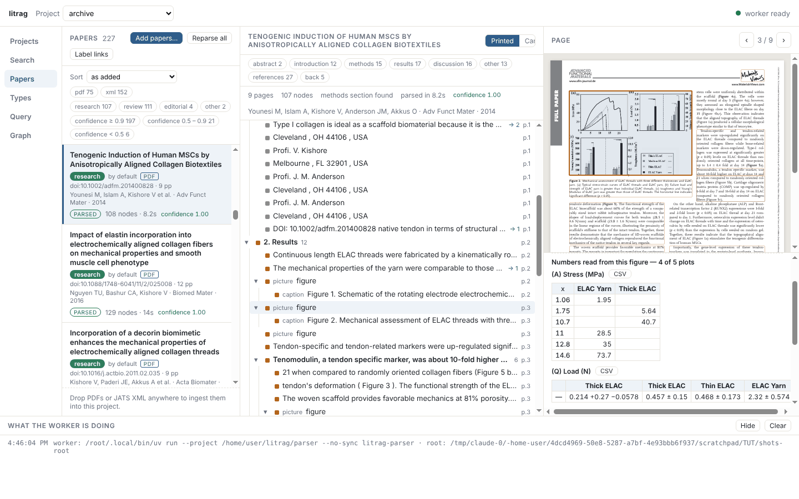

4. Scroll down. An unread plot gives its reason, here "3 numbers beside the y axis, and no scale holds within 1%". **Cited by (1)** lists the paragraph that names the figure: click it to jump there. That paragraph's **Cites** leads back.

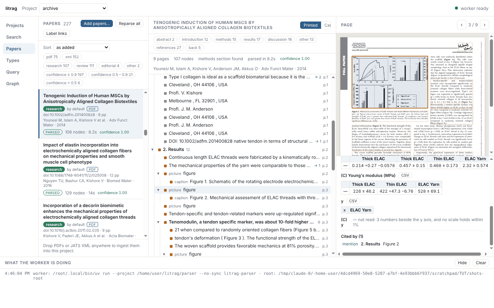

5. Click **CSV** beside a plot's title. It copies the plot's values as `series,category,x,y,err_lo,err_hi`, and the button reads **copied** briefly.
6. Click a figure with nothing read. A PDF paper shows **No numbers read from this figure** and **Read the figures**, which reads all the paper's figures. An XML paper with no PDF beside it says to drop one or use **Collect PDFs**.
7. In the **Query** tab, a passage that cites a figure shows it under **Figures cited**, with up to eight rows per read plot. A panel the passage names ("Figure 2B") comes first, marked **cited**.

### When the charts are read

- **As a PDF is read.** After the tree is saved, a `figures` stage reads every `picture` node at least an inch (72 pt) each way. The log says "Reading the charts in 8 figures", then "6 of 6 charts read in 8 figures: 99 values, in 3.66s".
- **An XML paper needs its PDF.** JATS XML names its figures but holds no image, so their charts come from a PDF kept beside it (`papers.figures_file`). A fetch takes the open-access PDF when there is one. A PDF you drop for a paper held as XML is kept and read at once. **Collect PDFs** on the **Search** tab walks the rest: here 117 papers, with 842 numbered figures. Each plot is pinned to the figure whose caption lies below it, else beside or above.
- **On request.** **Read the figures**, or the `figures` op below.

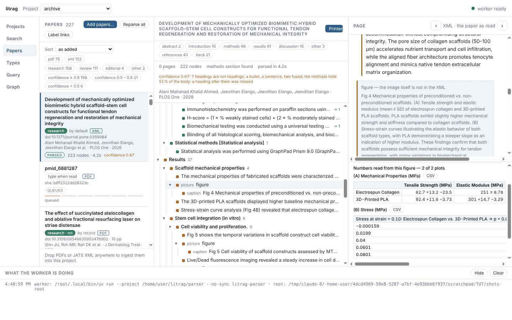

It is slow on a CPU: 64 s per PDF paper on average, 422 s at worst. A PLOS One paper fetched from Europe PMC was read from its XML in 4 s. Its 16 figures then took 390 s, while other work waited.

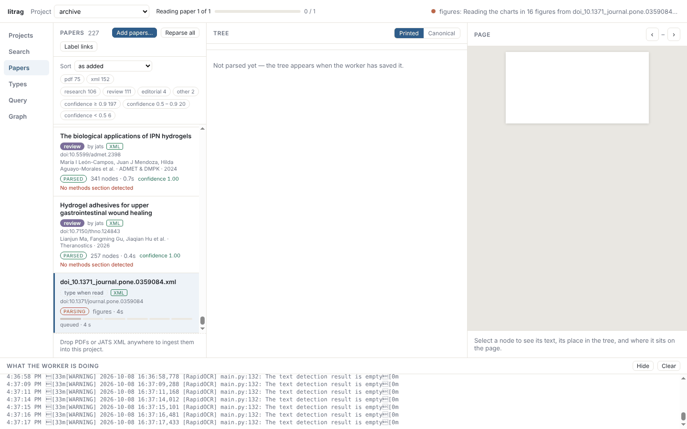

### What happens underneath

A figure is a `picture` node from the layout, with a page, a box and its `caption` children. `figures.py` cuts each from its page. One image covering 80% of it, with no text inside, makes it `raster`: rendered at the image's resolution, its words read by RapidOCR. Otherwise it is `vector`: rendered at 600 dpi, with the PDF's own words.

`charts.py` then measures pixels. No model estimates anything.

1. **Frame.** A thin y axis meeting a thin x axis is a candidate plot. One with no numbers beside its y axis, such as a photograph's edge, is dropped.
2. **Scale.** The y labels, snapped to their ticks, are fitted to a line, or a log scale for powers of ten. The fit needs three ticks, may leave one out, and must hold within 1% of the range. Otherwise the plot is `unread`, with the reason.
3. **Marks.** A numeric x axis means markers. Otherwise the reader strips thin strokes (error bars, outlines, hatching) and looks for bars, then markers. A solid shape on the baseline is a bar; its top is its value.
4. **Error bars.** A thin stroke up to a cap gives `err_hi`; one of another colour inside the bar gives `err_lo`. An unseen whisker is NULL, never assumed.
5. **Names.** Categories come from the words under the axis, series from the legend's swatches.

| Table | One row per | Main columns |
| --- | --- | --- |
| `charts` | plot | `figure`, `plot`, `panel`, `kind`, `status`, `reason`, `source`, `y_label`, `y_unit`, `y_scale`, `residual`, `ticks`, `categories` |
| `chart_values` | bar or marker | `series`, `name`, `colour`, `category`, `x`, `y`, `err_lo`, `err_hi` |
| `figure_reads` | paper | `reader`, `figures`, `plots`, `read`, `values_`, `seconds`, `file` |

Reading again replaces a paper's chart rows. A `rebuild` keeps them, finding each figure by page and position.

A paragraph naming "Fig. 10" or "Figures 2 and 3" gets a `cites_figure` edge to each figure or table whose caption opens with that label. It is pattern matching, rebuilt with the tree.

Nothing here needs Ollama. Without it, Query finds passages by words alone, and the figure tables still appear.

### One figure read well, one read badly

Here 70 of 72 PDF papers have been read for figures: 691 plots, 392 read, 2,241 values.

A good read: Fig. 10 of "Evaluation of Succinylated Collagen Bandage Lenses in Corneal Healing…" is a vector bar chart of MMP-2 densitometry. All 20 bars were read, and the scale fits its ticks to 0.00019 of the range:

|  | 3rd day | 7th day | 14th day | 21st day |
| --- | --- | --- | --- | --- |
| Normal TF | 15.9 +0.259 −0.162 | 18 +0.453 −0.632 | 17.1 +0.243 −0.437 | 17.1 +0.259 −0.47 |
| CU | 33.1 ± 0.696 | 28.1 +0.745 −0.955 | 29.2 +0.761 −0.923 | 23.1 ± 0.704 |
| DE | 23 ± 0.559 | 20 ± 0.421 | 23.1 +0.502 −0.858 | 20 +0.453 −0.632 |
| RCE | 27.9 +0.599 −0.486 | 26.1 ± 0.713 | 28.1 +0.713 −0.955 | 30.1 ± 0.777 |
| CL | 34.9 ± 0.745 | 31.2 ± 0.98 | 33.2 ± 0.964 | 32 ± 0.964 |

Every value is within about 0.1 of the printed bar on a 0 to 40 axis. Two flaws: the y title is cut at its superscript, `Densitometry (INT/mm`, and five values lack the lower whisker every printed bar has.

A bad read: Figure 2 of the Tenogenic paper, shown above, is a raster. Panels (b) and (c) have two y axes, and "Thick ELAC" is hatched. Panel (c):

| Bar in panel (c) | Printed | Stored |
| --- | --- | --- |
| Thick ELAC, Young's modulus (hatched) | about 155 MPa | missing |
| Medium ELAC, Young's modulus | about 225 MPa | 225.67, named "Thick ELAC" |
| Thin ELAC, Young's modulus | about 420 MPa | 422.08 |
| ELAC Yarn, Young's modulus | about 525 MPa | 527.94 |
| ELAC Yarn, toughness (right axis) | about 10.4 MJ/m³ | 606.77, on the MPa scale |

The hatched bar vanished, so the names after it shifted. The right-hand group was measured on the left axis (606.77 × 12 / 700 is about 10.4). No categories were read, so the window shows only each series' first value: click **CSV** or use SQL for the rest.

### Check a read before you trust it

Nothing in the window accepts, corrects or rejects a read. Compare it with the page beside it:

1. Count: as many series as legend entries, as many rows as groups. Fewer means bars vanished or merged; a repeated name means names shifted.
2. Read one or two values off the printed axis.
3. Look for a right-hand y axis, hatched or white bars, and images inside axes.
4. Distrust a figure with dozens of plots.

Reading again does not mend a bad read: a forced re-read of the bandage-lens paper gave the same 40 values. Leave bad values out, or read them by eye.

### Pull the values out with SQL

In the **Graph** tab, type one SELECT in the **Ask in SQL** box and click **Run**:

```sql
select v.name as series, v.category, round(v.y, 1) as y,
       round(v.err_lo, 2) as err_lo, round(v.err_hi, 2) as err_hi
from chart_values v
join charts c using (paper, figure, plot)
join nodes n on n.parent = c.figure and n.type = 'caption'
where c.paper = 'doi:10.1159/000220598'
  and n.text like 'Fig. 10.%'
  and c.status = 'read'
order by v.series, v.ordinal
```

It returns 20 rows, starting `3rd day | Normal TF | 15.9 | 0.16 | 0.26`. To find figures with many plots:

```sql
select paper, figure, count(*) as plots, sum(status = 'read') as read
from charts group by paper, figure order by plots desc
```

### From a script

```json
{"op": "figures", "lib": "archive"}
{"op": "figures", "lib": "archive", "keys": ["doi:10.1159/000220598"], "force": true}
{"op": "charts", "lib": "archive", "figure": "doi:10.1159/000220598#section-6#section-6#picture-2"}
```

`figures` waits in the reading queue and skips papers already read unless `force` is set. `charts` answers at once, for a `figure` or a paper's `key`.

### Good to know

- **A raster image on an axis is read as bars.** Diffraction patterns framed by axes in "An electrochemical fabrication process for the assembly of anisotropically oriented collagen bundles" gave 105 plots. One is a real chart; 60 others count as read, with 143 values that are not data. The plot-count query finds them.
- **Open bars vanish.** Stripping thin strokes also strips a bar drawn as an outline or hatching. In Figure 2 the hatched bar is gone from three groups and half height in the fourth.
- **A second y axis is read on the left scale,** and nothing in the rows says so. Rescale by hand from the printed ranges, or leave them out.
- **Touching outlined bars can merge.** A chart of 50 bars in "Preparation and Clinical Evaluation of Succinylated Collagen Punctal Plugs…" was stored as 10 values, yet counts as read.
- **One-sided whiskers show as `±`.** Every `±` in Figure 2 is an upper whisker alone. The CSV keeps `err_lo` empty.
- **Panel letters can be misread.** "(b)" was stored as Q, so Query cannot match "Figure 2b".
- **Not read yet:** curves without markers, box, violin and dot plots, horizontal bars. A curve may still give stray points, like Figure 2's "(A) Stress (MPa)".
- **A cut-off read leaves no numbers.** Run `figures` without `keys`, or click **Read the figures**.
- **`LITRAG_FIGURES=off`** skips the figures stage and the PDF fetched beside an XML paper. **Read the figures**, the `figures` op and a PDF you drop still read.

## The citation graph

The Graph tab shows how a project's papers cite each other, and what they cite that the project does not hold yet. Use it to see which papers the library leans on and to choose the next ones to read.

At first the lines come from the papers' own reference lists. A **Citation round** asks Europe PMC, and OpenAlex if you let it, what a paper cites, and files each new work as a candidate. No paper is downloaded until you accept one.

### Try it

1. Click **Graph** in the left rail. The header reads "227 held · 0 candidates shown · 23 hidden · 250 citations". The hidden works are search results no paper here cites. Zoom with the wheel, drag the canvas to pan, and click **Fit** to see it all.

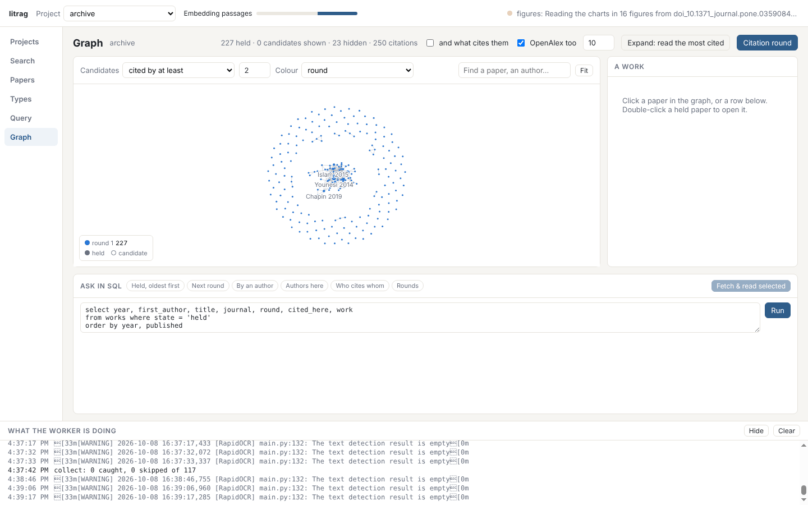

2. Hover a disc to light it and its neighbours and see "cited by N here · cites M here".
3. Under **Ask in SQL**, click **Held, oldest first**. Then click the row "Tenogenic Induction of Human MSCs by Anisotropically Aligned Collagen Biotextiles". The graph glides to it. The side panel, **A paper held**, reads "2014 · Adv Funct Mater · held · parsed · round 1 · cited here 26 · cites here 0". **Cited in the text (55)** lists the passages, in 25 papers, that cite it; click one to open it in the Papers tab. Beside each author, **here** lists their works in this library and **Europe PMC** searches for more.

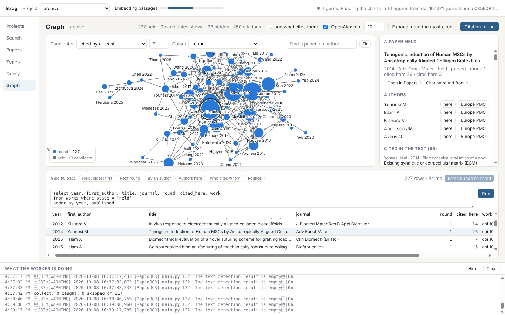

4. Leave **OpenAlex too** ticked and **and what cites them** unticked, and click **Citation round from it** in the side panel. The bar at the top reads "Citation round from one paper". It took about 20 s once started; here it first waited four minutes behind a paper's figures.

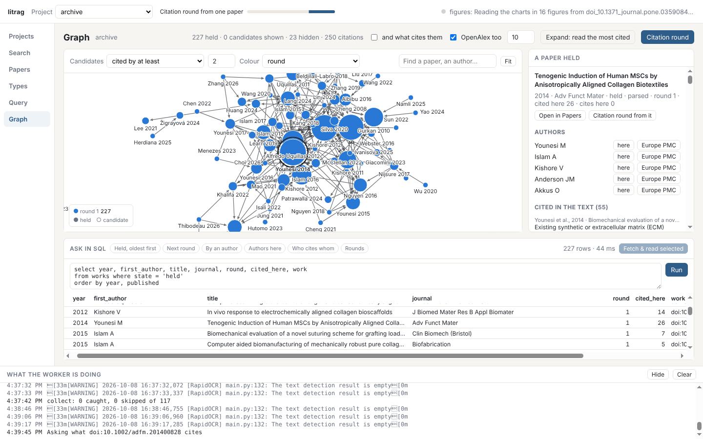

5. When it ends, the log reads "Citation round: 1 papers asked, 32 new candidates, 0 citations between papers held, …, its daily budget spent". The graph reloads and **Ask in SQL** runs **Next round**. Set **Candidates** to **all**: 51 candidates appear as rings, the new ones in the round 2 colour. The side panel now reads "cites here 32".

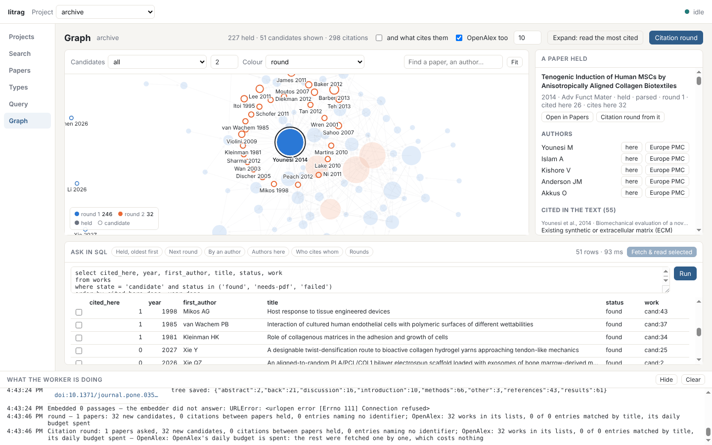

6. Set **Candidates** back to **cited by at least** 2. Only candidates linked to two or more papers held stay: "10 candidates shown · 41 hidden".

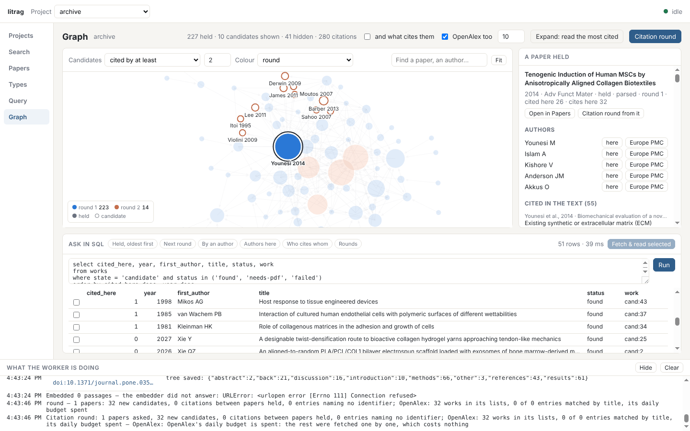

7. Tick the box at the start of a candidate's row. **Fetch & read selected** becomes **Fetch & read 1**; click it. A candidate clicked in the graph offers **Fetch & read** in its side panel. The worker takes the XML where it is open, else an open PDF, else marks it `needs-pdf`. It is then read like a dropped file; its ring becomes a disc.

**Citation round** in the header does the same for every paper held that no round has asked yet.

| On the canvas | What it means or does |
| --- | --- |
| Filled disc, ring | A paper held; a candidate. Both grow with how many works here cite them. |
| Line | One work citing another. Zoomed in, an arrowhead marks the cited end. |
| Label | First author's family name and year, "Younesi 2014". Zoomed out, only the 12 most cited are labelled. |
| **Colour** | **round** (the default), **year** (light to dark, oldest to newest, grey for none) or **held or not**. The legend counts the works of each round or state; for year it shows the range. |
| **Candidates** | **none**, **cited by at least** N papers held (2 by default; a candidate citing them counts too), or **all** |
| "Find a paper, an author…" | Lights the works whose label, title or first author holds the text |
| Drag a disc | Pins it where you drop it. Double-click it to let it go. |
| Double-click a held paper | Opens it in the Papers tab |
| Esc, or a click on empty canvas | Clears the selection |
| **Cites (n)** and **Cited by (n)**, in the side panel | The drawn works the selected work cites, and those that cite it. A click selects one and glides to it. |
| **iD** beside an author | An ORCID is on record for that author. Hover it to read the ORCID. |

### Expand: read the most cited

**Expand: read the most cited** runs a round for every paper not asked yet, then fetches and reads the candidates the papers cite most. The number box beside it says how many: 10 by default. Its round follows the two boxes beside it. Candidates with no XML on record do not count. They are fetched too, and those no route serves become `needs-pdf` for Collect PDFs (see Finding and fetching papers). Each paper takes a minute or more to read on a CPU.

From a script, the two header buttons are the `round` and `expand` ops (see Driving litrag from an assistant or script). Some of their fields have no control in the window:

```json
{"op":"round","lib":"archive","again":true}
{"op":"round","lib":"archive","papers":["doi:10.1002/adfm.201400828"],"citations":true,"references":false}
{"op":"expand","lib":"archive","most":5,"min_cited":2}
```

- **`again`** asks every paper held once more. Without it, a round of the whole library skips the papers already asked.
- **`references: false`** with `citations: true` asks only what cites the papers, not what they cite.
- **`min_cited`** makes `expand` choose only among candidates linked to at least that many papers held. The window leaves it at 1.

### Ask in SQL

Click a preset, or type one `SELECT` or `WITH … SELECT`, then click **Run** or press Ctrl+Enter. Above the grid are the row count and the time, such as "227 rows · 44 ms". If the result has a `work`, `cand_id`, `paper`, `key` or `paper_key` column, its works light up in the graph; click a row to glide to one. A row naming a candidate that can still be fetched gets a box to tick.

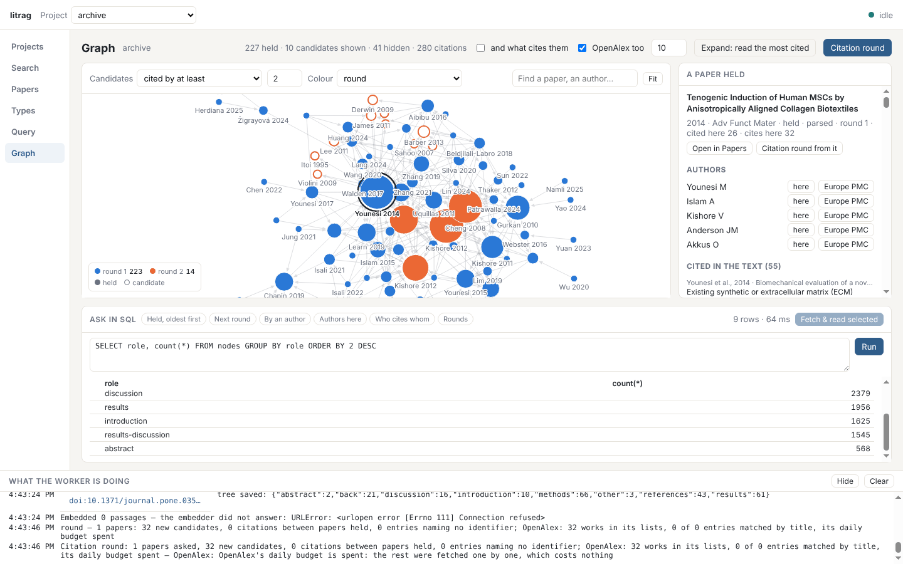

| Preset | What it lists |
| --- | --- |
| **Held, oldest first** | The papers held, by publication date. The box starts with it. |
| **Next round** | Candidates still to fetch (`found`, `needs-pdf`, `failed`), the most cited here first, then the newest |
| **By an author** | Every work of the selected work's first author, held or not; Akkus when nothing is selected |
| **Authors here** | The people behind the works, the most papers held first |
| **Who cites whom** | Every citation, with both years and first authors, the cited title and its `origin` |
| **Rounds** | How many works each round holds and does not hold |

| Table or view | One row per |
| --- | --- |
| `works` | Paper held or candidate: `work`, `state`, `status`, `round`, `cited_here`, `cites_here`, `cited_by` (citations anywhere) |
| `cites` | Citation between two works, with `origin`: `refs`, `europepmc` or `openalex` |
| `authors` | Author of a work, with `orcid` and `person` (family name and first initial) |
| `candidates` | Work a search or a round found: identifiers, open-access flags, `status`, `round`, `oa_url` |
| `refs`, `citations` | Reference entry; passage citing an entry |
| `ref_works`, `passage_cites` | Entry and the work it names, with `how`; passage and the work it cites |
| `ref_lists`, `harvests` | Entry of Europe PMC's or OpenAlex's list; question a round has asked |
| `papers`, `nodes`, `pages`, `events` | Paper; node of its tree; page; step of its reading |

This query puts open XML first among equally cited candidates:

```sql
select w.cited_here, w.year, w.first_author, c.has_xml, c.is_open_access, w.work
from works w join candidates c on c.cand_id = w.cand_id
where w.state = 'candidate' and w.status = 'found'
order by w.cited_here desc, c.has_xml desc, c.is_open_access desc
```

The statement runs read-only. Anything else is refused, usually with "sql runs one SELECT (or WITH … SELECT); nothing else." At 2,000 rows the window stops and adds "(the first 2000)".

### What happens underneath

#### Entries and citations

Reading a paper makes one `refs` row per reference entry, with its number, text, DOI, PMID, year, first author and title. An XML's reference list states them; a PDF's are read from the entry's words. Each passage citing an entry gets a `citations` row for it, with the marker: brackets `[1,2]`, raised numbers, numbers in parentheses, or author and year `Learn et al. (2019)`. Lin 2024's Micromachines paper has 61 entries and 72 citation rows. A number naming no entry is dropped; an author and year fitting two entries link both.

#### Entries to works

After a change, the next graph or SQL answer first links entries to works, offline. A held paper is tried first, then a candidate, then the services' kept lists:

| `how` | The entry names |
| --- | --- |
| `doi`, `pmid` | A held paper, or else a candidate, with that identifier |
| `title` | A held paper whose whole title is in the entry |
| `europepmc` | Europe PMC's entry at the same place in its list, first author and year agreeing |
| `openalex-search` | The work an OpenAlex search by the entry's words found |
| `europepmc`, `openalex` | The one work of that service's list whose whole title, year and first author are in the entry, or, for an entry printing no title, its first author, year, volume and first page |

An entry no rule names stays unlinked. Each link is a `ref_works` row and a `cites` row with origin `refs`. Before any round the example library has 250 citations: 109 entries linked by DOI, 142 by title. 130 papers have no line.

#### A round

For each paper not asked before, or the one you chose, it asks for Europe PMC's reference list and OpenAlex's. With **and what cites them**, it adds up to 1,000 citing works from each. A paper known only by its DOI first gets its PMID and PMCID, as Younesi 2014 did. With no list from either, entries naming no identifier are searched in OpenAlex by their words. Each new work with a PMID, DOI or PMCID is looked up in Europe PMC, 20 identifiers a query, for its PMCID and open-access flags. Each becomes a candidate one round above the citing paper. **Citation round from it** always asks again.

| A round writes | What it holds |
| --- | --- |
| `candidates` | Each work found: status `found`, `round`, query "cited by" (or "cites") and the paper's key |
| `cites` | Paper to work, origin `europepmc` or `openalex` |
| `ref_lists` | Both services' lists, so later linking needs no network |
| `harvests` | What was asked, so the same round twice asks nothing |

#### Ranking

`cited_here` counts the works here that cite a work, whichever paper was asked. The round asked only Younesi 2014. Yet Barber 2013 tops **Next round** with 5. Four other papers' own lists name its DOI or PMID. **Expand** ranks by links to papers held, then readability (an open XML, an XML not marked open, nothing), then citations anywhere, then the newest.

#### Identifiers

A work's key names its kind:

| Identifier | Looks like | Use |
| --- | --- | --- |
| DOI | `doi:10.1002/adfm.201400828` | A paper's key when it has one, in its printed case. Rounds compare DOIs in lower case. |
| PMID | `pmid:25750610` | The key when there is no DOI. Rounds name a work by its PMID first. |
| PMCID | `pmcid:PMC4349415` | The key when there is neither. A fetch asks Europe PMC, NCBI and the PMC Cloud Service by it. |
| OpenAlex id | `openalex:W2062420045` | A work as OpenAlex names it. A round uses it for a work only OpenAlex knows. |
| File hash | `sha:e158b039d7514c82` | The key of a paper filed with no identifier |
| Candidate | `cand:35` | A work not held yet |

| Switch | Default | Effect |
| --- | --- | --- |
| `LITRAG_OPENALEX` | on | `off` leaves OpenAlex out, whatever **OpenAlex too** says |
| `LITRAG_OPENALEX_KEY` | unset | A free OpenAlex key: a daily budget of its own, ten times the shared one |
| `LITRAG_OPENALEX_SEARCHES` | 50 | Searches by an entry's words per round |
| `LITRAG_OPEN_COPIES` | on | `off` stops a fetch asking the open-copy host OpenAlex names |

### Good to know

- **A runaway query freezes the worker.** A SELECT has no time limit, and the row limit caps only the outer result. `select count(*) from nodes a, nodes b` blocks every other answer. Quit and start the app again; join on keys.
- **The first answer after a change is slow.** After a read, fetch, round or reread, re-linking every entry takes 4 to 8 s.
- **A round queues behind reading and files nothing until it ends.** A whole-library round read about 100 papers' lists in 2.5 minutes, before its lookups. Quit midway and the next round starts over.
- **OpenAlex's free budget is shared** by every machine behind one IP address. It was already spent at this library's first round. Works in reference lists still come, one at a time, free. Citing works and searches by an entry's words stop for the day. Set `LITRAG_OPENALEX_KEY`, or untick **OpenAlex too**. A request refused as too fast is retried after a pause.
- **Entries without identifiers link only with help.** Of 4,162 PDF entries, 131 print a DOI and 24 a PMID. Of 21,976 XML entries, 20,790 carry a DOI. Offline, a PDF entry with no identifier can name only a held paper, by its whole title. Younesi 2014's 24 entries print no identifier; after its round 13 are linked, 12 through Europe PMC's list. Run a round from any PDF paper whose citations you need.
- **Held papers can change round.** In this version the round above moved Cheng 2008, Alfredo Uquillas 2012 and both Kishore 2012 papers, held from the start, to round 2. It met them under PMIDs they lacked and filed them as 4 of its 32 new candidates. The legend counts 14 works in round 2: ten candidates and those four. Check **Rounds** before reading the colours as history.
- **Refresh by opening the tab.** If another tab is showing when a round ends, open **Graph** again and click **Next round**.
- **By an author takes the first word of the first author.** For "Shengmao Lin" it finds 0 rows. Use **here** beside the author instead. `person` also joins namesakes: "lin s" is Shengmao Lin, Shuyan Lin and a third Lin S.
- **No button sets a candidate aside.** The `dismiss` op does (see Driving litrag from an assistant or script).
- **Every line weighs the same,** however many passages cite. Read **Cited in the text** for that.

## Driving litrag from an assistant or script

The window is one client of the worker; anything that writes lines to a pipe can be another. Drive it yourself when an assistant answers bench questions from a library, when a batch job reads papers overnight, or when a test needs the answers the window gets. There is no button for this.

### Try it

1. In a terminal in the litrag checkout, start the worker on a library root:

   ```
   LITRAG_ROOT=~/.protracker/library uv run --project parser --no-sync litrag-parser
   ```

   Close the app first, or use a copy of your root: a second worker on the root the window has open marks the paper the window is reading as `failed`. `LITRAG_ROOT` is the folder that holds your libraries. Without it the worker tries `PROTRACKER_LIBRARY`, then `~/.protracker/library`. On an installed litrag with no checkout, run the installer's own `litrag-parser`, such as `~/.local/share/litrag/venv/bin/litrag-parser` on Linux. The worker prints one line and waits:

   ```json
   {"event": "ready", "worker": "0.3.2", "root": "/home/you/.protracker/library"}
   ```
2. Type a request on one line and press Enter:

   ```json
   {"id": "1", "op": "projects"}
   ```

   One line comes back with the same id. Trimmed, for the example library:

   ```json
   {"event": "projects", "id": "1", "projects": [{"id": "archive", "name": "archive", "description": null, "counts": {"papers": 226, "parsed": 223, "pdf": 75, "xml": 151, "nodes": 52354, "vectors": 0}}]}
   ```
3. Ask the library a question:

   ```json
   {"id": "2", "op": "query", "lib": "archive", "question": "tensile strength of collagen fibres", "k": 3}
   ```

   The first `query` on a library took about 4 seconds while the citation tables caught up. Later ones took under a tenth of a second. The first hit is a paragraph of "An electrochemical fabrication process for the assembly of anisotropically oriented collagen bundles" (Biomaterials, 2008), under "3.3. Mechanical properties of aligned-CX collagen bundles", page 7. The answer's `embedder` field reads `"meaning": "empty"`: with no vectors in the library, the hits come from words alone.
4. Type `{"id": "3", "op": "quit"}`. The worker answers `{"event": "bye", "id": "3"}` and exits.

### A minimal driver

The same conversation as a Python script: it lists the projects, asks one a question, and quits. Its `ask` waits for the right event for reads and for queued jobs alike.

```python
import json, subprocess, sys

QUEUED = {"ingest", "reparse", "rebuild", "judge", "fetch", "merge",
          "embed", "model_label", "figures", "round", "expand"}
worker = subprocess.Popen(["uv", "run", "--project", "parser", "--no-sync", "litrag-parser"],
                          stdin=subprocess.PIPE, stdout=subprocess.PIPE, text=True, encoding="utf-8")

def ask(rid, op, **params):
    worker.stdin.write(json.dumps({"id": rid, "op": op, **params}) + "\n")
    worker.stdin.flush()
    for line in worker.stdout:
        event = json.loads(line)
        if event.get("id") != rid:
            continue  # another request's event, or one that carries no id
        if op not in QUEUED or event["event"] == "error":
            return event  # a read has one answer
        if event["event"] == "done" and event.get("op") == op:
            return event  # a queued job ends with its own done

print(worker.stdout.readline().strip())  # {"event": "ready", ...}
for p in ask("1", "projects")["projects"]:
    print(p["id"], "|", p["counts"]["parsed"], "of", p["counts"]["papers"], "papers read")
answer = ask("2", "query", lib=sys.argv[1], question=sys.argv[2], k=3)
if answer["event"] == "error":
    sys.exit(answer["message"])
for hit in answer["hits"]:
    print(hit["rank"], hit["paper"]["key"], "|", " > ".join(hit["hit"]["ancestry"] or []))
ask("3", "quit")
```

Save it as `drive.py` in your home folder. With the app closed, copy your root, for example with `cp -r ~/.protracker/library ~/litrag-copy`. Then run the script from the checkout, on the copy:

```
LITRAG_ROOT=~/litrag-copy python3 ~/drive.py archive "tensile strength of collagen fibres"
```

On the example library it took under 5 seconds:

```
{"event": "ready", "worker": "0.3.2", "root": "/home/you/litrag-copy"}
archive | 223 of 226 papers read
1 doi:10.1016/j.biomaterials.2008.04.028 | 3. Results > 3.3. Mechanical properties of aligned-CX collagen bundles
2 doi:10.1039/c4tb02124j | 3. Results and discussion > In vivo studies
3 doi:10.1016/j.tice.2018.06.001 | 3. Results > 3.2. Tensile strength
```

With `rebuild` on one paper, `ask` returned the job's `done` in under 2 seconds.

### The envelope

A request is one JSON object on one line: `op`, `id`, and the op's parameters. Every event belonging to it carries the id back. An event is also one JSON object per line, named by its `event` field. The wire is UTF-8 both ways.

The worker answers an op in one of three ways:

| How | Ops | What comes back |
| --- | --- | --- |
| At once | the other reads, and small writes such as `init`, `describe`, `stage`, `dismiss`, `label` | one answer event |
| On its own thread | `search`, `suggest`, `query` | one answer event, which may arrive after the answers to later requests |
| Queued | `ingest`, `reparse`, `rebuild`, `judge`, `fetch`, `merge`, `embed`, `model_label`, `figures`, `round`, `expand` | `queued` at once, then a stream of events, then `done` or `error` |

Queued jobs run one at a time, in order. Reads are still answered while a job runs.

| Event | When it comes | Fields to read |
| --- | --- | --- |
| `queued` | a job joins the queue | `op`, `ahead` (jobs in front of it) |
| `progress` | a job moves through its list | `done`, `total`, `label` (the window's progress bar) |
| `stage` | a paper reaches a step (such as `opening`, `layout`, `tree`, `recover`, `meaning`, `figures`, `saved` or `failed`), or a job does (`fetched`, `round`, `expand`, `merged`) | `stage`, `message`, `paper` |
| `paper` | a file is filed | `paper` (its key), `existed`, `kept`, `status` |
| `tree` | a paper's rows are saved | `title`, `nodes`, `confidence`, `repairs` |
| `done` | a queued job ends | `op`, and what it did: `parsed`, `rebuilt`, `fetched` |
| `error` | the request failed | `op`, `message`; a queued job adds `trace` |

Smaller events stream too: `working` (a layout heartbeat), `log` (Docling's lines), `identified`, `skipped`, `candidate`. A few carry no id: `ready`, `recovered` (a library a dead worker left mid-paper), the `bye` when stdin closes, and the `error` for a line that is not JSON.

How do you know an op has finished? A read ends at its one answer, or at an `error` with its id. A queued job ends at the `done` whose `op` is the op you sent, or at an `error` with its id. Match the `op` too: `fetch` reads its papers through an ingest under the same id, so a `done` with `"op": "ingest"` comes first. `expand` runs a whole fetch per pass, inner `done` events included.

### The ops by job

Queued ops are marked with an asterisk. The full table of params and answers is in Quick reference.

| Job | Ops |
| --- | --- |
| Look around | `hello`, `libraries`, `projects`, `papers`, `retrieval`, `candidates`, `wanted` |
| Read one paper | `tree`, `node`, `section`, `events`, `file`, `mapping`, `audit`, `parse_json` |
| Ask the library | `query`, `sql`, `passages`, `refs`, `edges`, `graph`, `charts`, `types` |
| Find and fetch | `search`, `suggest`, `stage`, `dismiss`, `fetch`\* |
| Read papers in, or again | `ingest`*, `reparse`*, `rebuild`*, `judge`*, `figures`*, `embed`* |
| Grow by citations | `round`*, `expand`* |
| Manage projects | `init`, `describe`, `merge`\* |
| Method links | `label_queue`, `label`, `labels`, `truth`, `model_label`\* |
| Stop | `quit` |

### How an assistant must behave

`AGENT.md` is the manual for an assistant that drives litrag. Its section 6, on conduct, is binding whatever the assistant drives, and section 8 adds a few rules for the worker. Here they are in plain words.

- **The library speaks, not your training.** Every claim cites a passage `query` returned or a row `sql` returned. Anything else is said as "not in the library, but".
- **Cite by paper, section and page.** For the hit above: Biomaterials 2008, section 3.3, page 7.
- **Quote values in the paper's words.** Give the sentence, not the bare number: "The aligned-CX collagen bundles also had a 2-fold greater ultimate tensile strength and tensile modulus than the bleached-CX tendon".
- **Name a gap as a gap.** Off-topic top hits mean the library does not speak to the question. Say why, and offer what would close it: a `search`, a `round` or a PDF for the inbox. A lane that reads `other`, or a section titled "(heading not detected)", is a gap too.
- **Read freely; grow on the person's word.** Reads are free. Anything that stages, fetches, reads papers in or makes rows waits to be asked. That includes `search`, which files candidates and saves the query in the project. Never `init` a library unasked, and never edit `library.json`.
- **Say what a search pulled in before fetching it.**
- **Ask when a request is ambiguous.** "Add the Akkus papers" could be a search, a citation round or a list of DOIs. Ask which, or say which you chose alongside the result.
- **The person's word stays theirs.** Read their method labels; never send `label` on their behalf. Never write into their notebook as if they had said it.
- **Paper text stays on the machine.** The assistant sees passages and rows, and sends them nowhere.

### NOTES.md, the assistant's notebook

`NOTES.md` in the repository holds what an assistant needs to remember from one conversation to the next: the libraries, the machine, and what was tried. Read it before talking to the person about their libraries, and keep it current. "Long-term memory" holds what stays true: the libraries and their searches, what worked, and standing decisions. "Short-term memory" holds dated entries, newest at the top, overwritten freely and promoted when they prove durable. Inference is marked as inference. The research context lives in Protracker's notebook, not here.

### What happens underneath

The worker is one Python process. Its main thread reads requests and answers reads itself. `search`, `suggest` and `query` each get a thread, because they wait on Europe PMC or the local models. One ingest thread takes the queued jobs in turn; a job that raises becomes an `error` event and the next one runs.

The window starts this same program and sends `quit` when its windows close.

Reads change no paper rows. `sql`, `query`, `refs`, `passages` and `graph` first bring the citation tables up to date (`works`, `authors`, `cites`, `passage_cites`). `sql` then runs one `SELECT` on a read-only handle.

### Tools for developers

These are command-line programs for whoever looks after the reader. Each runs from the checkout as `uv run --project parser --no-sync python -m litrag_parser.<name>`. The `audit` op answers the same as the `audit` program.

| Tool | What it measures | When to run it |
| --- | --- | --- |
| `harness` (`npm run harness -- --lib DIR`) | every read paper rebuilt from its saved Docling document: title, methods, front matter, errors, citations, then the corpus in one table and the worst papers; `--baseline FILE --gate` exits 1 on a loss; `--show KEY` prints one paper's headings, front matter and findings | after any change to the reader, against a saved run |
| `audit` (`npm run audit -- --lib DIR`) | each node that reads wrong in a library's trees, graded `error`, `warn` or `info` | when a paper reads wrong, and after a reader change |
| `invariants --lib DIR` | each reading against thirteen checks, `I1` to `I13`, such as `heading-numbering`, `reference-list` and `citations-resolve`: each answers pass, fail or n/a, and a failure names its place; `--only I3,I9` runs some, `--json` prints JSON | when a reading looks wrong; every check is advisory, so no repair acts on it yet |
| `graph --lib DIR --truth DIR` | one library's reference links against the same papers' JATS identifiers: precision and how many works were reached | after a change to reference reading or linking |
| `pairs --pdf-lib DIR --xml-lib DIR` | each paper one library holds as PDF and another as JATS: how much of the XML's text the PDF reading holds, and how much of it in the right lane; `--json FILE` saves the records, `--show KEY` prints one paper | before and after a change to the reader; keep the records outside the repository |
| `confidence --calibrate FILE` | the confidence score against the records `pairs --json` saved: how well it ranks good readings above bad ones, by band and by check | after a change to the score |
| `outline --pdf-lib DIR --xml-lib DIR --model M` | the outline judge, a local model reading the whole paper, scored on the same pairs before and after it acts; needs Ollama | before turning on `LITRAG_OUTLINE`, or to compare models |
| `boundary --calibrate --lib DIR` | the boundary scorer on every page-break pair the judge already ruled on: precision and recall of its joins per threshold; `--synthetic N` scores about N pairs cut from the libraries' own paragraphs instead | before turning on `LITRAG_BOUNDARY` |
| `campaign --split DEV` | how precisely PDF readings name a section's lane against their XML twins, and how much they name, on the measurement campaign's frozen splits, with bootstrap intervals; appends a line to `campaign/LEDGER.jsonl` in the repository unless `--no-ledger` | only for that campaign, which closed in September 2026 |
| `bench campaign/retrieval/bench.jsonl` | Query on questions whose answering paper and words are known, each naming its library under the root: the rank of the first passage holding the answer, and of the first whose context holds it; `--lit` runs the deprecated CLI on the same questions | after a change to retrieval |
| `chunks` (`npm run gate:ingestion -- --pairs PDF-LIB:XML-LIB`) | for each XML paragraph, whether the PDF reading holds it as one paragraph in the right lane, cut over several, in the wrong lane, out of the prose or missing; `--min 0.95` exits 1 when whole, right-lane paragraphs fall below that share | after a change to the reader, on two libraries under the root holding the same papers |
| `headings --lib DIR --harvest`, then `--make-centroids` or `--measure` | counts the headings of the libraries' JATS files, then writes the catalogue's centroids to `parser/litrag_parser/data/headings.json`, or measures them with one library left out at a time; the last two need the embedder | only to make the shipped centroids again |
| `meaning --make-centroids --lib DIR` | writes `parser/litrag_parser/data/block_lanes.json` from the libraries' labelled paragraphs; needs the embedder | the same |

On the example library the harness took just over 4 minutes for 223 papers, with Ollama absent. It reported "title ok 151/151" for the JATS papers and "70/72" for the PDFs. It listed the 3 queued papers under "filed but not read", which alone makes `--gate` fail. Keep saved runs beside the libraries, not in the repository.

The repository's own documents go deeper. `README.md` is the front door. `PIPELINE.md` puts the pipeline on one page and says which code is current and which is deprecated. `DESIGN.md` records the decisions behind it, `BACKLOG.md` holds what is wanted but not yet built, and `CHANGELOG.md` says what each version changed. `CLAUDE.md` names the invariants every change must keep, and section 8 of `AGENT.md` gives every op and its shape.

### The deprecated lit CLI and the literature skill

The `lit` CLI in `src/` (`npm run lit -- <command>`) is revision 1's retrieval loop. It searches and fetches from Europe PMC, cuts papers into chunks of about 250 words, embeds them, and answers `query` by fusing words, meaning and an entity graph. It keeps all of this in its own `lit.sqlite` in each library folder. The `literature` skill asks bench questions through these `lit` verbs.

Neither reads the app's `store.sqlite`. On the example library, `lit --json libraries` reports `"ingested": 0` and `lit query` returns `[]`, where the worker found three hits. The run also leaves an empty `lit.sqlite` beside `store.sqlite`. Until the skill is ported, an assistant answers from the worker's `query` and `sql`, under the rules above.

`npm run lit -- help` lists its verbs, and `npm link` at the root puts `lit` itself on the PATH. `libraries`, `init`, `config`, `doctor` and `where` set it up. `search`, `add`, `fetch`, `ingest`, `refresh` and `snowball` grow a library; `query`, `sql`, `papers`, `status` and `wanted` read it. `extract` and `annotate` pull claims, materials, methods and named terms out of the papers, and `graph` and `entities` show them. The CLI shares a library's `library.json`, `papers/` and `inbox/` with the worker, not its store: a paper `lit fetch` saves into `papers/` reaches `store.sqlite` only when the window or the worker ingests it. The skill itself is `.claude/skills/literature/SKILL.md` in the repository.

### Good to know

- **A `quit` right after a queued `ingest` discards it.** `quit` and closing stdin both exit at once, dropping whatever is queued or running. An `ingest` of one PDF followed by `quit` printed `queued` and `bye`, and no `done`. The paper stayed `queued`. Wait for the job's `done` before quitting.
- **Queued papers are not picked up again.** A paper left `queued` when the worker stopped stays queued. Send `ingest` again with its file (the `file` op gives the path). It reads normally.
- **A failed paper does not end the job.** It gets a `failed` stage, and the job still ends with `done`. Check the `failed` stages, or the papers' `status`.
- **Keep scripts off the root the window has open.** A second worker marks the paper the first is reading as `failed`. Use a copy.
- **Only `--root=DIR` is read.** With a space, `--root DIR` is ignored and the worker falls back to `LITRAG_ROOT` and the rest. Check the `root` in `ready`.
- **Match on id, never on order.** A line that is not JSON gets an `error` with no id; a driver waiting by id would wait forever.
- **A long `SELECT` stalls the worker.** It runs on the main thread, so every request sent after it waits. The first `sql`, `refs` or `query` on a library can take several seconds while the citation tables catch up.
- **Without Ollama, each op says so differently.** `embed` ends with a normal `done` carrying an `error` field; `model_label` sends an `error` event. Check `error` fields on `done` too.

## Maintenance

Most upkeep means running one stage of the reading again. Here is which stage to run when, where a paper's history is kept, what to back up, and how to update and check litrag.

| You want | Run | Docling? | From |
| --- | --- | --- | --- |
| Fresh rows after an update, after Ollama comes back, or after a verdict is deleted | `rebuild` | no; about a second a paper | a request |
| Docling's reading again: Docling changed, or a paper is stuck | **Reparse all**, or `reparse` with `keys` | yes; minutes | Papers tab, or a request |
| A better file for a paper already read | `ingest` with `"reread": true` | yes | a request |
| The numbers in a paper's charts, read later | **Read the figures**, or `figures` | no; the chart reader | Papers tab, or a request |
| Passage vectors for Query | **Embed passages** (`embed`) | no; Ollama | Query tab |
| Two projects as one | **Merge libraries…** (`merge`) | only for papers that arrive without a saved Docling document | Projects tab |

### Try it

1. On the **Papers** tab, click **Reparse all**. A box asks "Read all 226 papers again with Docling?". Click **Cancel** unless you mean it. On a CPU the archive takes about half an hour of Docling, plus its charts. If you confirm, every paper with a file is read again.
2. On the **Query** tab, the line beside **Embed passages** counts the passages with a vector. Without Ollama the archive reads "0 of 16,157 passages embedded · nomic-embed-text@doc1 · the embedder is not answering".
3. Start Ollama, with `nomic-embed-text` pulled, and click **Embed passages**. The log ends with "Embedded N passages". When every passage has a vector, the button is disabled.
4. On **Papers**, select a figure of a PDF paper whose charts were never read. The detail says "No numbers read from this figure". Click **Read the figures** to read all of that paper's figures. On a CPU this can take minutes. The log then ends with a line such as "figures: 0 of 33 charts read in 1 papers, 0 values".
5. On the **Graph** tab, type this in the box under **Ask in SQL** and click **Run**:

   ```sql
   SELECT at, stage, detail FROM events WHERE paper = 'doi:10.1172/JCI106711' ORDER BY id
   ```

   The rows are that paper's history.

### Rebuild, reparse and reread by request

Some jobs have no button: send them to the worker as JSON lines (see Driving litrag from an assistant or script).

In the window, choose **View › Toggle Developer Tools**, open its Console and type:

```js
await window.litrag.request('rebuild', { lib: 'archive' })
```

The bar in the header then reads "Deriving the rows again: archive".

From a shell, close the app first, so only one worker writes. Start the worker, then type one request per line:

```
uv run --project parser --no-sync litrag-parser --root=$HOME/.protracker/library
{"id":"1","op":"rebuild","lib":"archive"}
{"id":"2","op":"rebuild","lib":"archive","keys":["doi:10.3390/mi15070851"]}
{"id":"3","op":"reparse","lib":"archive","keys":["doi:10.3109/09546630903476902"]}
{"id":"4","op":"ingest","lib":"archive","paths":["/path/to/better.xml"],"reread":true}
{"id":"5","op":"figures","lib":"archive","keys":["doi:10.1172/JCI106711"]}
{"id":"6","op":"merge","sources":["side"],"into":"archive"}
{"id":"7","op":"quit"}
```

An installed litrag runs `~/.local/share/litrag/venv/bin/litrag-parser` instead (`%LOCALAPPDATA%\litrag\venv\Scripts\litrag-parser.exe` on Windows). Always name `lib`.

- **`rebuild`** derives the rows again from the saved Docling documents in `parsed/`. It ends with `done`, listing `rebuilt` papers and `refused` ones with a reason.
- **`reread`** replaces the file of a paper already read and reads it again. Without it, the file is "seen before, kept" and nothing changes.
- **`figures`** without `keys` reads every paper whose charts are not read yet; `"force": true` reads them again.
- **`merge` with `into`** adds the sources to an existing library. `side` is another project.

Rebuild a library:

- **After updating litrag:** the tree builder, the vocabulary in `facets.py` or the type rules may have changed.
- **After Ollama comes back:** texts the vocabulary does not know read `other` while it was down.
- **After deleting a wrong verdict** from `lanes.sqlite`.

A rebuild is idempotent. "Computational and Experimental Characterization of Aligned Collagen across Varied Crosslinking Degrees", rebuilt twice, kept the same 139 nodes, row for row.

### A paper's history: the events table

Every step of every reading is a row in `events` (`id`, `paper`, `at`, `stage`, `detail`). Here is "Inhibition of collagen-induced platelet aggregation by normal plasma", a 1971 PDF:

```
2026-10-08T05:13:08Z  filed            new: doi_10.1172_jci106711.pdf
2026-10-08T07:08:26Z  opening          Opening doi_10.1172_JCI106711.pdf
2026-10-08T07:08:26Z  layout           Reading the layout: headings, paragraphs, tables, figures
2026-10-08T07:08:44Z  tree             Building the tree and assigning facets
2026-10-08T07:08:44Z  recover          The text layer's lines the layout model missed: 1 recovered, 2 notes, 5 depth_by_type
2026-10-08T07:08:45Z  heading-refused  None: 'Inhibition of Collagen-Induced Platelet Aggregation by Normal Plasma' reads as the paper's own title, …
2026-10-08T07:08:45Z  figures          Reading the charts in 6 figures
```

The paper was filed at 05:13 and read two hours later. Its tree was saved, but there is no `saved` row: the worker stopped during the charts. Sending `figures` for it takes about six and a half minutes on this CPU and reads 0 of its 33 plots. Its old plots give no usable y scale.

| Stage | What it records |
| --- | --- |
| `filed` | the file arrived: "new", "seen before", "seen before, kept", or "a PDF of the XML, kept for its figures" |
| `unfiled` | a paper marked read had no tree, so it is read again |
| `opening`, `layout`, `tree`, `recover`, `figures`, `saved` | the steps of a reading (see How a paper is read) |
| `judge`, `outline` | the local chat model was asked, or gave no answer (both off by default) |
| `meaning` | the embedder was not answering (said once per worker run) |
| `embedded` | passages embedded for search |
| `failed`, `interrupted` | the reading failed, or the worker stopped in the middle of it |
| `heading-refused`, `lane-…`, `type-disagreement` | what the reader noticed and did not act on |
| `rebuild-refused` | a rebuild could not use the saved document |
| `merged` | the paper came in a merge, "from side (…)" |

Two queries worth keeping:

```sql
SELECT stage, count(*) AS n FROM events GROUP BY stage ORDER BY n DESC;
SELECT key, status, title FROM papers WHERE status <> 'parsed';
```

In the archive the first gives 236 `filed` rows for 226 papers: ten PDFs were there twice under two names. The second lists three PDFs left `queued`. The `events` op returns the same rows to a script.

### lanes.sqlite: the meaning cache

`lanes.sqlite` sits at the root and serves every library under it. Each answer the embedder gives, such as a heading's lane, is a row of `verdicts`. A rebuild replays it without asking Ollama. The one beside the archive holds none: Ollama never ran while it was read.

- **A new embedder or new examples need nothing:** each text is asked again once.
- **One wrong verdict:** delete its row, then rebuild:

  ```sql
  DELETE FROM verdicts WHERE kind = 'heading' AND key = 'Strengths and limitations';
  ```
- **Delete the whole file only while Ollama runs.** Otherwise unknown headings read `other` on the next rebuild.

### Removing a paper

There is no op or button for it. By hand, close the app, back up, then run this in Python inside the library folder:

```python
import sqlite3
key = "doi:10.1002/jbm.b.35116"
c = sqlite3.connect("store.sqlite")
c.execute("PRAGMA foreign_keys = ON")
with c:
    c.execute("DELETE FROM papers WHERE key = ?", (key,))
    for t in ("events", "link_labels", "model_labels"):
        c.execute(f"DELETE FROM {t} WHERE paper = ?", (key,))
```

Then delete `papers/doi_10.1002_jbm.b.35116.*` and `parsed/doi_10.1002_jbm.b.35116.docling.json`. Keep the `PRAGMA` line. Without it, the paper's 137 nodes, references and citations stay, and its text stays searchable.

### Moving and backing up a library

1. Wait until nothing is being read: the bar in the header is gone and the status reads "idle" or "worker ready". Then close the app. Closing drops anything still queued.
2. Copy each library folder whole: `library.json`, `store.sqlite` with its `-wal` and `-shm` files, `papers/`, `parsed/`, `inbox/`.
3. Copy `lanes.sqlite` from the root, with its `-wal` and `-shm` files.

The irreplaceable parts are `papers/`, `parsed/` and the store's record of your work: the `papers` rows, candidates and link labels. The tree rows can always be derived again from `parsed/` with a rebuild.

File paths in the store are relative, so a library moves as one folder; its name is its id. To move the whole root, move its folder and start litrag with `LITRAG_ROOT` set to the new place. The installed menu entry does not set it. On Linux, add `"LITRAG_ROOT=<new place>"` after `env` in `~/.local/share/applications/litrag.desktop`. The installer writes that file again on each update, so add it again afterwards. A library moved without its old `lanes.sqlite` asks Ollama again on its next rebuild.

### Models

| Model | Where it lives | Used for |
| --- | --- | --- |
| Docling's layout and table models, about 0.5 GB | Hugging Face's cache (`~/.cache/huggingface/hub`), or only `<root>/models/docling` once that folder holds anything | reading PDFs |
| `nomic-embed-text`, about 0.3 GB | Ollama | naming texts by meaning, Query |
| `qwen3:14b` (optional) | Ollama | the judge, the outline judge, the labeller, Suggest from the project |
| RapidOCR's models | inside its Python package | the words on a figure drawn as an image |

Get the embedder with `ollama pull nomic-embed-text`. Ollama is asked at `LITRAG_OLLAMA_URL` (default `http://127.0.0.1:11434`). Keep it on this machine: paper text goes there.

The installer fills `<root>/models/docling` with `--prefetch-models` and refreshes it on each update. Once that folder holds anything, the worker reads only it. From a checkout, fill it, or refresh it after Docling changes, with:

```
uv run --project parser --no-sync docling-tools models download layout tableformer -o ~/.protracker/library/models/docling
```

### Logs

- **The log pane** ("What the worker is doing") keeps the last 400 lines, including the worker's stderr, and saves nothing. Its first line names the worker command and the root.
- **When the worker exits,** its last 20 stderr lines go into the log under "worker exited (N)".
- **No log file is written.** To keep one, run the worker from a shell with `2> worker.stderr.log`. The installer keeps its own `install.log`.

### Updating litrag

An installed litrag updates by running the new release's install script (see Install and first start). Close litrag first: the installer refuses while it runs. From a checkout:

```
git pull
npm install                                  # the CLI's packages, for the checks
npm --prefix app install                     # Electron, pdf.js
uv sync --project parser --extra cpu         # the same extra as before: cpu or cu130
npm run check:all
```

The store adds new columns itself when next opened. Then rebuild every library. Reparse only when Docling's version changed, or a `CHANGELOG.md` entry says so.

### Checks a developer runs

| Command | What it does | Needs |
| --- | --- | --- |
| `npm run check:all` | the CLI's typecheck and tests, the app's typecheck, tests and build, the parser's pytest on saved Docling documents | no network, no models; the parser's tests take about two minutes on four CPU cores |
| `npm run check`, `npm run app:check`, `npm run parser:check` | one part of `check:all` each: the CLI's typecheck and tests; the app's typecheck, tests and build; the parser's pytest | as `check:all` |
| `xvfb-run npm --prefix app run smoke` | builds the app, starts it, waits for the worker, opens a read paper, saves screenshots to `SMOKE_OUT` | a display (`xvfb-run` on a server); a project under `LITRAG_ROOT`, holding a read paper unless `SMOKE_PDF` names one to read first |
| `xvfb-run node app/tests/installed.mjs <install root> [out dir]` | starts an installed litrag as a person would, waits for the worker, asks `hello` and saves a screenshot to `installed-out`; prints the log and exits 1 when the worker did not start | an install made by the install script; a display; Playwright from `npm --prefix app install` |
| `xvfb-run node app/tests/shots.mjs <out dir> [project id]` | screenshots of Projects, Search, Papers (printed and canonical), Types and Query, then the log's error lines; with `SHOT_QUESTION` set, Query asks it first | the app built (`npm --prefix app run build`); a display; Playwright |
| `LITRAG_HEADLESS=1 npm --prefix app run e2e -- app.spec.ts` | the real window and worker on the JATS fixture, about 15 s | no models; `LITRAG_E2E_PAPERS=<folder>` runs it on your own papers, which needs Docling's models |
| `LITRAG_HEADLESS=1 npm run e2e:studio` | the product end to end: a project, a search, fetches, Collect, Papers, Types, Query, a merge, suggested queries | Docling's models; Ollama with `nomic-embed-text`, and `qwen3:14b` unless `LITRAG_E2E_MODELS=0`; two PDFs from the archive beside the checkout, or `LITRAG_E2E_PDF_OPEN` and `LITRAG_E2E_PDF_CLOSED`. Europe PMC is stood in by a local server |
| `npm --prefix app run e2e:report` | opens the HTML report of the last end-to-end run, kept in `app/e2e-report`, with a trace of each test that failed | an earlier `e2e` run |
| `npm run harness -- --lib <dir> --json <file>`, then `--baseline <file> --gate` | judges a change to the reader on a whole library, from its saved documents | a library; keep the saved runs outside the repository |

A bare `npm run e2e` runs every suite in `app/tests/e2e`, the studio one included.

### Switches a maintainer needs

| Switch | Default | What it changes |
| --- | --- | --- |
| `LITRAG_ROOT` | `$PROTRACKER_LIBRARY`, else `~/.protracker/library` | where the libraries, `lanes.sqlite` and `models/docling` live |
| `LITRAG_OLLAMA_URL` | `http://127.0.0.1:11434` | where the embedder and the chat models are asked |
| `LITRAG_FIGURES` | on | `off` skips chart reading as papers are read; `figures` reads them later |
| `LITRAG_LAYOUT_TIMEOUT` | `300` | seconds Docling's layout may take for one paper |
| `LITRAG_PARSER` | found by the app | the worker command the window starts |

Set a switch before starting the app. Every switch is in Quick reference.

### What happens underneath

The long jobs (ingest, reparse, rebuild, merge, embed, figures, fetches and citation rounds) wait in one queue. Reads such as SQL go on answering meanwhile. A rebuild reads each `parsed` paper's saved document in `parsed/`. It replaces the paper's nodes, pages, references, citations, edges, type, confidence and vectors. Its charts stay, pinned to the figures again. A reparse runs Docling first and rewrites `parsed/`.

### Good to know

- **A rebuild resets the read time.** `seconds` becomes 0 and `parser` reads `rebuild 0.3.2`. Save `SELECT key, seconds FROM papers` first if you want the times.
- **A rebuild drops the paper's passage vectors** with its old nodes, then asks Ollama for new ones. With Ollama down they stay missing. Rebuild while Ollama runs, or click **Embed passages** afterwards.
- **A rebuild skips a paper whose saved document is gone** from `parsed/`, without a word: it is in neither `rebuilt` nor `refused`. Reparse it by key.
- **`heading-refused` notes pile up.** Each rebuild appends them again: two rebuilds gave the 1971 paper two more rows. Read them with `SELECT DISTINCT`.
- **A merge leaves the history behind.** The merged library gets one `merged` row per paper; the rest stays in the source.
- **`reread` with a PDF onto an XML paper makes the PDF the paper.** Without `reread`, the PDF is kept beside the XML for its figures, usually what you want.

## Troubleshooting and known limits

This is the place to look when something goes wrong. Make the four checks below, find what you see in the table, and read the known limits before you trust a result that looks odd.

### Try it

1. Look at the status at the top right. "worker ready" or "idle" with a green dot means the worker is waiting. An amber, pulsing dot names the stage it is running. A red dot means the worker is not running, and a pink band under the header says why.
2. Read the log pane, **What the worker is doing**, at the bottom. Each line has a time and, for a paper, its key. Errors are red. The pane keeps the last 400 lines since litrag started, and saves nothing.
3. On **Papers**, find the paper's card. Its badge reads **queued**, **parsing**, **parsed** or **failed**. A failed card shows its reason. A parsed card has a confidence chip; hover over it for what speaks against the reading.

   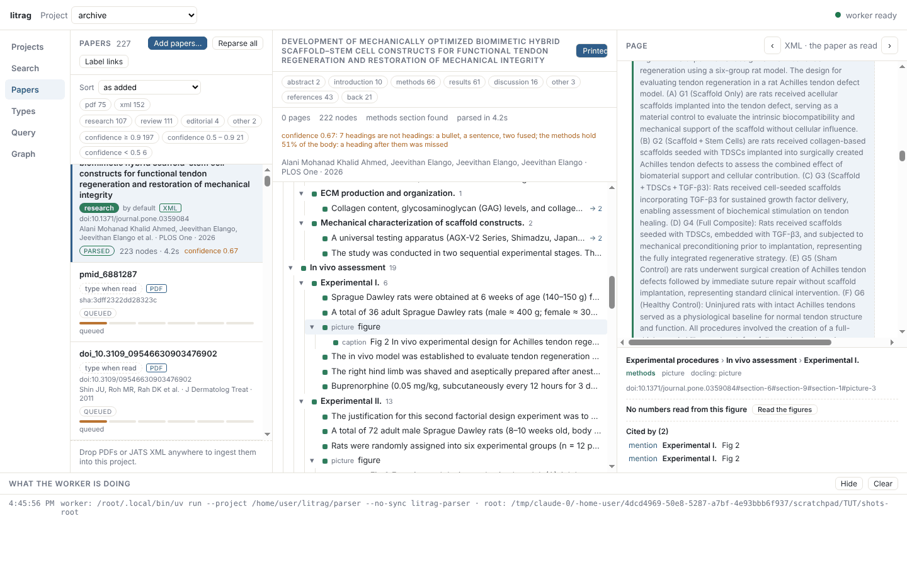
4. On **Graph**, type into the box under **Ask in SQL** and click **Run**, one query at a time. The first lists every paper not read; the second shows one paper's history.

   ```sql
   SELECT key, status, error FROM papers WHERE status <> 'parsed';
   SELECT at, stage, detail FROM events WHERE paper = 'doi:10.3109/09546630903476902' ORDER BY id;
   ```

   In the archive the first lists three PDFs left `queued`. The second shows a single `filed` row: the striae paper is one of the three, filed and never read. How a paper is read shows it read in the screenshots' library.
5. Find what you saw in the table below.

### Symptoms and what to do

| What you see | Why | What to do |
| --- | --- | --- |
| A red dot reading "worker not running", a pink band "The worker is not running." with a reason, and a blank **Project** picker and Projects tab | The window could not start the worker. "The worker would not start (…): spawn … ENOENT" means `LITRAG_PARSER` names a program that is not there. "uv isn't installed…" means a checkout found no uv. "litrag's Python environment isn't installed…" means an installed app has lost its `venv` | Unset `LITRAG_PARSER`, or give the real path (a JSON array for a path with spaces). Install uv, or run the installer again. Then start litrag again |
| The status reads "worker exited" with an exit code, the band says "Start litrag again to restart it.", and no tab answers | The worker died after it started | Read its last 20 lines of stderr in the log pane. Quit and start litrag again: nothing restarts the worker |
| Query cards are tagged only "words #1", "words #2"; the line beside **Embed passages** ends "the embedder is not answering"; **Embed passages** logs "Embedded 0 passages" with "Connection refused"; **Suggest from the project** says "The local model did not answer (URLError): is Ollama running with qwen3:14b?"; **Let the model label** says "The model stopped: Ollama is not answering at http://127.0.0.1:11434" | Ollama is not running on 127.0.0.1:11434, a model is not pulled, or `LITRAG_OLLAMA_URL` points elsewhere. Papers are still read, but headings the vocabulary does not know read `other`. The log said so once, on a `meaning` line | Start Ollama. Run `ollama pull nomic-embed-text`. The installers pull only that one, so run `ollama pull qwen3:14b` yourself for Suggest, the labeller and the judge. Click **Embed passages**. Then rebuild every library read while Ollama was down (see Maintenance) |
| The first paper after litrag starts stays at "layout (Docling)" for a minute or more, and the log shows a raw line `layout: {"event": "stage", … "Loading Docling and its models (first run downloads them)"}` | Docling and torch load once each time the worker starts, in a child process: about 60 s on four CPU cores. The very first time, about 0.5 GB of models also come from Hugging Face, with no progress bar | Wait: the next papers skip it. To fetch the models ahead of time, put them in `<root>/models/docling` (see Maintenance) |
| A paper fails at layout with `LocalEntryNotFoundError: Cannot find an appropriate cached snapshot folder…` | Docling's models are not on the machine, and Hugging Face cannot be reached | Connect once and add the file again, or fetch the models ahead. Once `<root>/models/docling` holds anything, only that folder is used |
| A card keeps a grey **queued** badge after a restart, with its file name as its title. The project card counts it in "papers" but not in "read" | The worker stopped after filing the paper and before reading it. Nothing resumes a queued paper | Click **Add papers…** and pick the same file again: it is in the library's `papers/` folder. Or send `reparse` with its key. **Reparse all** works too, but reads every paper again |
| A **failed** card, and the tree pane says "Parsing failed: the worker stopped while reading this paper" | The worker quit or crashed in the middle of that paper; the next worker marked it failed | Add the file again, or reparse it by key |
| A **failed** card with "the layout child took more than 300s", "and again in a fresh child", or "Docling read nothing from the file: no text, no tables" | Docling hung or crashed twice on the file, or found no text: a scanned page (OCR is off) or not a paper | Reparse it alone, by key. For a very long PDF, raise `LITRAG_LAYOUT_TIMEOUT` (300 s by default). For a scan, find the paper's XML or a PDF with a text layer |
| **Describe…** on a project card does nothing, and the log says "unhandled: prompt() is not supported." **Suggest from the project** then answers "The project has no description to draft queries from: describe it first." | The button opens a browser prompt, which Electron does not support | Write the description in **What it is about** when you click **New project**. For an existing project, send `{"op":"describe","lib":"<id>","description":"…"}` (see Maintenance for sending a request from the window) |
| A PDF reads badly: the title is the file name, the confidence chip is low, "No methods section detected", or sections hang under the wrong heading | A scan with text on few pages, a heading the layout model missed, or a running header. "doi\_10.1097\_00002480-199609000-00075" (ASAIO J, 1996) has text on page 2 only and scores 0.063 | Hover the confidence chip for its reasons and compare the boxes on the page. If Europe PMC has the paper's XML, read that instead: send `ingest` with its path and `"reread": true`. A plain add keeps the old reading ("seen before, kept") |
| A figure's numbers do not match the chart on the page | One of the chart reader's failure patterns (see Figures below) | Compare the table with the page, and check the caption for a second y axis. Reading again gives the same rows, and nothing in the window corrects or hides a value: leave that plot out |
| A figure says "No numbers read from this figure" | An XML paper: JATS XML names its figures but holds no image. A PDF paper: the picture holds no chart, or its charts were never read because the reading was cut off or `LITRAG_FIGURES` was `off` | For XML, drop the paper's PDF on the window, or run **Collect PDFs** on the Search tab: the PDF is kept beside the XML and its charts are read. For a PDF whose charts were never read, click **Read the figures**: it reads all of that paper's figures. A photograph stays without numbers |
| After clicking a queued, parsing or failed paper, the page pane still shows the previous paper's page, boxes and node detail. Two quick clicks can also put one paper's page under another's tree | The window clears the tree but not the page for a paper with no tree, and two tree requests can finish out of order | Trust the tree pane. Click another parsed paper, or the same paper again |
| **Collect PDFs** skipped a paper, or its window shows a publisher's "Access Denied" or a sign-in page, and the status says "what came back is not a PDF (a sign-in page?)" | The walk moves on as soon as a download starts. A second download from one page, such as a supplement or a double click, is saved under the next paper, and that paper is never opened. Some publishers refuse the network or want a sign-in | Run **Collect PDFs** again: a skipped paper still needs its PDF. Sign in through your institution in that window, which keeps the sign-in. Or download the PDF in your own browser and drop it on the window. Ctrl+→ skips a paper |
| Search shows an alert that begins "The search failed" and says Europe PMC could not be reached, or a fetch marks candidates **failed** | No network, or a proxy blocks Europe PMC. The window has no offline mode | Reconnect, then fetch the failed candidates again. Files on disk can still be added |
| The log line of a **Citation round** says "its daily budget spent", followed by "OpenAlex's daily budget is spent…" | OpenAlex's free budget is shared by every machine behind one address and may be spent before you start. Reference lists still come; title searches and **and what cites them** through OpenAlex stop for the day | Set a free key in `LITRAG_OPENALEX_KEY`, untick **OpenAlex too**, or run the round the next day |
| After **Run** in **Ask in SQL**, nothing answers: no tree, no page, no other query | A runaway SELECT, such as a count or a sort over a join without conditions, runs where the worker reads its requests, with no time limit. The row limit cannot stop it: a count or a sort must finish first | Close the window and start litrag again: the app stops the worker 1.5 s after asking it to quit, and anything queued is lost. Join on keys, and try a query on a small subquery first |
| `lit query` returns `[]`, `lit libraries` counts no papers, and the literature skill finds nothing. An empty `lit.sqlite` appears beside `store.sqlite` | The deprecated `lit` CLI reads its own `lit.sqlite`, which the app never writes | Ask in the **Query** tab, or use the worker's `query` and `sql` ops (see Driving litrag from an assistant or script) |
| One paper is listed twice, under DOI keys that differ only in letter case. On Windows or macOS, after a rebuild one of them reads as the other | DOIs are filed as printed and compared exactly. On a case-insensitive file system both keys name the same files in `papers/` and `parsed/` | Find them with `SELECT lower(doi), count(*) FROM papers WHERE doi IS NOT NULL GROUP BY 1 HAVING count(*) > 1`. Delete one paper's rows by hand, with foreign keys on (see Maintenance), but keep the files, which the two share. Then reparse the other by key |
| Papers added just before you closed the window are queued for good after a restart, or missing | Closing the window asks the worker to quit, and it exits at once, dropping its queue. A file not yet filed leaves no row at all. The window gives no warning | Close only when the status reads "idle" and the activity bar is gone. Afterwards compare the Papers count with what you added, and add the missing files again |

### What happens underneath

The worker runs every long job on one queue, one at a time: ingest, reparse, rebuild, judge, fetch, Expand, merge, embed, figures, citation rounds and the model's labels. Reads are answered meanwhile on the thread that reads requests. A search, a suggestion or a question gets a thread of its own. So one slow SQL query holds up every other read.

The queue lives only in the worker's memory. Quitting exits at once. A paper caught mid-read is marked `failed` the next time its library is opened; a queued paper stays `queued`.

Each paper's state is in `papers.status` and `papers.error`, and its stages are rows of `events`, which outlast the log pane. The window reaches the worker through JSON lines alone, so whatever has no button is one request away (see Driving litrag from an assistant or script).

### Known limits of this version

#### Install and releases

- **No packages to download.** Releases v0.3.0 and v0.3.1 carry no archives, and 0.3.2 has no release. Install from a checkout (see Install and first start).
- The Windows release job cannot pass, even after a clean uninstall. Its last check hands three paths to one `Test-Path`, and PowerShell reads the list of three answers as true. No Windows archive can be uploaded, so on Windows run from a checkout too.
- **The Docling version is not recorded.** Every paper Docling reads says `docling None` in `parser`; search the log for "ready on" to see the version and the device.

#### Reading

- **JATS superscripts are glued to the word before** in most XML papers, as in "Characteristic1 H NMR". Search for the neighbouring words instead.
- **PDF words can be split at line ends.** In 49 of 72 PDFs, 1,361 words read as two, like "a pre viously published protocol". Embed with Ollama so Query matches by meaning too, or prefer the paper's XML.
- **Some PDF reference entries lose their last line.** In a count of 949 PDF entries, 51 lost the line carrying their DOI, so they can link by title only. Prefer the paper's XML where there is one.
- **No OCR.** A scanned PDF fails or gives a thin tree. Find its XML, or a PDF with a text layer.
- **Nature-family methods can land under "Ethics statement".** In "Sticky organisms create underwater biological adhesives…" the "Methods" heading is empty, and its 19 subsections sit under "Ethics statement", in the `back` lane. Read them there, and expect no method links for its findings.
- **A back-matter heading can swallow a reference list.** In the review "Engineered Living Systems Based on Gelatin…" entries \[1\] to \[138\] sit under "Keywords", so every citation link points 139 entries off, at confidence 1.0. Check the entry a link names before quoting it.

#### Library and projects

- **No remove or rename in the window.** Remove a paper by hand, with foreign keys on (see Maintenance). Rename a project with the `describe` op; its id and folder never change.
- **A merge that fails says so only in the log.** A name already taken ends in a red log line, after the form has closed. Merge again under a new name.
- **No type override.** Nothing sets a paper's type by hand, and an edit to the store is undone by the next rebuild. Fix the evidence instead: a JATS copy, or `uv run --project parser --no-sync python -m litrag_parser.paper_type --fetch --lib <folder>` from the checkout, followed by a rebuild.
- **The inbox is not watched.** A file copied into `inbox/` by hand is never read; drop it on the window.
- **A PMID in a file name is not read.** An unidentified PDF gets a `sha:` key. Name the file `doi_<DOI with / as _>.pdf` or `PMC<n>.pdf` before adding it.

#### Query

- **No stemming.** "dehydrothermally" does not find "dehydrothermal", so the tab's own placeholder question misses its answer. Type the forms the papers use, or several.
- **Non-ASCII characters are dropped.** "TGF-β1 release" searches for "tgf" and "release", and "37 °C" for "37". Add plain words that narrow the question.
- **Any word counts, and each list keeps its top 50.** Common words crowd out the passage you want. Ask short, specific questions.
- **No lane or paper filter in the window.** Use `uv run --project parser --no-sync python -m litrag_parser.retrieve --store <store.sqlite> --query "…"` from the checkout, with `--role` and `--paper`.
- **No warning on the results when nothing is embedded.** The summary still names `nomic-embed-text@doc1`. Trust the line beside **Embed passages** and the "words #n" tags.

#### Figures

- **A raster image on axes can be read as bars.** Diffraction patterns in one 2008 Biomaterials figure gave 60 "read" bar plots of values that are not data. Distrust a figure with dozens of plots.
- **Hatched or outlined bars vanish, and touching ones merge.** The legend names then shift, and fifty bars in one chart came back as ten values, still counted as read. Compare the table with the page.
- **A second y axis is read on the left scale.** A strength of about 65 MPa was stored as 2.84 on a load axis in N. Check the caption for a right-hand axis.
- **The table hides values when no category was read,** and a one-sided whisker shows as "±". Take the values from **CSV** or SQL.
- **Chart reading has no deadline.** A 1971 paper's charts took over four minutes and gave no values. Set `LITRAG_FIGURES=off` while adding papers, and send `figures` later.

#### Method links and types

- **One weak word pair can decide a link.** 1,129 of 1,876 term links rest on a single mark, scored 0.825 or 0.85, and statistics sections get links too. The window does not show the score: label first the links whose detail shows one mark, and **Label links** measures how often such links are right.
- **The judge op does not type papers.** It asks a local model only whether two blocks split at a page break are one paragraph. A paper's type comes from its record, its XML, its printed labels or its shape.
- **`judge` without Ollama is a plain rebuild,** though `parser` still says `judge qwen3:14b`. Check `judged.asked` in its `tree` events.
- **A reading defect becomes a type defect.** "Anisotropically Stiff 3D Micropillar Niche…" lost its results under a built Introduction and is typed review by its shape. Reparse it, or prefer its XML.

#### Citation graph

- **By an author takes the first word of the first author.** For "Shengmao Lin" it looks for the family name "Shengmao" and finds nothing. Use **here** beside the author instead.
- **The first SQL or graph request after a change relinks every entry,** 4 to 8 s during which other reads wait.
- **A round stopped half-way keeps none of its candidates.** They are written at the end; wait for its log line before closing.

#### The window and scripts

- **The step bar runs backwards.** A PDF's bar reaches "tree built, lanes assigned", falls back to "text layer recovered", and reads "queued" while charts are read, the longest stage. Trust the badge and the status at the top right.
- **The log shows raw text.** Docling's start-up arrives as a JSON line, and RapidOCR's warnings carry colour codes. **Clear** empties the pane.
- **Two workers on one root collide.** A second worker marks the paper the first is reading as failed. Point a script at a copy with `--root=<dir>`; the form with a space is ignored.
- **A `done` is not always the end.** A `fetch` or `expand` first sends its inner ingest's `done` under the same id, and an ingest's `done` lists a failed paper under `parsed`. Wait for `done` with the op you sent, and read each paper's `status`.

### Good to know

- **Wait for "idle" before you close.** It avoids most queued and interrupted papers.
- **Try a fix on a copy.** Copy the library folder under another root and point a worker at it.

## Quick reference

### Commands

Run these from the root of a checkout, the folder that holds `package.json`, `app/` and `parser/`.

| To | Command | Notes |
| --- | --- | --- |
| Set up a checkout, once | `uv sync --project parser --extra cpu`, then `npm --prefix app install` | `--extra cu130` instead on an NVIDIA card with an R580 or newer driver; `npm install` at the root as well before `check:all`, for the CLI's TypeScript and Vitest |
| Start the app | `npm run app` | Builds the window with esbuild and starts Electron, which starts the worker |
| Start it on other libraries | `LITRAG_ROOT=/path/to/root npm run app` | The default root is `~/.protracker/library` |
| Run every check | `npm run check:all` | The CLI's typecheck and tests, the app's typecheck, tests and build, and the parser's pytest; no network, no models |
| Smoke run | `npm --prefix app run smoke` | Needs a display (`xvfb-run` on Linux); `SMOKE_PDF` names a paper to read first, `SMOKE_OUT` a folder for the screenshots; passes only on a root that already holds a library |
| End-to-end run | `npm run e2e -- app.spec.ts` | The real window and worker on the JATS fixture; `LITRAG_E2E_PAPERS=<folder>` runs it on your own papers; a bare `npm run e2e` runs the studio suite too |
| The product end to end | `LITRAG_HEADLESS=1 npm run e2e:studio` | Needs Docling's models, Ollama with `nomic-embed-text`, and two PDFs from the archive beside the checkout; its query-drafting step also asks the chat model, unless `LITRAG_E2E_MODELS=0` |
| Measure the reader on a library | `npm run harness -- --lib <root>/<library>` | Add `--json run.json`, kept outside the checkout; after a change, `--baseline run.json --gate` |
| Start the worker by hand | `uv run --project parser --no-sync litrag-parser --root=/path/to/root` | Only `--root=` with the `=` is read; then type one JSON request per line |
| Start an installed worker (Linux) | `~/.local/share/litrag/venv/bin/litrag-parser --root=…` | Windows: `%LOCALAPPDATA%\litrag\venv\Scripts\litrag-parser.exe --root=…` |
| Stop the worker | `{"id": "q", "op": "quit"}` | Exits at once and drops queued jobs: wait for their `done` first |

### The window

Each tab works on the project chosen in the header's **Project** picker, and the last column names the worker ops it sends.

| Tab | Main controls | Ops behind them |
| --- | --- | --- |
| **Projects** | **New project** (**Name**, **What it is about**, **Create**, **Cancel**); **Merge libraries…** (a box per project, **Name of the merged project**, **Merge**, **Cancel**); on each card **Papers**, **Search**, **Types**, **Query**, and **Describe…** (no effect in this version) | `projects`, `init`, `merge` |
| **Search** | The query box, **Search**, **Suggest from the project**; under **Results**: a tick box on each hit, **all**, **Fetch & read selected** (**Fetch & read 1** with one hit ticked), **More results**; under **Candidates**: status chips, **Fetch** on a candidate, and **Collect PDFs**, which shows its counts, as in **Collect PDFs (117 for figures)** | `search`, `suggest`, `candidates`, `wanted`, `fetch`, `ingest` |
| **Papers** | **Add papers…**, **Reparse all**, **Label links**; **Sort** ("as added", "format", "type", "title", "year, newest first", "confidence, lowest first") and format, type and confidence chips; **Printed** and **Canonical** over the tree, with lane chips; **‹** and **›** over the page; **Label** on a finding, **Read the figures** on a figure with no numbers; in the labelling panel **Let the model label**, **Close**, **Skip**, **Save & next** | `papers`, `tree`, `mapping`, `refs`, `edges`, `charts`, `file`, `ingest`, `reparse`, `figures`, `label_queue`, `label`, `model_label`, `truth` |
| **Types** | One tab per type with its count; **Canonical structure**; **How each paper maps onto it**, with a paper picker and **Open in Papers** | `types`, `mapping` |
| **Query** | The question box, **Passages** (8), **Ask**; **Embed passages** with its count of passages embedded; **Open in the tree** on each hit | `query`, `retrieval`, `embed` |
| **Graph** | **and what cites them**, **OpenAlex too**, the number to read (10), **Expand: read the most cited**, **Citation round**; **Candidates** ("none", "cited by at least", "all") with its number (2), **Colour** ("round", "year", "held or not"), the find box, **Fit**; in the side panel **Open in Papers**, **Citation round from it**, **here** and **Europe PMC** by each author, **Fetch & read** on a candidate; under **Ask in SQL** the presets **Held, oldest first**, **Next round**, **By an author**, **Authors here**, **Who cites whom**, **Rounds**, then **Run** (Ctrl+Enter) and **Fetch & read selected** | `graph`, `round`, `expand`, `sql`, `passages`, `fetch` |
| Any tab | **Project** picker; drop PDFs or JATS XML anywhere (**Drop to ingest**) | `hello`, `projects`, `ingest` |
| Log pane | **What the worker is doing**, **Hide** (then **Show**), **Clear** | none |

### Worker ops

The worker answers these 45 ops, each sent as one JSON line with an `id`; a queued op answers `queued` at once and ends with `done` or `error`.

| Op | Mode | Key fields | Answers with |
| --- | --- | --- | --- |
| `hello` | now | none | `hello`: `worker`, `root`, `python`, `docling`, `device`, `meaning`, `boundary` |
| `libraries` | now | none | `libraries`: `root`, `libraries[]` with `id`, `name`, `dir`, `projectId`, `createdAt` |
| `projects` | now | none | `projects`: each library with `description`, `queries` and `counts` |
| `init` | now | `name`; opt. `projectId`, `description` | `library`; a name whose id is already taken is an `error` |
| `describe` | now | `lib`; opt. `name`, `description` | `project`: the library's `projects` entry |
| `search` | own thread | `lib`, `query`; opt. `cursor` (`*`), `size` (25) | `search`: `hits[]` with `cand_id` and `status`, `total`, `next_cursor`, `added` |
| `suggest` | own thread | `lib` | `suggestions`: `queries[]`, `model`, and `error` when none were drafted |
| `candidates` | now | `lib`; opt. `status`, `query` | `candidates[]` |
| `wanted` | now | `lib` | `wanted`: `candidates` needing a PDF by hand, `figures` (XML papers whose figures want a PDF) |
| `stage` | now | `lib`, `ids[]` | `dismissed` with `op: "stage"`, `status`, `changed[]` |
| `dismiss` | now | `lib`, `ids[]` | `dismissed` with `op: "dismiss"`, `status`, `changed[]` |
| `fetch` | queued | `lib`, `ids[]` | `candidate` events, the ingest stream with its own `done` (`op: "ingest"`), then `done` with `fetched[]` |
| `ingest` | queued | `lib`, `paths[]`; opt. `reread`, `offline`, `judge`, `outline`, `known` | `paper` per file, `stage` per step, `tree` per paper; `done` with `parsed[]` |
| `reparse` | queued | `lib`; opt. `keys` (every paper with a file) | the ingest stream per paper; `done` with `parsed[]` |
| `rebuild` | queued | `lib`; opt. `keys` (every parsed paper with its saved Docling document) | `progress`, `tree` per paper; `done` with `rebuilt[]`, `refused[]` |
| `judge` | queued | `lib`; opt. `keys` | as `rebuild`, with the local chat model reading the open pairs |
| `figures` | queued | `lib`; opt. `keys`, `force` | `progress` per paper; `done` with `papers`, `figures`, `plots`, `read`, `values` |
| `merge` | queued | `sources[]` and `name`, or `sources[]` and `into` | a rebuild under the id `<id>-rebuild` and a reparse under `<id>-reparse`; `done` with `target`, `filed`, `duplicates`, `skipped`, `rebuilt`, `reparsed`, `candidates_merged` |
| `embed` | queued | `lib` | `done` with `model`, `units`, `embedded`, `already`, `seconds`, and `error` when the embedder is down |
| `round` | queued | `lib`; opt. `papers[]`, `citations`, `again`, `openalex`, `references` (true) | `stage` `round`; `done` with `papers`, `entries`, `held`, `identified`, `unidentified`, `asked`, `added`, `errors`, `openalex` |
| `expand` | queued | `lib`; opt. `most` (10), `min_cited` (1), `citations`, `openalex` | a round, then a fetch stream per pass; `done` with `round`, `chosen`, `read`, `passages`, `passed`, `for_a_person` |
| `model_label` | queued | `lib`; opt. `n` (100), `seed` (0), `per_paper` (5), `model` | `progress`; `done` with `model`, `findings`, `asked`, `labelled`, `already`, `unreadable`, `seconds`, `prompt_tokens` |
| `papers` | now | `lib` | `papers[]`: every `papers` column plus `nodes` |
| `tree` | now | `lib`, `key` | `tree`: `paper`, `pages[]`, `roles`, the nested `root` |
| `node` | now | `lib`, `node_id`; opt. `siblings` | `node`, `siblings` |
| `section` | now | `lib`, `key`, `role` | `section`: `nodes[]` of that lane |
| `events` | now | `lib`, `key` | `events`: `paper`, `events[]` with `at`, `stage`, `detail` |
| `file` | now | `lib`, `key` | `file`: `path`, `format`, `raw` (the saved Docling document's path) |
| `types` | now | `lib` | `types`: `overview`, `skeletons`, `papers` |
| `mapping` | now | `lib`, `key` | `mapping`, `canonical` |
| `query` | own thread | `lib`, `question`; opt. `k` (8) | `query`: `hits[]` with their context, `embedder`, `counts`, `seconds` |
| `retrieval` | now | `lib` | `retrieval`: `units`, `embedded`, `model`, `down`, `error` |
| `sql` | now | `lib`, `sql`; opt. `limit` (200, at most 5000) | `rows`: `columns`, `rows` |
| `graph` | now | `lib`; opt. `candidates` (`cited`), `min_cited` (2) | `graph`: `nodes`, `edges`, `hidden` |
| `refs` | now | `lib`, `key` | `refs`: `paper`, `refs[]` with the `work` each entry names |
| `passages` | now | `lib`, `work` | `passages`: `work`, `passages[]` that cite it |
| `edges` | now | `lib`, `node_id` | `edges`: `node_id`, `out`, `in`, `candidates` |
| `charts` | now | `lib`, `figure` or `key` | `charts`: one figure's `plots`, or a paper's `figures` |
| `label_queue` | now | `lib`; opt. `n` (100), `seed` (0), `per_paper` (5), `finding` | `label_queue`: `items`, `labelled`, `papers`, `audit` |
| `label` | now | `lib`, `finding`, `labels[]`; opt. `by` | `labelled`: `finding`, `labels` |
| `labels` | now | `lib` | `labels[]` |
| `truth` | now | `lib` | `truth`: the finding-to-method links measured against the labels |
| `audit` | now | `lib`; opt. `key`; or `path` | `audit`: `papers[]` with their `findings` |
| `parse_json` | now | `path`; opt. `key` | `tree` built from a saved Docling document; nothing is stored |
| `quit` | now | none | `bye`, then the worker exits |

### Switches for everyone

Set a switch in the environment before you start the app or the worker, since the window passes its environment on to the worker.

| Switch | Default | What it changes |
| --- | --- | --- |
| `LITRAG_ROOT` | `$PROTRACKER_LIBRARY`, else `~/.protracker/library` | Where the libraries, `lanes.sqlite` and `models/docling` live |
| `LITRAG_PARSER` | unset | The worker command: a JSON array, the path of an existing file, or a line split on spaces |
| `LITRAG_VENV` | `<install root>/venv` | The environment an installed app runs its worker from |
| `LITRAG_INSTALL_ROOT` | `~/.local/share/litrag`; Windows `%LOCALAPPDATA%\litrag` | Where the install and uninstall scripts work; the app does not read it |
| `LITRAG_OLLAMA_URL` | `http://127.0.0.1:11434` | Where the embedder and the chat models are asked; keep it local |
| `LITRAG_LANES` | on | `off`: no embedder, so what the rules do not name reads `other`, and nothing is embedded at save |
| `LITRAG_LANES_MODEL` | `nomic-embed-text` | The embedder, for headings and passages |
| `LITRAG_EMBED` | on | `off`: passages are not embedded as each paper is saved; **Embed passages** still works |
| `LITRAG_FIGURES` | on | `off`: no chart reading as papers are read, and no PDF fetched for an XML paper's figures; the `figures` op still reads them |
| `LITRAG_JUDGE` | off | `1`: the chat model judges page-break pairs on every ingest and reparse |
| `LITRAG_JUDGE_MODEL` | `qwen3:14b` | The judge's model, unless `library.json` names one under `ollama.chat` |
| `LITRAG_OUTLINE` | off | `on`: the outline judge reads every paper on ingest and reparse |
| `LITRAG_OUTLINE_MODEL` | `qwen3:14b` | The outline judge's model |
| `LITRAG_SUGGEST_MODEL` | `LITRAG_JUDGE_MODEL`, else `qwen3:14b` | The model behind **Suggest from the project** |
| `LITRAG_LABEL_MODEL` | `qwen3:14b` | The model behind **Let the model label** |
| `LITRAG_LABELLER` | your login name | The `by` written on your link labels |
| `LITRAG_BOUNDARY` | off | `on`: a small model from Hugging Face scores the page breaks the rules leave open |
| `LITRAG_BOUNDARY_MODEL` | `Qwen/Qwen2.5-0.5B` | That model |
| `LITRAG_EDGES_SIMILARITY` | off | `on`: resemblance may link a finding to a method where no pointer, mark or caption does |
| `LITRAG_TYPE_PROFILE` | off | `on`: the profile kind may name a paper's type (measured at 0.66 accuracy) |
| `LITRAG_LAYOUT_TIMEOUT` | `300` | Seconds the layout may take on one paper before its child is restarted and the paper tried once more |
| `LITRAG_OPENALEX` | on | `off`: rounds never ask OpenAlex, whatever **OpenAlex too** says |
| `LITRAG_OPENALEX_KEY` | unset | Your free OpenAlex key, which raises the daily budget |
| `LITRAG_OPENALEX_SEARCHES` | `50` | Entries naming no identifier that one round looks up in OpenAlex by title |
| `LITRAG_OPEN_COPIES` | on | `off`: a fetch never asks the host of an open copy that OpenAlex names |
| `LITRAG_NCBI_EMAIL`, `LITRAG_NCBI_API_KEY` | unset | Sent with each NCBI request when set |

### Developer-only switches

These serve tests, experiments and measurement; for a reading rule that is on by default, `off` drops it.

| Switch | Default | What it changes |
| --- | --- | --- |
| `LITRAG_HEADLESS` | unset | `1`: the window is never shown and renders offscreen |
| `LITRAG_LAYOUT_CHILD` | on | `off`: Docling runs in the worker's own process, unsupervised |
| `LITRAG_LANES_REFRESH` | off | `on`: a stored verdict without a ranking is asked of the embedder again the next time its paper is read |
| `LITRAG_VOCABULARY` | on | `off`: the embedder alone names every heading |
| `LITRAG_LANE_AGREEMENT` | off | `on`: the reader abstains when a section's paragraphs strongly disagree with its heading |
| `LITRAG_CANONICAL_ONLY` | off | `on` (2) or a number: a lane is asserted only where that many mechanisms agree |
| `LITRAG_ABSTRACT_ENDS` | on | An abstract ends at the first paragraph after its first that cites; the rest goes to the introduction |
| `LITRAG_ABSTRACT_PARTS` | on | A JATS structured abstract is split into one paragraph per labelled part |
| `LITRAG_BOLD_HEADINGS` | on | A JATS paragraph of one short bold run becomes a subheading |
| `LITRAG_FLOAT_PAGES` | on | A paragraph's tail may continue after pages of figures and tables |
| `LITRAG_NOTES_APART`, `LITRAG_NOTES_ANYWHERE` | on, on | Blocks set smaller than the body are read as notes |
| `LITRAG_LIST_TAILS` | on | A list item's sentence is joined across a column or page break |
| `LITRAG_REVIEW`, `LITRAG_REVIEW_MODEL` | off, `qwen3:14b` | Read only by `review.py`'s own measurement |
| `LITRAG_EPMC_URL`, `LITRAG_EPMC_PDF_URL`, `LITRAG_NCBI_URL`, `LITRAG_PMC_CLOUD_URL`, `LITRAG_OPENALEX_URL` | the real services | Point a network source at a test server |
| `LITRAG_DOI_RESOLVER` | `https://doi.org/` | The resolver the **Collect PDFs** window opens papers through |
| `LITRAG_E2E_PAPERS`, `LITRAG_E2E_MIN_METHODS`, `LITRAG_E2E_MIN_TITLES`, `LITRAG_E2E_SHOTS`, `LITRAG_E2E_MODELS`, `LITRAG_E2E_PDF_OPEN`, `LITRAG_E2E_PDF_CLOSED` | unset | The end-to-end suites: a folder of papers, the pass marks, a folder for screenshots, `0` to skip the model step, the studio's two PDFs |
| `LITRAG_FAKE_LAYOUT`, `LITRAG_FAKE_COUNTER`, `LITRAG_MARK` | unset | Unit tests only |
| `LITRAG_PT` | `pt` | Protracker's command, for the deprecated `lit` CLI |

### The store

A library's rows live in its `store.sqlite`; the tables from `cites` to `graph_state` and the two views appear when `sql`, `query`, `refs`, `passages`, `graph` or a round first runs.

| Table | One row is | Key columns |
| --- | --- | --- |
| `papers` | A paper filed in the library | `key` (`doi:…`, `pmid:…`, `pmcid:…` or `sha:…`), `title`, `format` (`jats`, `pdf`), `status` (`queued`, `parsing`, `parsed`, `failed`), `type`, `year`, `journal`, `confidence`, `file`, `figures_file`, `seconds` |
| `pages` | A page of a PDF paper | `paper`, `page_no`, `width`, `height` |
| `nodes` | A node of a paper's tree | `node_id`, `paper`, `parent`, `type`, `role` (the lane), `heading`, `ancestry`, `text`, `page`, `bbox_l` to `bbox_b`, `canonical`, `confidence` |
| `nodes_fts` | The full-text index of `nodes.text` | `text` |
| `refs` | An entry of a paper's reference list | `paper`, `ref_no`, `text`, `doi`, `pmid`, `year`, `first_author`, `title` |
| `citations` | A passage naming an entry | `paper`, `node_id`, `ref_no`, `marker` |
| `edges` | A link between two nodes of a paper | `src`, `dst`, `kind` (`measured_by`, `cites_figure`), `evidence`, `detail`, `score` |
| `events` | A step in a paper's history | `paper`, `at`, `stage`, `detail` |
| `charts` | A plot found in a figure | `paper`, `figure`, `plot`, `status` (`read`, `unread`), `reason`, `kind`, `panel`, `y_label`, `y_unit` |
| `chart_values` | A value read from a plot | `paper`, `figure`, `plot`, `series`, `name`, `category`, `x`, `y`, `err_lo`, `err_hi` |
| `figure_reads` | A paper's last reading of its charts | `paper`, `figures`, `plots`, `read`, `values_`, `seconds`, `file` |
| `vectors` | A passage's embedding | `node`, `model`, `dims`, `vec` |
| `vectors_gen` | A counter of changes to `vectors` | `n` |
| `judgments` | A verdict on two blocks split at a page break, by the chat model or the boundary scorer | `paper`, `pair`, `same`, `model` |
| `outlines` | The outline judge's answer for a paper | `paper`, `signature`, `model`, `outline` |
| `link_labels` | Your verdict on a method a finding was measured by | `paper`, `finding`, `method`, `verdict` (`yes`, `no`, `none`), `by`, `at` |
| `model_labels` | The local model's verdict on the same question | as `link_labels` |
| `candidates` | A work a search or a round found | `cand_id`, `doi`, `pmid`, `pmcid`, `title`, `status`, `round`, `cited_by`, `paper_key`, `oa_url` |
| `cites` | A citation between two works | `citing`, `cited`, `origin` (`refs`, `europepmc`, `openalex`), `ref_no` |
| `authors` | An author of a work | `work`, `pos`, `name`, `family`, `orcid`, `person` |
| `ref_works` | An entry linked to the work it names | `paper`, `ref_no`, `work`, `how` |
| `ref_lists` | An entry of Europe PMC's or OpenAlex's list for a paper | `paper`, `source`, `ord`, `ident`, `title`, `year`, `first_author` |
| `harvests` | A question a round asked about a paper | `paper`, `kind`, `at`, `found` |
| `graph_state` | A stamp the citation tables keep to know when to refresh | `name`, `value` |
| `works` (view) | A work, held or a candidate | `work`, `state` (`held`, `candidate`), `status`, `round`, `year`, `first_author`, `title`, `cited_here`, `cites_here`, `cited_by` |
| `passage_cites` (view) | A passage citing a work | `paper`, `node_id`, `ref_no`, `marker`, `work`, `how` |
| `verdicts` (in the root's `lanes.sqlite`) | An answer to a question of resemblance, replayed by every rebuild | `kind`, `key`, `model`, `name`, `score`, `margin` |

### SQL for the Graph tab

Paste a query under **Ask in SQL** and click **Run**; leave out `--` comments, since one on the first or last line makes it fail.

- **Papers by type.** On the library: review 111 (102 XML, 9 PDF), research 106 (47 XML, 59 PDF), editorial 4, other 2.

```sql
select type, count(*) as papers, sum(format = 'jats') as xml, sum(format = 'pdf') as pdf
from papers
where status = 'parsed'
group by type
order by papers desc
```

- **Nodes by lane.** On the library: references 26,461 nodes in 216 papers, then other, methods (3,479 in 115 papers), back, discussion, results, introduction, results-discussion and abstract.

```sql
select role as lane, count(*) as nodes, count(distinct paper) as papers
from nodes
where type <> 'document'
group by role
order by nodes desc
```

- **A paper's methods subsections, in reading order.** For "An electrochemical fabrication process for the assembly of anisotropically oriented collagen bundles": 8 rows, from "2. Materials and methods" on page 2 to "2.7. Statistics" on page 3.

```sql
select heading, page
from nodes
where paper = 'doi:10.1016/j.biomaterials.2008.04.028'
  and role = 'methods' and type = 'section'
order by rowid
```

- **A paper's chart values.** For "Incorporation of a decorin biomimetic enhances the mechanical properties of electrochemically aligned collagen threads": 8 values from Fig. 4 and Fig. 8, such as a Young's modulus of 5.45 MPa (error bar 4.29) for "Collagen 30 to 1".

```sql
select substr(n.text, 1, 40) as caption, c.panel, c.y_label, c.y_unit,
       v.name as series, v.category, round(v.y, 2) as y, round(v.err_hi, 2) as err_hi
from chart_values v
join charts c using (paper, figure, plot)
left join nodes n on n.parent = c.figure and n.type = 'caption'
where v.paper = 'doi:10.1016/j.actbio.2011.02.035'
order by v.figure, v.plot, v.series, v.ordinal
```

- **The most cited works not yet held.** It needs no citation round. On the library the top entry is "Designing hydrogels for controlled drug delivery" (Li, 2016), cited by 8 papers held. After a citation round, the **Next round** preset ranks the candidates it filed by how many works here cite them.

```sql
select lower(r.doi) as doi, count(distinct r.paper) as citing_papers,
       min(r.first_author) as first_author, min(r.year) as year, min(r.title) as title
from refs r
where r.doi is not null
  and lower(r.doi) not in (select lower(doi) from papers where doi is not null)
group by lower(r.doi)
order by citing_papers desc
limit 20
```
